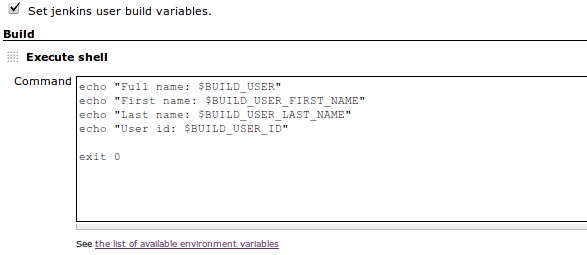

This plugin provides a set of environment variables that describe the
user who started the build.

[[BuildUserVarsPlugin-Variablesprovided]]
== Variables provided

This plugin defines the following environment variables to describe the
user who started the build:

[cols=",",options="header",]
|===
|Variable |Description
|BUILD_USER |Full name (first name + last name)
|BUILD_USER_FIRST_NAME |First name
|BUILD_USER_LAST_NAME |Last name
|BUILD_USER_ID |Jenkins user ID
|BUILD_USER_EMAIL |Email address
|===

[[BuildUserVarsPlugin-Usageexample]]
== Usage example

Select _Set Jenkins user build variables_ and reference the variables
during the build:

[.confluence-embedded-file-wrapper .image-center-wrapper]##

[[BuildUserVarsPlugin-PipelineExamples]]
== Pipeline Examples

*Script*
[.collapse-source .expand-control]#[.expand-control-icon .icon]## ##[.expand-control-text]##Expand
source### [.collapse-spinner-wrapper]# #

[source,syntaxhighlighter-pre]
----
node {
  wrap([$class: 'BuildUser']) {
    def user = env.BUILD_USER_ID
  }
}
----

 +

[[BuildUserVarsPlugin-Jenkinscorecompatibility]]
== Jenkins core compatibility

This plugin requires Jenkins 1.609+ (since 1.5 version of plugin).

[[BuildUserVarsPlugin-Changelog]]
== Changelog

[[BuildUserVarsPlugin-1.5(Dec11,2015)]]
=== 1.5 (Dec 11, 2015)

* image:docs/images/add.svg[(plus)]
 -  Workflow support
* Requires 1.609 or higher of Jenkins.

[[BuildUserVarsPlugin-1.4(Oct10,2014)]]
=== 1.4 (Oct 10, 2014)

* image:docs/images/add.svg[(plus)]
- Support of BUILD_USER_EMAIL. Currently, only the explicit e-mail
definition in user properties will work (see
https://wiki.jenkins-ci.org/display/JENKINS/Mailer[Mailer Plugin])
* image:docs/images/error.svg[(error)]
- NPE on non-existent upstream builds
(https://issues.jenkins-ci.org/browse/JENKINS-22974[JENKINS-22974])

[[BuildUserVarsPlugin-1.3(Apr12,2014)]]
=== 1.3 (Apr 12, 2014)

* image:docs/images/error.svg[(error)]
User variables are not set to Maven3 build
(https://issues.jenkins-ci.org/browse/JENKINS-19187[JENKINS-19187])

[[BuildUserVarsPlugin-1.2]]
=== 1.2

* [JENKINS-21955] Set BUILD_USER to "SCMTrigger" if a build is run
because of a source code change

[[BuildUserVarsPlugin-1.1]]
=== 1.1

* Now works with Jenkins starting from 1.396 version.

[[BuildUserVarsPlugin-1.0]]
=== 1.0

* Initial version
