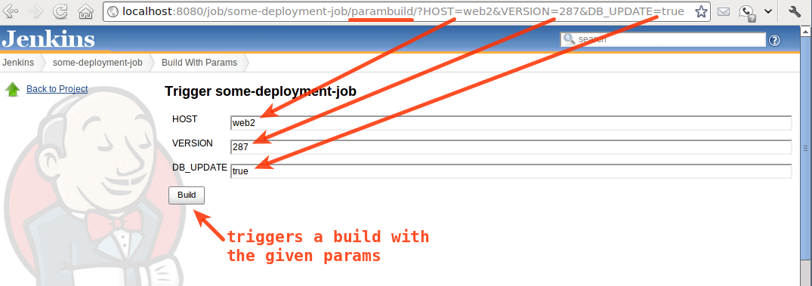

Allows the user to provide parameters for a build in the url, prompting
for confirmation before triggering the job.

The plugin exposes `+$JENKINS/job/$JOB/parambuild+` url to trigger the
build with parameter. Unlike `+$JENKINS/job/$JOB/buildWithParameters+`,
human must confirm that the parameters are correct before the build is
triggered. This is useful if you want to create a list of jobs with
parameters to trigger ahead of time, and execute it at some future date
(e.g. a deployment plan).

An example triggering of a job with the plugin: +
[.confluence-embedded-file-wrapper]##

[[BuildWithParametersPlugin-Changelog]]
== Changelog

[[BuildWithParametersPlugin-1.4]]
=== 1.4

* [.js-issue-title]#Fixed 404 error for not logged user
(https://issues.jenkins-ci.org/browse/JENKINS-25534[JENKINS-25534])#
* [.js-issue-title]##Support for pipelines
(##https://issues.jenkins-ci.org/browse/JENKINS-35378[JENKINS-35378])

[[BuildWithParametersPlugin-1.3]]
=== 1.3

* Hide job action from UI to avoid confusion
(https://issues.jenkins-ci.org/browse/JENKINS-25413[JENKINS-25413])
