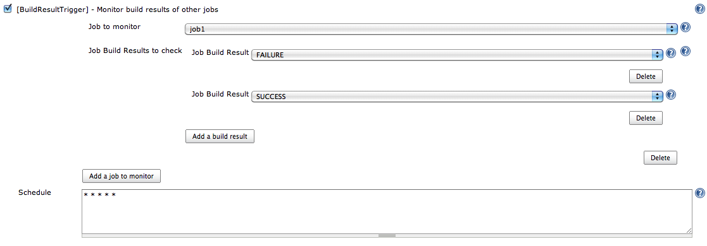

[.conf-macro .output-inline]# #

[.aui-icon .aui-icon-small .aui-iconfont-warning .confluence-information-macro-icon]##

*This plugin is up for adoption.* Want to help improve this plugin?
https://wiki.jenkins-ci.org/display/JENKINS/Adopt+a+Plugin[Click here to
learn more]!

BuildResultTrigger makes it possible to monitor the build results of
other jobs. +

[[BuildResultTriggerPlugin-Features]]
== Features

When you you have two jobs jobA and jobB and you want Jenkins to
schedule jobB after the jobA execution (whatever the build result of
jobA), you can configure Jenkins to say that jobB is the downstream job
of jobA. The drawback with this approach is that jobA has the knowledge
of its dependencies. +
With the BuildResultPlugin, you configure jobB to monitor jobA build
result. A build is scheduled if there is a new build result matches your
criteria (unstable, failure, ...)

Note: The plug-in uses only persistence in memory. There is no impact on
the Jenkins infrastructure (no new files created). +
This plugin provides a polling typology among the
https://wiki.jenkins-ci.org/display/JENKINS/XTrigger+Plugin[XTrigger
Plugin].

[[BuildResultTriggerPlugin-Someusecases]]
== Some use cases

* Having dedicated jobs (such as cleaning an environment, backing up a
database, ...) that are scheduled if other jobs are in failure. +
The other jobs don't depend on these dedicated jobs. +
* Implementing a build pipeline (or a build chain) in which each step of
the build pipeline is implemented with a Jenkins job.

[[BuildResultTriggerPlugin-Configuration]]
== Configuration

[.confluence-embedded-file-wrapper .image-center-wrapper]##

[[BuildResultTriggerPlugin-Comparisonwithotherplugins]]
== Comparison with other plugins

This plugin provides the inverse mechanism of the core feature
(downstream/upstream) and the
https://wiki.jenkins-ci.org/display/JENKINS/Parameterized+Trigger+Plugin[Parameterized
Trigger Plugin].

[[BuildResultTriggerPlugin-Changelog]]
== Changelog

[[BuildResultTriggerPlugin-Release0.17]]
=== Release 0.17

* Show upstream project in dependency graph

[[BuildResultTriggerPlugin-Release0.16]]
=== Release 0.16

* Fix https://issues.jenkins-ci.org/browse/JENKINS-18888[JENKINS-18888]
- Add AND of build results instead of OR

[[BuildResultTriggerPlugin-Release0.15]]
=== Release 0.15

* Fix https://issues.jenkins-ci.org/browse/JENKINS-18889[JENKINS-18889]
- BuildResultTrigger should not need to check for available nodes

[[BuildResultTriggerPlugin-Release0.14]]
=== Release 0.14

* Fix https://issues.jenkins-ci.org/browse/JENKINS-18667[JENKINS-18667]
- NullPointerException when saving job config

[[BuildResultTriggerPlugin-Release0.13]]
=== Release 0.13

* Fix https://issues.jenkins-ci.org/browse/JENKINS-18931[JENKINS-18931]
- Build is triggered incorrectly when a triggered build starts running

[[BuildResultTriggerPlugin-Release0.12]]
=== Release 0.12

* Fix https://issues.jenkins-ci.org/browse/JENKINS-18389[JENKINS-18389]
- BuildResult constantly triggers job

[[BuildResultTriggerPlugin-Release0.11]]
=== Release 0.11

* Fix poll with at least two checked jobs

[[BuildResultTriggerPlugin-Release0.10]]
=== Release 0.10

* Fix https://issues.jenkins-ci.org/browse/JENKINS-17641[JENKINS-17641]
- Unknown field 'logEnabled' in org.jenkinsci.lib.xtrigger.XTriggerCause

[[BuildResultTriggerPlugin-Version0.9]]
=== Version 0.9

* Fix https://issues.jenkins-ci.org/browse/JENKINS-14580[JENKINS-14580]
- Configuration of Buildresult-Trigger remains unchanged, when saved.

[[BuildResultTriggerPlugin-Version0.8(Jenkins1.461+)]]
=== Version 0.8 (Jenkins 1.461+)

* Fix https://issues.jenkins-ci.org/browse/JENKINS-13746[JENKINS-13746]
- Buildresult trigger plugin does not support hierachical folders +
* Fix Security issues

[[BuildResultTriggerPlugin-Version0.7]]
=== Version 0.7

* Fix the restriction to READ elements

[[BuildResultTriggerPlugin-Version0.6]]
=== Version 0.6

* Fix https://issues.jenkins-ci.org/browse/JENKINS-13182[JENKINS-13182]
- Add parent job name to the list of multi-configuration project child
jobs

[[BuildResultTriggerPlugin-Version0.5]]
=== Version 0.5

* Migrate to xtrigger-lib 0.8

[[BuildResultTriggerPlugin-Version0.4]]
=== Version 0.4

* Updated parent version to 1.409 so it can be used in a LTS version

[[BuildResultTriggerPlugin-Version0.3]]
=== Version 0.3

* Fix Button labels

[[BuildResultTriggerPlugin-Version0.2]]
=== Version 0.2

* Changed detection processing, based on build number

[[BuildResultTriggerPlugin-Version0.1]]
=== Version 0.1

* Initial version
