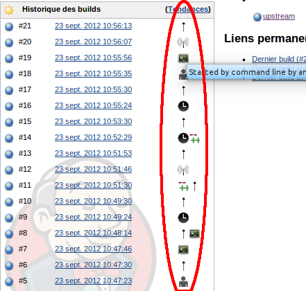
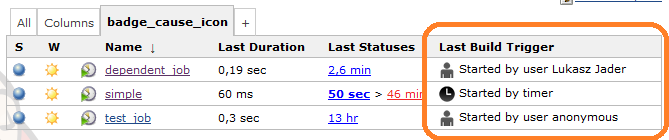

This plugin displays icon(s) representing the cause(s) of a build
directly in the build history. It lets you quickly know which cause
triggered a build.Without this plugin, you may sometimes wonder what
triggered a particular build shown in the build history. +
To know it, you have to open each link separately, which can be
cumbersome.

Note: after installation, the plugin will currently only add icons on
new builds. Old builds won't have the indicator.

[[BuildTriggerBadgePlugin-Screenshot]]
== Screenshot

[width="100%",cols="50%,50%",options="header",]
|===
|On builds |Last Build Trigger Column
a|
[.confluence-embedded-file-wrapper .image-center-wrapper]##

a|
[.confluence-embedded-file-wrapper]## +
A tooltip on each icon is available for details.

|===

[[BuildTriggerBadgePlugin-Wait,thisdoesnotwork,Iseeaquestionmarkiconformybuilds!]]
== Wait, this does not work, I see a question mark icon for my builds!

This means the _cause_ of the build is not yet supported by the plugin.
It's pretty easy to add one, we basically only need the fully qualified
name (FQN) of that build cause, and an icon
image:docs/images/smile.svg[(smile)]. +
Finding out that FQN is pretty easy. You can simply use the Jenkins API
through your browser.

Open the build page, and suffix it with
_/api/xml?xpath=//cause&wrapper=causes_. To give something like:
_https://yourjenkinsserver/job/somejob/15/api/xml?xpath=//cause&wrapper=causes_

Then, paste that output in a JIRA issue explaining your case. Even
better, filing a pull-request would be great
image:docs/images/smile.svg[(smile)].

[[BuildTriggerBadgePlugin-Changelog(note:thedateformatbelowisthelogicalone,nottheamericanone)]]
== Changelog (note: the date format below is the logical one, not the american one image:docs/images/wink.svg[(wink)])

[[BuildTriggerBadgePlugin-Version2.10-]]
=== Version 2.10 - 21 Dec 2018 

* Support
the https://wiki.jenkins.io/display/JENKINS/Parameterized+Scheduler+Plugin[Parameterized
Scheduler Plugin] cause
(https://github.com/jenkinsci/buildtriggerbadge-plugin/pull/33[PR-33])
* Update to Java 8 and Jenkins 2.60.3 minimum requirement

[[BuildTriggerBadgePlugin-Version2.9-]]
=== Version 2.9 - 06 Dec 2017 

* Support the https://release-notes.cloudbees.com/product/110[CloudBees
Checkpoints Plugin] cause

[[BuildTriggerBadgePlugin-Version2.8-17/02/2017]]
=== Version 2.8 - 17/02/2017

* Support the branch-api plugin's `+jenkins.branch.BranchEventCause+`.

[[BuildTriggerBadgePlugin-Version2.7-20/11/2016]]
=== Version 2.7 - 20/11/2016

* Support the proprietary
https://go.cloudbees.com/docs/cloudbees-documentation/cje-user-guide/index.html#pull-request-builder-for-github[CloudBees
Pull-Request Builder for GitHub Plugin] cause

[[BuildTriggerBadgePlugin-Version2.6-15/10/2016]]
=== Version 2.6 - 15/10/2016

* Support the XTrigger Plugin Cause. Requested through
https://issues.jenkins-ci.org/browse/JENKINS-38932[JENKINS-38932]

[[BuildTriggerBadgePlugin-Version2.5-07/10/2016]]
=== Version 2.5 - 07/10/2016

* Support the Pipeline Replay Cause. See the
https://www.cloudbees.com/blog/replay-pipeline[related article to know
more about that]

[[BuildTriggerBadgePlugin-Version2.4-04/10/2016]]
=== Version 2.4 - 04/10/2016

* Support for
https://github.com/jenkinsci/buildtriggerbadge-plugin/commit/660abcbf054b27a51595ae8b0417220122aaf058[Branch
Indexing] from the
https://wiki.jenkins-ci.org/display/JENKINS/Branch+API+Plugin[Branch API
Plugin]
* (Internal: updated to the 2.x plugin parent pom)

[[BuildTriggerBadgePlugin-Version2.3-17/06/2016]]
=== Version 2.3 - 17/06/2016

* Support for the
https://github.com/jenkinsci/buildtriggerbadge-plugin/commit/4766f2c55b5b575e98b299944e8ce69e80b97ecc[Github
Integration Plugin]

[[BuildTriggerBadgePlugin-Version2.2-10/10/2015]]
=== Version 2.2 - 10/10/2015

* https://issues.jenkins-ci.org/browse/JENKINS-27225[JENKINS-27225]
Workflow plugin support (now Workflow jobs also have the
BuildTriggerBadge icons)
* Text for column changed from "Last Build Trigger" to just "Cause" so
that it's short. Particularly important/useful when using the "icon only
mode" available since 2.1

[[BuildTriggerBadgePlugin-Version2.1-01/09/2015]]
=== Version 2.1 - 01/09/2015

Pull-requests Based Release
image:docs/images/smile.svg[(smile)]
:

* Support for the
https://wiki.jenkins-ci.org/display/JENKINS/Stash+pullrequest+builder+plugin[Stash
Pull Request Builder Plugin] cause, thanks to Alexis Morelle
* Support for the
https://wiki.jenkins-ci.org/display/JENKINS/URLTrigger+Plugin[URL
Trigger Plugin] cause, thanks to Lucy Davies
* https://issues.jenkins-ci.org/browse/JENKINS-26186[JENKINS-26186]
Enable changing display format for Last Build Trigger Column, thanks
Łukasz Jąder

[[BuildTriggerBadgePlugin-Version2.0-06/02/2015]]
=== Version 2.0 - 06/02/2015

* Support for externally defined badges: one can now
https://github.com/jenkinsci/buildtriggerbadge-plugin#what-if-i-want-to-add-override-or-disable-a-badge-for-some-build-cause-[add,
override or disable badges through extension points]

[[BuildTriggerBadgePlugin-Version1.4-31/01/2015]]
=== Version 1.4 - 31/01/2015

* JENKINS-26233 : support for the
https://wiki.jenkins-ci.org/display/JENKINS/GitHub+pull+request+builder+plugin[GitHub
Pull Request Builder Plugin cause]

[[BuildTriggerBadgePlugin-Version1.3-24/09/2014]]
=== Version 1.3 - 24/09/2014

* Some french translations fixes/adjustments
* add badge for general Git commit hook cause (thanks Domi)

[[BuildTriggerBadgePlugin-Version1.2-29/04/2014]]
=== Version 1.2 - 29/04/2014

* Added icons for :
** Build Flow Plugin
** Naginator Plugin
** Bitbucket pushes
* https://issues.jenkins-ci.org/browse/JENKINS-22557[JENKINS-22557:
Column should have text in tooltip (like history)]
* Typos fixes in french translations

[[BuildTriggerBadgePlugin-Version1.1]]
=== Version 1.1

* Added a column showing cause and short description of the last build
-> thanks to Łukasz Jąder (ljader)
: https://github.com/jenkinsci/buildtriggerbadge-plugin/pull/3[pullrequest
#3]
* Added periodic-reincarnation-plugin cause -> thanks to Mirko
Friedenhagen (mfriedenhagen)
: https://github.com/jenkinsci/buildtriggerbadge-plugin/pull/4[pullrequest
#4]
* Upgrade required core version to current Jenkins LTS version (1.509.2)

[[BuildTriggerBadgePlugin-Version1.0]]
=== Version 1.0

* Added M2Release cause as UserCause -> thanks to Christian Apel
(christianapel)
: https://github.com/jenkinsci/buildtriggerbadge-plugin/pull/1[pullrequest
#1]
* Added GitPush cause + Fall back on superclass if a cause does not have
a badge -> thanks to James Clarke (jrtc27)
: https://github.com/jenkinsci/buildtriggerbadge-plugin/pull/2[pullrequest
#2]

[[BuildTriggerBadgePlugin-Version0.9]]
=== Version 0.9

* https://issues.jenkins-ci.org/browse/JENKINS-15474[JENKINS-15474] :
filter duplicates of the same Cause type and the same description

[.aui-icon .aui-icon-small .aui-iconfont-warning .confluence-information-macro-icon]#
#

To remove duplicates of the same Cause type and the same description
(see https://issues.jenkins-ci.org/browse/JENKINS-15474[JENKINS-15474]),
you can apply this groovy script :

[source,syntaxhighlighter-pre]
----
import org.jenkinsci.plugins.buildtriggerbadge.BuildTriggerBadgeAction;

for(item in Jenkins.instance.items) {
  for(build in item.builds) {
    def set = new HashSet();
    for(action in build.badgeActions) {
      if(action instanceof BuildTriggerBadgeAction) {
        def filter = action.cause.class.canonicalName + "_" + action.cause.shortDescription
        if(set.contains(filter)) {
        println "removing duplicates BuildTriggerBadgeAction in build " + build.id
            build.actions.remove(action)
            build.save()
        }
        else {
            set.add(filter);
        }
      }
    }
  }
}
----

It's not necessary to apply this script for versions >= 0.9.

[[BuildTriggerBadgePlugin-Version0.8]]
=== Version 0.8

* https://issues.jenkins-ci.org/browse/JENKINS-15307[JENKINS-15307] :
fix images URL when Jenkins is running as non-context root (deployed as
a tomcat webapp, for example).

[[BuildTriggerBadgePlugin-Version0.7]]
=== Version 0.7

* Added a global option to de/activate the plugin

[[BuildTriggerBadgePlugin-Version0.6]]
=== Version 0.6

* Added support for builds triggered from command line using
jenkins-cli.jar (CLICause) and for remotely triggered build
(RemoteCause).

[[BuildTriggerBadgePlugin-Version0.5]]
=== Version 0.5

* initial release. 
** Shows icons for builds triggered by user, timer, scm or upstream
cause. Any other cause will currently show a question mark.
