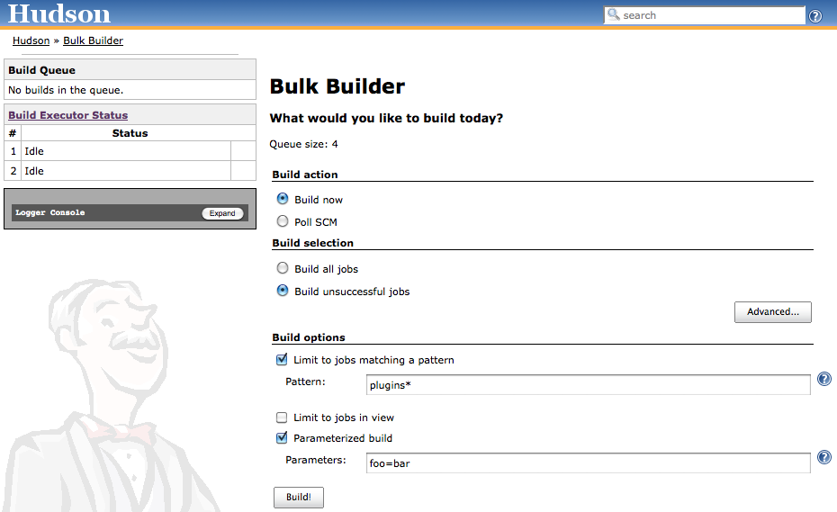

Trigger multiple builds with ease. Designed for users with many jobs.

[[BulkBuilderPlugin-Screenshot]]
== Screenshot

[.confluence-embedded-file-wrapper]##

[[BulkBuilderPlugin-Development]]
== Development

Offical
http://ci.jenkins-ci.org/view/Plugins/job/plugins_bulk-builder/[CI
Server] +
_Backstage_
https://swestcott.ci.cloudbees.com//job/Jenkins%20Bulk%20Builder/[CI
Server] (more stats available)

Both track the official repository at
http://github.com/jenkinsci/bulk-builder-plugin[github.com/jenkinsci/bulk-builder-plugin].

[[BulkBuilderPlugin-Bugs]]
=== Bugs

Please
http://issues.jenkins-ci.org/secure/CreateIssueDetails.jspa?pid=10172&issuetype=1&components=15774&priority=3[raise
an issue] for any bugs you find, and ensure the component is set to
_bulk-builder_. Please include details about your Jenkins setup and
plugin version number.

[[BulkBuilderPlugin-Integrationwithexternalsystems]]
=== Integration with external systems

Bulk builds can be easily triggered by external scripts or processes,

[source,syntaxhighlighter-pre]
----
curl -u username:password -X POST http://localhost:8080/bulkbuilder/build -d action=immediate_build -d build=all

curl -u username:password -X POST http://localhost:8080/bulkbuilder/build -d action=immediate_build -d build=failed

curl -u username:password -X POST http://localhost:8080/bulkbuilder/build -d action=immediate_build -d build=all -d pattern=*foo*
----

Patterns accepts wildcard
image:docs/images/star_yellow.svg[(star)] +
If any curl requests does not have the expected outcome it is
recommended to test by executing the plugin manually in Jenkins and then
check the browser log via the browser development mode. +
F.ex. in Chrome. Press F12 to enter dev mode. Select 'Preserve log' and
then select Network. After you push the Build button you can examine the
actual request sent by the bulk builder plugin.

[[BulkBuilderPlugin-Changelog]]
== Changelog

[[BulkBuilderPlugin-Version1.5(2012-04-04)]]
=== Version 1.5 (2012-04-04)

* Fixed regression whereby user supplied parameters were ignored
(https://issues.jenkins-ci.org/browse/JENKINS-12968[JENKINS-12968])

[[BulkBuilderPlugin-Version1.4(2011-11-14)]]
=== Version 1.4 (2011-11-14)

* Added support for bulk polling. This includes significant internal
refactoring of the plugin
(https://issues.jenkins-ci.org/browse/JENKINS-10930[JENKINS-10930])
* Allow wildcards in patterns
(https://issues.jenkins-ci.org/browse/JENKINS-11712[JENKINS-11712])

[[BulkBuilderPlugin-Version1.3(2011-09-04)]]
=== Version 1.3 (2011-09-04)

* Added ability to build all jobs by View
(https://issues.jenkins-ci.org/browse/JENKINS-8807[JENKINS-8807])

[[BulkBuilderPlugin-Version1.2(2011-06-22)]]
=== Version 1.2 (2011-06-22)

* Moved radio buttons introduced in 1.1 behind 'Advanced' button.

[[BulkBuilderPlugin-Version1.1(2011-06-20)]]
=== Version 1.1 (2011-06-20)

* Prevent bulk builder index.jelly automatically reloading (which wipes
out form changes not submitted)
* Added additional radio buttons to build unstable builds, aborted
builds, etc.

[[BulkBuilderPlugin-Version1.0(2011-05-13)]]
=== Version 1.0 (2011-05-13)

* Fixed NPE when initiating bulk builds via curl/external scripts
(https://issues.jenkins-ci.org/browse/JENKINS-8743[JENKINS-8743])

[[BulkBuilderPlugin-Version0.8(2011-03-23)]]
=== Version 0.8 (2011-03-23)

* Fixed form bug in Chrome/Safari
(https://issues.jenkins-ci.org/browse/JENKINS-9136[JENKINS-9136])
* Obey security policy
(https://issues.jenkins-ci.org/browse/JENKINS-8936[JENKINS-8936])
* Fixed NPE

[[BulkBuilderPlugin-Version0.7(2011-02-25)]]
=== Version 0.7 (2011-02-25)

* Add support for parameterised builds
(https://issues.jenkins-ci.org/browse/JENKINS-8456[JENKINS-8456])
* Small internal refactoring and content tweaks

[[BulkBuilderPlugin-Version0.6(2011-02-06)]]
=== Version 0.6 (2011-02-06)

* Create build/slave stats side bar
(https://issues.jenkins-ci.org/browse/JENKINS-8534[JENKINS-8534])
* License update
* Hudson > Jenkins migration

[[BulkBuilderPlugin-Version0.5(2010-12-09)]]
=== Version 0.5 (2010-12-09)

* Build pattern field auto-suggests previous patterns.

[[BulkBuilderPlugin-Version0.4(2010-11-17)]]
=== Version 0.4 (2010-11-17)

* Internationalised content. Translations are welcome!

[[BulkBuilderPlugin-Version0.3(2010-11-17)]]
=== Version 0.3 (2010-11-17)

* Added _"build jobs by pattern"_ feature
* Added licensing to source files
* Put more detail into pom file
* Refactored code to separate view/model logic

[[BulkBuilderPlugin-Version0.2.1(2010-11-04)]]
=== Version 0.2.1 (2010-11-04)

* Corrected package naming as per Hudson plugin docs

[[BulkBuilderPlugin-Version0.2(2010-11-04)]]
=== Version 0.2 (2010-11-04)

* Broken release (hey, I'm still new to the release process
image:docs/images/smile.svg[(smile)]
)

[[BulkBuilderPlugin-Version0.1(2010-10-01)]]
=== Version 0.1 (2010-10-01)

* Initial release
