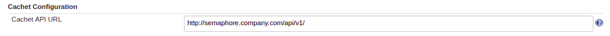
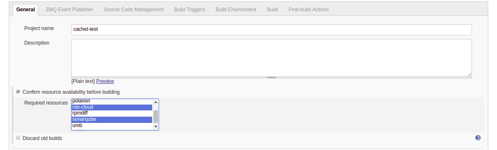
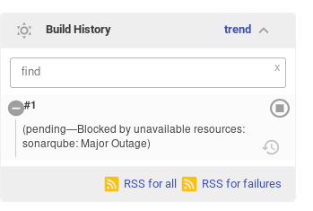

The Cachet Gate Plugin allows jobs to be gated based on Cachet resource
availability.

[[CachetGatePlugin-ChangeLog]]
== Change Log

[[CachetGatePlugin-Version1.0.6(Feb21,2019)]]
=== Version 1.0.6 (Feb 21, 2019) 

* Add missing Operational status to metrics. (#9)

[[CachetGatePlugin-SetUp]]
== Set Up

[[CachetGatePlugin-GlobalConfiguration]]
=== Global Configuration

Before the plugin may be used, you must configure the Cachet API URL in
the Jenkins global configuration:

[.confluence-embedded-file-wrapper .confluence-embedded-manual-size]##

[[CachetGatePlugin-init.groovy.dConfiguration]]
=== init.groovy.d Configuration

You can also specify the following snippet as a
https://wiki.jenkins.io/display/JENKINS/Groovy+Hook+Script[Groovy Hook
Script]

....
import com.redhat.jenkins.plugins.cachet.GlobalCachetConfiguration
import com.redhat.jenkins.plugins.cachet.ResourceUpdater

def cachetUrl = "https://status.example.com/api/v1/"
GlobalCachetConfiguration gcc = GlobalCachetConfiguration.get();
gcc.setCachetUrl(cachetUrl);
gcc.setIgnoreSSL(true);

ResourceUpdater.setResources();
....

 +

[[CachetGatePlugin-GatingJobs]]
== Gating Jobs

To gate jobs, in the job configuration check the box to confirm resource
availability before building and then select the required resource from
the list. Note that *all* selected resources must be available for the
job to run.

[.confluence-embedded-file-wrapper .confluence-embedded-manual-size]##

 +

Below is an example of a build that is blocked or gated:

 +

[.confluence-embedded-file-wrapper .confluence-embedded-manual-size]##

[[CachetGatePlugin-JobsetupusingJJB]]
== Job setup using JJB

From jenkins-job-builder 2.10.2 you can setup your jobs using JJB. Here
is an example snippet:

[source,syntaxhighlighter-pre]
----
properties:
      - cachet-gating:
          required-resources: true
          resources:
              - beaker
              - brew
----

 +

[[CachetGatePlugin-JobsetupusingJobDSL]]
== Job setup using Job DSL

You can also use the job dsl plugin to configure gating for your jobs.
Here is an example snippet:

[source,syntaxhighlighter-pre]
----
properties {
  cachetJobProperty {
    requiredResources(true)
    resources(["service1", "service2"])
  }
}
----

 +

[[CachetGatePlugin-Gatingmetrics]]
== Gating metrics

You can use the following snippet to gathering metrics once build has
started after being gated:

 +

[source,syntaxhighlighter-pre]
----
def metricsMap = cachetgatingmetrics()
if (metricsMap.size() > 0) {
  echo "Semaphore Required Resources Gating Metrics:"
} else {
  echo "This build was not gated by required resources not being available"
}

metricsMap.each{ k, v ->
       echo "- Resource name: ${k}"
       echo "- Status:        ${v.getGatingStatus()}"
       echo "- Elapsed time:  ${v.getGatedTimeElapsed()} ms"
       echo ""
}

----
