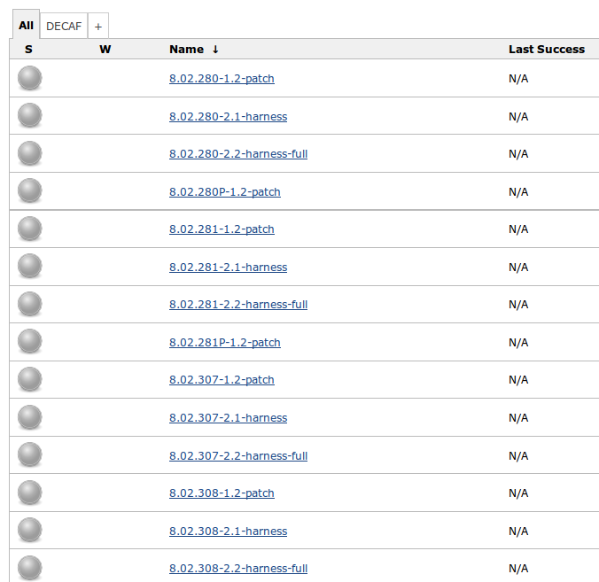
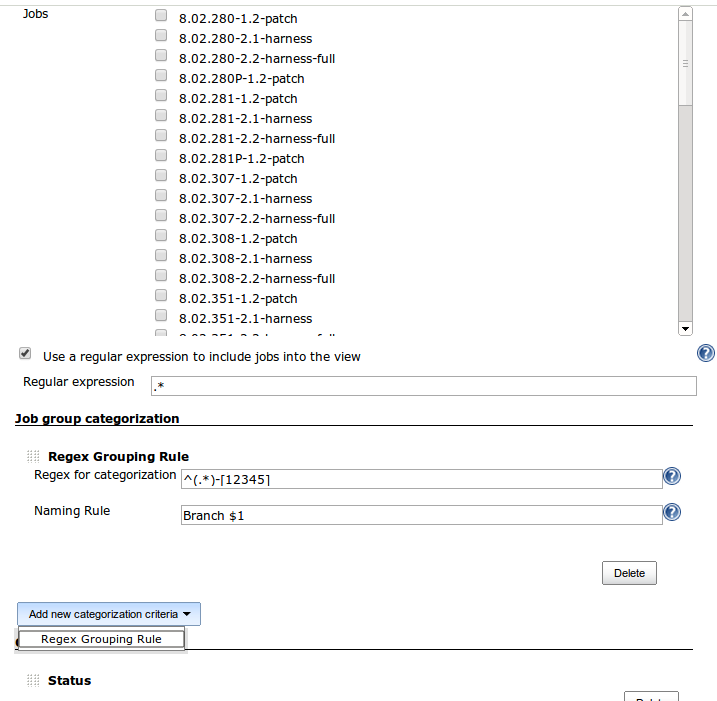
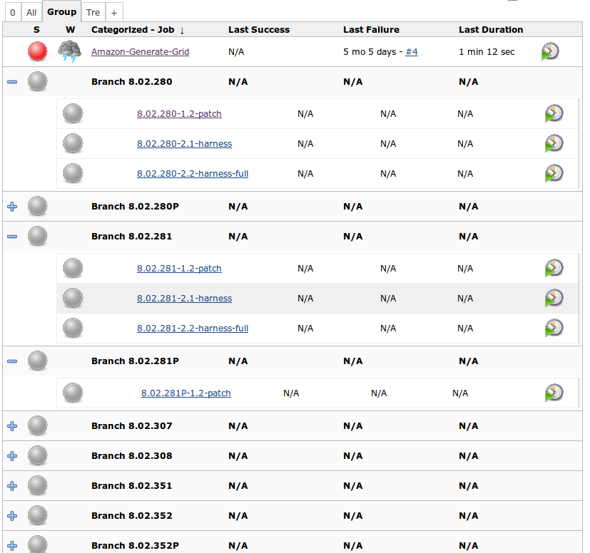

Introduce a new kind of view where you can categorize groups of jobs
under a single label created by regular expressions or other criterias
that can be implemented as extension points.

[[CategorizedJobsView-Description]]
== Description

This plugin allows you to create a new view that is very similar to the
standard Jenkins List Views, but where you can group jobs and categorize
them according +
to regular expressions. The functionality is better explained with
images.

Let's suppose you have several jobs with a common prefix, such as the
software version of a specific branch. The versions follow a pattern.
For example, this is the usual "All" view for the jobs:

[.confluence-embedded-file-wrapper]##

You start by creating a "Categorized Jobs View" from the view creation
button, and you will find the following new section (Job group
categorization):

[.confluence-embedded-file-wrapper]##

Besides de categorization configuration, all the other options apply
without any changes. After you create the view, the result will be the
following:

[.confluence-embedded-file-wrapper]##

That is, the jobs are now categorized under the labels derived from the
regular expression.

[[CategorizedJobsView-Usage]]
== Usage

To create the view, just follow the usual procedure to add new views and
you will find a new type of view named "Categorized Jobs View".

The configuration page has a new section, "Job group categorization".
You can add as many expressions as you want. For each expression, there
are two fields:

* Regex for categorization : regular expression to match job names that
will be part of this category
* Naming Rule : The name of the category. You can use $1 to use the
match to create the category name.

You are not forced to use complex regular expressions. Let's suppose you
just want to add some specific jobs to a given category. You can use the
following:

* Regex for categorization : ^Name of Job 1|Name of Job 2|...$
* Naming Rule : My Jobs

Just notice that I put ^ and $, which are regular expressions meta
symbols to match start and end of string. You have to put it to make
sure you won't get other jobs whose name contains the jobs listed above
(such as "foo Name of Job 1").

A few things to keep in mind:

* The groups are not mutually exclusive. It is possible for two distinct
groups to have a non empty intersection of jobs.
* If you create multiple rules that map to the same group, it will be a
single group. It won't create multiple groups with the same name (as
expected)

[[CategorizedJobsView-Changelog]]
== Changelog

[[CategorizedJobsView-Version1.10]]
=== Version 1.10

* Thanks to github's dcendents PR, the plugin has been fixed to be
compatible with pipeline jobs.

[[CategorizedJobsView-Version1.9]]
=== Version 1.9

After a long time, I'm finally releasing a new version with a couple of
changes

* It's now possible to choose whether the jobs should be grouped by
"Display Name" instead of their internal names
* You can specify a regex to exclude jobs from "status computing". That
is, if a job is broken, but its *actual name* (not display name) matches
the regex, it won't affect the group status.

[[CategorizedJobsView-Version1.8]]
=== Version 1.8

* [JENKINS-22624] Support Jenkins 1.532.1

[[CategorizedJobsView-Version1.7]]
=== Version 1.7

* [JENKINS-22585] When editing an existing categorized view, the plugin
wasn't showing jobs that have been previously checked and where grouped.

[[CategorizedJobsView-Version1.6]]
=== Version 1.6

* Botched.

[[CategorizedJobsView-Version1.5]]
=== Version 1.5

* JENKINS-22580 - Fixed a NPE that happened due jobs that had no builds
mixed with jobs that had.

[[CategorizedJobsView-Version1.4]]
=== Version 1.4

* Fixed a small glitch that would show up the hidden header borders on
firefox.

[[CategorizedJobsView-Version1.3]]
=== Version 1.3

* Just removed a sample extension that was released by accident.

[[CategorizedJobsView-Version1.2]]
=== Version 1.2

* Complete UI Revamp
* [JENKINS-22415] Category line now summarizes the columns result
columns, health status, last build success and failure and so on.
* [JENKINS-19466] Fixed the bug that caused the sorting break.
* [JENKINS-21343] Categorization rules are now extensible throught the 
"CategorizationCriteria" extension point
