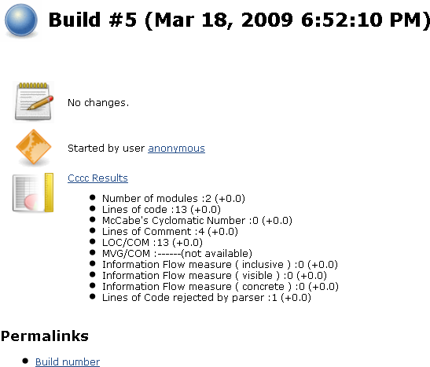
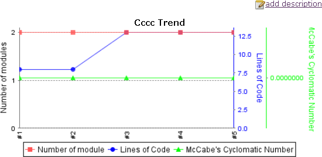

[.conf-macro .output-inline]#This plugin generates the trend report for
http://cccc.sourceforge.net/[CCCC] (C and C++ Code Counter).# +
CCCC is a tool which analyzes C++ and Java files and generates a report
on various metrics of the code. Metrics supported include lines of code,
McCabe's complexity and metrics proposed by Chidamber&Kemerer and
Henry&Kafura. +
 +

[[CCCCPlugin-ProjectConfiguration]]
== Project Configuration

 +
[.confluence-embedded-file-wrapper]## +

[[CCCCPlugin-Reporting]]
== Reporting

 +
[.confluence-embedded-file-wrapper]## +
[.confluence-embedded-file-wrapper]## +

[[CCCCPlugin-Other-Pmccabe]]
== Other - Pmccabe

Unfortunately, CCCC is an abandoned and unmaintained project.
http://parisc-linux.org/~bame/pmccabe/[Pmccabe] by contrast is a new and
maintained McCabe-style complexity evaluator and sloc counter. +
There is no Jenkins plugin at the moment but feel free to create it (I
can give you some input guidelines).

[[CCCCPlugin-Changelog]]
== Changelog

[[CCCCPlugin-Release0.6(November24.2011)]]
=== Release 0.6 (November 24. 2011)

* Fixed
https://issues.jenkins-ci.org/browse/JENKINS-10769[JENKINS-10769] -
NullPointerException on creating Cccc trend graph

[[CCCCPlugin-Release0.5(August13,2011)]]
=== Release 0.5 (August 13, 2011)

* Fixed
https://issues.jenkins-ci.org/browse/JENKINS-10584[JENKINS-10584] - CCCC
Plugin doesn't appear to run for failed builds

[[CCCCPlugin-Release0.4(May17,2011)]]
=== Release 0.4 (May 17, 2011)

* Fixed https://issues.jenkins-ci.org/browse/JENKINS-4584[JENKINS-4584]
- CCCC plugin fails on non-default root directory

[[CCCCPlugin-Release0.3(May09,2010)]]
=== Release 0.3 (May 09, 2010)

* Technical Upgrade to new Hudson API

[[CCCCPlugin-Release0.2(April15,2009)]]
=== Release 0.2 (April 15, 2009)

* Adding ability to run remote build

[[CCCCPlugin-Release0.1(April11,2009)]]
=== Release 0.1 (April 11, 2009)

* Initial release
