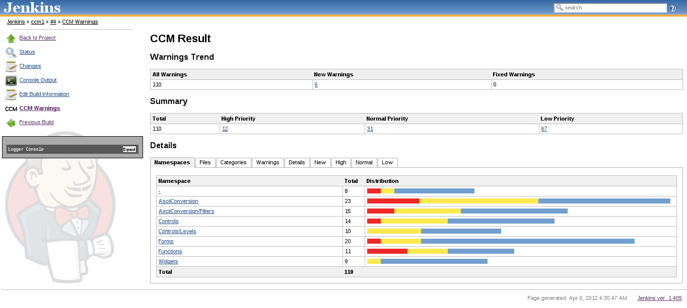

[.conf-macro .output-inline]##

[cols="",options="header",]
|===
|Plugin Information
|View CCM https://plugins.jenkins.io/ccm[on the plugin site] for more
information.
|===

[.aui-icon .aui-icon-small .aui-iconfont-info .confluence-information-macro-icon]##

Older versions of this plugin may not be safe to use. Please review the
following warnings before using an older version:

* https://jenkins.io/security/advisory/2018-02-05/[XML External Entity
(XXE) processing vulnerability]

This plug-in generates reports on cyclomatic complexity for .NET code.

Note

[.aui-icon .aui-icon-small .aui-iconfont-warning .confluence-information-macro-icon]#
#

This plug-in has been integrated into the warnings plug-in and is not
supported anymore.

[[CCMPlugin-Description]]
== Description

[.confluence-embedded-file-wrapper .confluence-embedded-manual-size]##

 This plug-in is supported by
the https://wiki.jenkins-ci.org/display/JENKINS/Analysis+Collector+Plugin[Static
Analysis Collector plug-in] that collects different analysis results and
shows the results in aggregated trend graphs. Additionally, health
reporting and build stability are also based on the aggregated results.

The http://www.blunck.se/ccm.html[CCM] plug-in scans for ccm.xml files
in the build workspace and reports the number of warnings found. 

The current release is available in
the http://maven.jenkins-ci.org/content/repositories/releases/org/jvnet/hudson/plugins/ccm[download
section]. This plug-in is developed and maintained by Ullrich Hafner.
Please use
the https://wiki.jenkins-ci.org/display/JENKINS/Mailing+Lists[mailing
lists] or http://issues.jenkins-ci.org/[issue tracker] to ask questions,
create feature request or bug reports, since I don't read the comment
section on this page regularly.

[[CCMPlugin-CompatibilityMatrix]]
=== Compatibility Matrix

[cols=",,,,,,",]
|===
|Plugin |1.0.x |1.1 |2.5 |2.6 |3.0 |3.0.1
|CCM |0.8+ |1.0.2+ |1.0.2+ |1.0.5+ |1.0.5+ |1.1.7 beta
|Jenkins |1.366+ |1.366+ |1.388+ |1.388+ |1.399+ |1.399+
|===

[[refresh-module-1783891977]]
[[refresh-1783891977]][[jira-issues-1783891977]]
Key

Summary

T

Created

Updated

Due

Assignee

Reporter

P

Status

Resolution

[.refresh-action-group]# #

[[refresh-issues-loading-1783891977]]
[.aui-icon .aui-icon-wait]#Loading...#

[#refresh-issues-button-1783891977]##
[#refresh-issues-link-1783891977]#Refresh#
[#error-message-1783891977 .error-message .hidden]# #

[[CCMPlugin-Sponsors]]
=== Sponsors

http://www.tupilabs.com/[[.confluence-embedded-file-wrapper .confluence-embedded-manual-size]#image:docs/images/logo1.png[image,width=300]#]

For commercial support, please get contact us
via https://twitter.com/tupilabs[@tupilabs]

[[CCMPlugin-ReleaseNotes]]
=== Release Notes

[[CCMPlugin-Release3.2]]
==== Release 3.2

. https://jenkins.io/security/advisory/2018-02-05/[Fix security issue]

[[CCMPlugin-Release3.1]]
==== Release 3.1

. Merged pull request #5 to add support to the Workflow Plug-in (Thanks
to @amunis)

[[CCMPlugin-Release3.0.2]]
==== Release 3.0.2

. Merged pull requests to add support for "graded" complexity reports.
Some tools also describe complexity with "grades", like A, B, C, D, E
and F. The plugin will now recognize grades and assign them priorities.
The mappings are as follows: A -> low, B -> normal, C, D, E and F ->
high priority.

[[CCMPlugin-Release3.0.1]]
==== Release 3.0.1

. Merged pull requests for start and end line in the reports

[[CCMPlugin-Release3.0]]
==== Release 3.0

. *Use of analysis-core API to refactor the old code and make it
compliant with standard static analysis plug-ins in Jenkins*
. *Instead of a builder plus a graph generator, now the plug-in is
simply a publisher. It means that the plug-in won't invoke CCM anymore.
You should use Windows batch commands, MSBuild or other build tools to
invoke CCM.*
. Due to the refactoring, the i18n for Portuguese and Spanish were lost.

[[CCMPlugin-Release2.5]]
==== Release 2.5

. Finished Portuguese translation
. Added Spanish language support
. BUG-8165 - Failed to load hudson.plugins.ccm.CCMBuilder at hudson
startup on hudson version 1.384 with current version of CCM plug-in
(thanks to +
abjoshi for reporting)
. BUG-8336 - When using CCM with a parameterized build, report
generation fails because the parameters are passed to ccm.exe and
treated as source folders (thanks to Iristyle for reporting)
. Created maven site

[[CCMPlugin-Release1.1]]
==== Release 1.1

. i18n. Now CCM supports English and Brazilian Portuguese.
. Rename class CCMBuilderDescription to CCMBuilderDescriptor to keep
source code following the standard of names found in many plug-ins code.
. Add help info for all options seen by the user (the ? blue icon)
. Allow the user to define the output file name. (Not implemented)
. Remove unused class files in source code.
. Let the user define multiple source folders instead of only one.
. Let the user define multiple exclusion filters (files, folders and
functions). According to CCM 1.0.2 configuration file.

[[CCMPlugin-Release1.0.1]]
==== Release 1.0.1

. BUG-7522 - The plugin wasn't ready to behave in distributed Hudson.
(thanks to svenborman for reporting and help testing)
. BUG-7531 - The execution command was compatible with Windows XP, Vista
and 7, however in Windows 2003 it needed double quotes added to work out
properly. (again thanks to svenborman for reporting and help testing)

[[CCMPlugin-Release1.0]]
==== Release 1.0

. First version of the plug-in (the development was guided based on the
source code of the following plug-ins: Violations, Tasks, Seleniumhq and
Sonar).

[[CCMPlugin-Roadmap]]
=== Roadmap

[[CCMPlugin-Version2.6]]
==== Version 2.6

. Use Area charts (like those that display test results in Jenkins for
TestNG and JUnit)

[[CCMPlugin-Opensourcelicensesdonatedforthisproject]]
=== Open source licenses donated for this project

http://stan4j.com/[[.confluence-embedded-file-wrapper]#image:docs/images/stan4j-88x31-o1.png[image]#]
