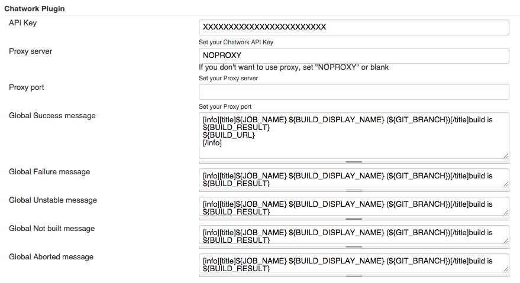
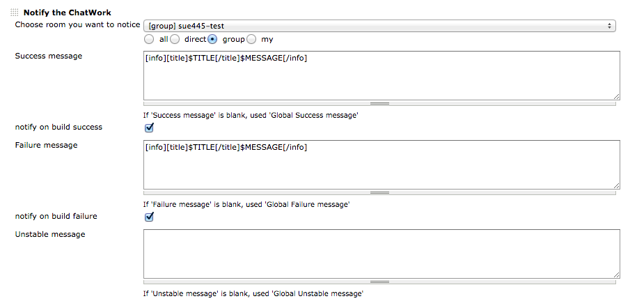

[[ChatWorkPlugin-Summary]]
== Summary

This Plugin will notify the ChatWork any message.

https://wiki.jenkins-ci.org/display/JENKINS/ChatWork+Plugin[[.confluence-embedded-file-wrapper]#image:http://sebastian-badge.info/plugins/chatwork.svg[image]#]
https://jenkins.ci.cloudbees.com/job/plugins/job/chatwork-plugin/[[.confluence-embedded-file-wrapper]#image:https://jenkins.ci.cloudbees.com/buildStatus/icon?job=plugins/chatwork-plugin[image]#]

[[ChatWorkPlugin-Tableofcontent]]
=== Table of content

[[ChatWorkPlugin-Usage]]
== Usage

[[ChatWorkPlugin-GlobalConfiguration]]
=== Global Configuration

[.confluence-embedded-file-wrapper]##

[[ChatWorkPlugin-JobConfiguration]]
=== Job Configuration

[.confluence-embedded-file-wrapper]##

* *Success message* , *Failure message* , *Unstable message* , *Not
built message* , *Aborted message*
** If message is empty, used Global message
** emoticon
** chatwork tags

* *Default message* is supported some variables.

example

* build variables (ex. _$JOB_NAME_ , _$BUILD_URL_ )
* environment variables (ex. _$PATH_ , _$JAVA_HOME_ )
* _$BUILD_RESULT_ (ex. _SUCCESS_, _FAILED_ )

[[ChatWorkPlugin-Changelog]]
== Changelog

Details
https://github.com/jenkinsci/chatwork-plugin/blob/master/CHANGELOG.md

[[ChatWorkPlugin-Version1.0.9(Sep14,2019)]]
=== Version 1.0.9 (Sep 14, 2019)

* [Security] Save apiKey to Secret field instead of String field
** Plain apiKey is automatically encrypted and stored when Global
Configuration saving

[[ChatWorkPlugin-Version1.0.8(Jan27,2017)]]
=== Version 1.0.8 (Jan 27, 2017)

* Update API version (v2)

[[ChatWorkPlugin-Version1.0.6(Dec1,2016)]]
=== Version 1.0.6 (Dec 1, 2016)

* Fix NullPointerException when contains canceled user

[[ChatWorkPlugin-Version1.0.5(Mar23,2016)]]
=== Version 1.0.5 (Mar 23, 2016)

* Sanitize special char in room name

[[ChatWorkPlugin-Version1.0.4(Nov11,2015)]]
=== Version 1.0.4 (Nov 11, 2015)

* Bugfix causing null value exception when received Github _payload_
json (neither PullRequest nor compare)

[[ChatWorkPlugin-Version1.0.3(Oct8,2015)]]
=== Version 1.0.3 (Oct 8, 2015)

* Bugfix multibyte garbled

[[ChatWorkPlugin-Version1.0.2(Sep25,2015)]]
=== Version 1.0.2 (Sep 25, 2015)

* Remove legacy help

[[ChatWorkPlugin-Version1.0.1(Sep25,2015)]]
=== Version 1.0.1 (Sep 25, 2015)

* Add room selection pulldown instead of textbox

[[ChatWorkPlugin-Version1.0.0(Mar8,2015)]]
=== Version 1.0.0 (Mar 8, 2015)

* Add build result pattern messages
* Add global messages

[[ChatWorkPlugin-NOTE]]
==== NOTE

*Default message* (below v0.6.2) is removed. If upgrade from v0.x to
1.0.0+, *Default message* is copied to *Success message*, *Failure
message*, *Unstable message*, *Not built message* and *Aborted message*

[[ChatWorkPlugin-Version0.6.2(Jan22,2015)]]
=== Version 0.6.2 (Jan 22, 2015)

* Support variable to room id

[[ChatWorkPlugin-Version0.6.1(Jan14,2015)]]
=== Version 0.6.1 (Jan 14, 2015)

* Bugfix: Failed to serialize
