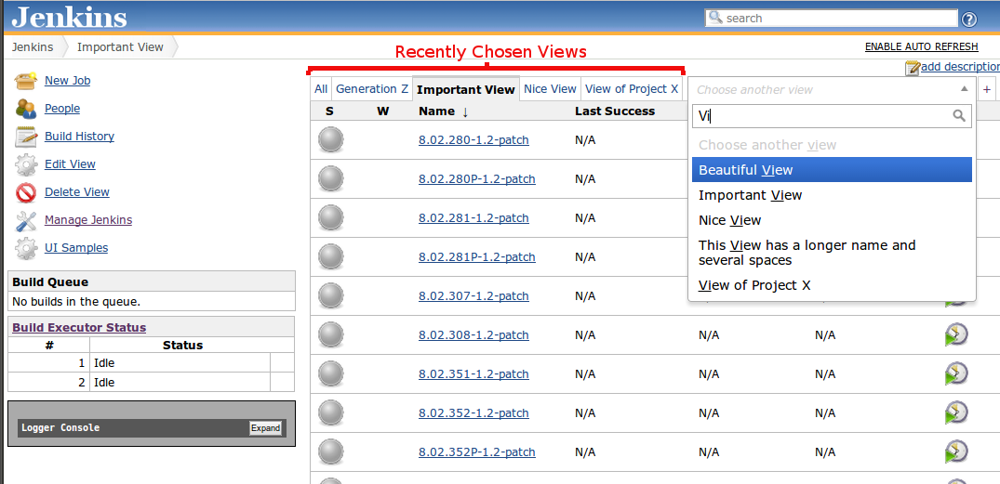
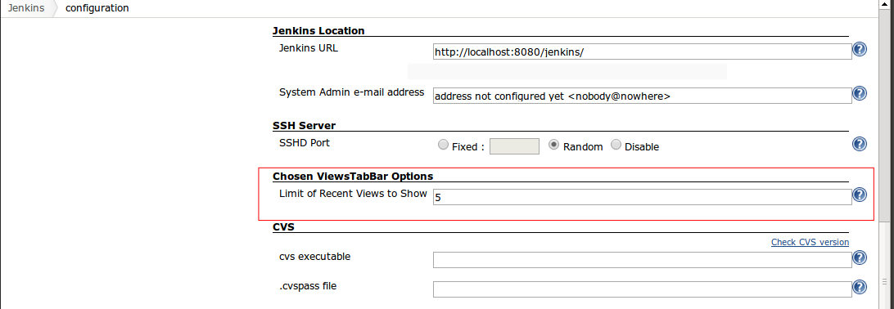

Do you have too many views in your Jenkins? Do you get the dreaded
horizontal scrolling? Then this plugin is for you!

[[ChosenViewsTabBar-Description]]
== Description

This plugin introduce a new _Views Tab Bar_ that display the views using
the excellent http://harvesthq.github.io/chosen/[Chosen Drop Down] to
choose the views and, additionally, keeps the most recent chosen views
to the left as tabs. +
This is a case where an image is worth more than a thousand words:
[.confluence-embedded-file-wrapper]## +
There are two parts in the above screenshot:

. The Recently Opened Views tabs, listing all views tha have been chosen
recently, up to 5 by default.
. A "Chosen" select box, which allows you to filter the view list by
typing any part of the view name.

Everytime a view is open in Jenkins, it will be "remembered" in the left
set of tabs. The amount of views to remember can be changed through the
global configurations:
[.confluence-embedded-file-wrapper]##

[[ChosenViewsTabBar-Changelog]]
== Changelog

[[ChosenViewsTabBar-Version1.2]]
=== Version 1.2

* Introducing the possibility to set up a hotkey to focus the dropdown
