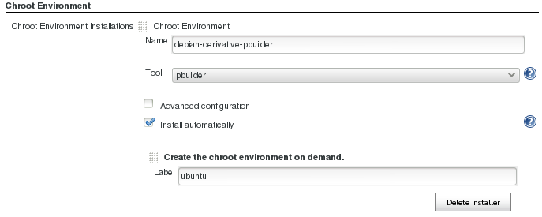
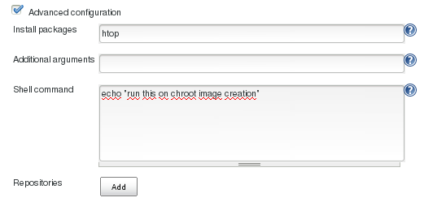
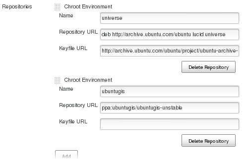
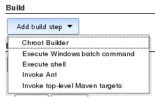
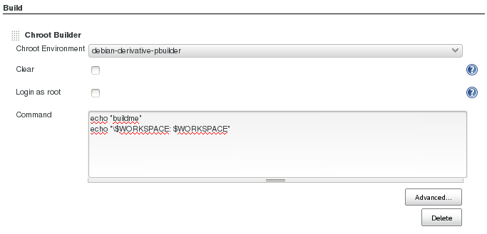
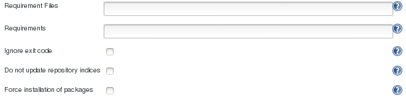
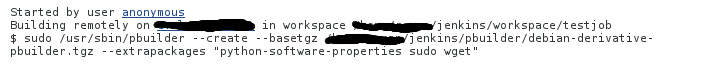
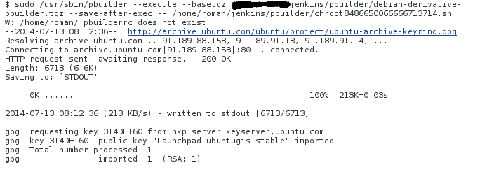
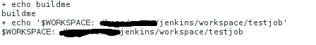

Support for disposable chroot environments (pbuilder), which can be very
useful for C and C++ projects

[[chrootPlugin-NodeSetup]]
== Node Setup

On every node, where you want to run the plugin, you have to

. install pbuiler:
+
[source,syntaxhighlighter-pre]
----
 apt-get install pbuilder 
----
. Allow jenkins to use _pbuilder:_
+
[source,syntaxhighlighter-pre]
----
jenkins_user ALL=(ALL) NOPASSWD: /usr/sbin/pbuilder
----

[[chrootPlugin-SetupaChrootEnvironment]]
== Setup a Chroot Environment

[[chrootPlugin-MinimalSetup]]
=== Minimal Setup

Create chroot environments in _Manage Jenkins_ > _Chroot Environments_:

[.confluence-embedded-file-wrapper]##

*Make sure that "Install Automatically" is selected, and is configured
to use the "Create the chroot environment on demand" installer!*

[[chrootPlugin-AdvancedSetup]]
=== Advanced Setup

[.confluence-embedded-file-wrapper]##

[[chrootPlugin-Addingrepositories]]
==== Adding repositories

You can add *ppa's* and standard repositories like *universe*. The
plugin distinguishes between the two types by the *Repository URL*
prefix. If it starts with _deb_, the repository is just added to
_/etc/apt/sources.list.d/_ and the key is imported. If the URL starts
with _ppa_, the repository is added via _add-apt-repository_ (no keyfile
is required).

[[chrootPlugin-Addingtheuniverserepository]]
===== Adding the universe repository

*Name*: universe

*Repository URL*: deb http://archive.ubuntu.com/ubuntu *DISTRO* universe

*Keyfile URL*:
http://archive.ubuntu.com/ubuntu/project/ubuntu-archive-keyring.gpg

Make sure to select the correct distro of the chroot environment. By
default a chroot environment similar to the host system where the node
is running is created.

In the screenshot at the end of this section i have used *lucid*.

[[chrootPlugin-Addingubuntugisppa]]
===== Adding ubuntugis ppa

*Name*: ubuntugis

*Repository URL*: ppa:ubuntugis/ubuntugis-unstable

The resulting repositories section should now look like this:

[.confluence-embedded-file-wrapper]##

[[chrootPlugin-UsingaChrootEnvironment]]
== Using a Chroot Environment

[[chrootPlugin-MinimalSetup.1]]
=== Minimal Setup

After you have configured a Chroot-Environment, it can be used in the
Chroot Buildstep in every job.

Make sure, that you restrict the job to nodes where pbuilder is
configured. +
[.confluence-embedded-file-wrapper]## +
Add a Chroot  Buildstep:

[.confluence-embedded-file-wrapper]## +
Select the chroot environment and add the build instructions:

[.confluence-embedded-file-wrapper]##

*Chroot Environment*: A list of the predefined chroot environments

*Clear*: The chroot environment (of the job) will be reset to the state
of the predefined environment before every build ( better
reproducability, slower build)

*Login as root*: The build comands will be run via the root unser inside
of the environment (*although it is inside the environment, be carefull
what you do!*)

*Command*: the build commands (uses bash per default)

*Note, that all the jenkins specific environment varaibles are
available!*

[[chrootPlugin-AdvancedConfiguration]]
=== Advanced Configuration

[.confluence-embedded-file-wrapper]##

*Requirement Files*: Files which contain package dependencies
(comparable to requirements.txt in the python world)

*Requirements*: Additional package dependencies, not listed in any
requirement file

*Ignore exit code*: The build will always succeed, no mather if the
build step fails or not.

*Do not update repository indices*: speeds up the build, but will not
fetch and install the newest versions of the packages

*Force installation of packages*: allows the installation of unsigned
packages (can be dangerous)

[[chrootPlugin-Runthejob]]
== Run the job

After configuring a new chroot instance it will be built along with the
first job which uses this environment. When launching the build, you
will encounter something like this:

[.confluence-embedded-file-wrapper]##

Here the two previously configured repositories (ubuntugis and universe)
are added:

[.confluence-embedded-file-wrapper]##

These steps are part of the initial creation of the environment, which
can take a few minutes. They are only excuted once, if you add a
completely new environment, or if you change the existing configuration
in the Jenkins System configuration.

This is what we actually wanted to do in the build (as stated before,
the $WORKSPACE variable was available inside the chroot environment):

[.confluence-embedded-file-wrapper]##

[[chrootPlugin-Roadmap]]
== Roadmap

* mock support is next

[[chrootPlugin-Changelog]]
== Changelog

[[chrootPlugin-Version0.1.4]]
=== Version 0.1.4

* add support for Ubuntu > 12.04
* better detection if the chroot binary is correctly set up for Jenkins
* correctly process additional chroot arguments with quotes

[[chrootPlugin-Version0.1.2]]
=== Version 0.1.2

* fixes a null pointer exception when building on a slave node
* uses 'local' copying of chroot image FilePaths, no more network
involved
* removes useless tarBall field from ChrootToolsetProperty
* detects aborted/failed chroot environment initializations

[[chrootPlugin-Version0.1.1]]
=== Version 0.1.1

* adding description and wiki page to pom

[[chrootPlugin-Version0.1]]
=== Version 0.1

* initial release
* pbuilder support (mock not usable at the moment)
