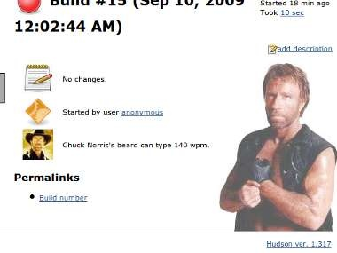
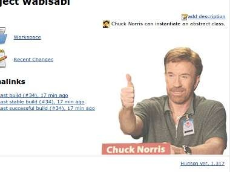
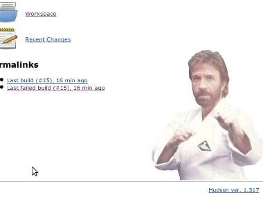

Displays a picture of Chuck Norris (instead of Jenkins the butler) and a
random Chuck Norris 'The Programmer' fact on each build page.

[[ChuckNorrisPlugin-Download&Installation]]
== Download & Installation

You can preferably install this plugin directly from the Plugins Update
Center, or if need be by downloading the
http://updates.jenkins-ci.org/latest/chucknorris.hpi[latest .hpi] and
install it from the Manage Plugins menu.

[[ChuckNorrisPlugin-Usage]]
== Usage

. After installing the plugin, go to job configuration page, a checkbox
with the text 'Activate ChuckNorris' should appear.
. Tick the checkbox and save the configuration. For freestyle job, Chuck
Norris image (along with a random quote) will appear on the job page.
. Run a build. After it's completed, Chuck Norris image (and the random
quote) should also appear on the build page. This is applicable for both
freestyle and Maven jobs.

[[ChuckNorrisPlugin-Screenshots]]
== Screenshots

[.confluence-embedded-file-wrapper]## +
[.confluence-embedded-file-wrapper]## +
[.confluence-embedded-file-wrapper]##

[[ChuckNorrisPlugin-FAQ]]
== FAQ

*Q:* I'm getting NonExistentFieldException in Hudson log file, how to
fix this problem? +
hudson.util.RobustReflectionConverter doUnmarshal +
WARNING: Skipping a non-existent field fact +
com.thoughtworks.xstream.converters.reflection.NonExistentFieldException:
No such field hudson.plugins.chucknorris.RoundhouseAction.fact +
*A:* Upgrade to ChuckNorris Plugin 0.4 or newer. That should get rid of
the exception message.

[[ChuckNorrisPlugin-Testimonials]]
== Testimonials

* Uncle Bob Martin said ChuckNorris Plugin
http://twitter.com/unclebobmartin/statuses/10741488856[is _very_
motivating] .
* Fabrizio Giudici said
http://weblogs.java.net/blog/fabriziogiudici/archive/2009/10/29/kick-your-bugs-ass[Kick
your bugs in the ass!]
* John Ferguson Smart mentioned ChuckNorris Plugin in
http://weblogs.java.net/blog/johnsmart/archive/2009/10/06/kickass-hudson-plugins-part-1-setenv-and-description-setter[Kickass
Hudson Plugins]

[[ChuckNorrisPlugin-Credits]]
== Credits

http://www.codesqueeze.com/the-ultimate-top-25-chuck-norris-the-programmer-jokes[Chuck
Norris 'The Programmer' facts] and
http://wiki.jenkins-ci.org/display/HUDSON/Emotional+Hudson+Plugin[Emotional
Hudson Plugin].
