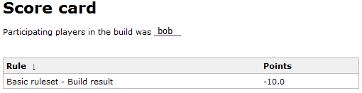
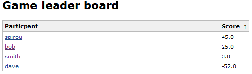

This plugin introduces a game where users gets point on improving the
builds.The plugin is a simple proof of concept of the Build game that
was created by
http://clintshank.javadevelopersjournal.com/ci_build_game.htm[Clint
Shank]. The idea behind the game is to decrease the number of times a
build becomes broken. To win the game the developers have to commit code
that is compiling and keep adding unit tests.

[[TheContinuousIntegrationGameplugin-Usage]]
== Usage

[[TheContinuousIntegrationGameplugin-Configuration]]
=== Configuration

Version requirements

[.aui-icon .aui-icon-small .aui-iconfont-warning .confluence-information-macro-icon]#
#

Note that the plugin version 1.13+ requires Hudson 1.320 to work and the
following plugin versions:

* Checkstyle 3.1
* Findbugs 4.0
* PMD 3.1
* Tasks 4.0
* Warnings 3.0
* Violations 0.5.4
* analysis-core 1.0

The plugin is not activated for all jobs at start, each separate job has
to activate the game. The game can also be de-activated in one job if
some large merge activity is going to take place. To activate the game
for a job, go to the job configuration page, click "Add post-build
action" and select "_Continuous integration game_" from the list of
available post-build actions.

[[TheContinuousIntegrationGameplugin-Buildscorecard]]
=== Build score card

For each build the game calculates, according to the rules, the number
of points that it is worth. Each user that is responsible for the build
(ie comitters) receives the points. +
[.confluence-embedded-file-wrapper .image-center-wrapper]## +

Clicking on the link shows what rules that were involved in the point
calculation. +
[.confluence-embedded-file-wrapper .image-center-wrapper]## +

[[TheContinuousIntegrationGameplugin-Leaderboard]]
=== Leader board

To see who is winning the build game, there is a leader board that is
shown on the front page. +
[.confluence-embedded-file-wrapper .image-center-wrapper]## +

[[TheContinuousIntegrationGameplugin-Rules]]
== Rules

The rules of the game are:

* -10 points for breaking a build
* 0 points for breaking a build that already was broken
* +1 points for doing a build with no failures (unstable builds gives no
points)
* -1 points for each new test failures
* +1 points for each new test that passes

Rules that depend on other plugins:

* https://wiki.jenkins-ci.org/display/JENKINS/PMD+Plugin[PMD Plugin].
Adding/removing a HIGH priority warning = -5/+5. Adding/removing a
MEDIUM priority warning = -3/+3. Adding/removing a LOW priority warning
= -1/+1.
* https://wiki.jenkins-ci.org/display/JENKINS/Task+Scanner+Plugin[Task
Scanner Plugin]. Adding/removing a HIGH priority task = -5/+5.
Adding/removing a MEDIUM priority task = -3/+3. Adding/removing a LOW
priority task = -1/+1
* https://wiki.jenkins-ci.org/display/JENKINS/Violations+Plugin[Violations
Plugin]. Adding/removing a violation = -1/+1. Adding/removing a
duplication violation = -5/+5.
* https://wiki.jenkins-ci.org/display/JENKINS/FindBugs+Plugin[Findbugs
Plugin]. Adding/removing a HIGH priority findbugs warning = -5/+5.
Adding/removing a MEDIUM priority findbugs warning = -3/+3.
Adding/removing a LOW priority findbugs warning = -1/+1
* https://wiki.jenkins-ci.org/display/JENKINS/Warnings+Plugin[Warnings
Plugin]. Adding/removing a compiler warning = -1/+1.
* https://wiki.jenkins-ci.org/display/JENKINS/Checkstyle+Plugin[Checkstyle
Plugin]. Adding/removing a checkstyle warning = -1/+1.

[[TheContinuousIntegrationGameplugin-Addingrulestothegame]]
=== Adding rules to the game

Currently there are three ways to add rules to the game.

[[TheContinuousIntegrationGameplugin-Patch]]
==== Patch

Send me a patch for the rule implementation, and I can include it in the
main game plugin.

[[TheContinuousIntegrationGameplugin-Includingrulesinanotherplugin]]
==== Including rules in another plugin

You are a maintainer of a plugin and would like to add rules to the game
with data from your plugin. To do this you should declare the game
plugin as an
https://wiki.jenkins-ci.org/display/JENKINS/Dependencies+among+plugins#Dependenciesamongplugins-Optionaldependencies[optional
dependency] to your plugin. To create rules implement the interface
*Rule*, and group them together in a *RuleSet*. To add a *RuleSet* to
the game, add it to the game's *RuleBook*.

[source,syntaxhighlighter-pre]
----
hudson.plugins.cigame.PluginImpl.GAME_PUBLISHER_DESCRIPTOR.getRuleBook().addRuleSet(pluginruleset);
----

If there are already rules for your plugin in the game plugin, let me
know so they can be removed from the plugin.

[[TheContinuousIntegrationGameplugin-Includerulesinathirdplugin]]
==== Include rules in a third plugin

You would like to add rules to the game that are only valid for your
organization and do not want to share them. To do this you should
declare the game plugin as a
https://wiki.jenkins-ci.org/display/JENKINS/Dependencies+among+plugins#Dependenciesamongplugins-Mandatorydependencies[mandatory
dependency] to your plugin. Then implement the *Rule* and add them to
the *RuleBook* as in above point.

[[TheContinuousIntegrationGameplugin-Changelog]]
== Changelog

[[TheContinuousIntegrationGameplugin-Version1.26(2016-10-21)compatibilitywithDSLs(pull-19)]]
=== Version 1.26 (2016-10-21)compatibility with DSLs (pull-19)

[[TheContinuousIntegrationGameplugin-Version1.26(2016-10-21)]]
=== Version 1.26 (2016-10-21)

* compatibility with
DSLs (https://github.com/jenkinsci/ci-game-plugin/pull/19[pull-19])

[[TheContinuousIntegrationGameplugin-Version1.25(2016-06-30)]]
=== Version 1.25 (2016-06-30)

* Support for jacoco coverage
(https://github.com/jenkinsci/ci-game-plugin/pull/16[pull-16])

[[TheContinuousIntegrationGameplugin-Version1.24(2016-03-12)]]
=== Version 1.24 (2016-03-12)

* Support for maven findbugs scores
(https://github.com/jenkinsci/ci-game-plugin/pull/18[pull-18])

[[TheContinuousIntegrationGameplugin-Version1.23(2015-11-08)]]
=== Version 1.23 (2015-11-08)

* Prevent user to edit score value
(https://github.com/jenkinsci/ci-game-plugin/pull/17[pull-17])

[[TheContinuousIntegrationGameplugin-Version1.22(2015-08-21)]]
=== Version 1.22 (2015-08-21)

* Expose leaderboard via API
(https://github.com/jenkinsci/ci-game-plugin/pull/9[pull-9])

[[TheContinuousIntegrationGameplugin-Version1.21(2015-02-17)]]
=== Version 1.21 (2015-02-17)

* Adapt to API changes introduced in Jenkins core, bump version
dependencies (https://issues.jenkins-ci.org/browse/JENKINS-24478[issue
#24478])

[[TheContinuousIntegrationGameplugin-Version1.20(2014-07-19)]]
=== Version 1.20 (2014-07-19)

* Remember history per user where most recent awarded points are coming
from (https://github.com/jenkinsci/ci-game-plugin/pull/7[pull-7])
* Correct help link for case insensitive setting
(https://issues.jenkins-ci.org/browse/JENKINS-20125[issue #20125])
* Configurable points to be awarded for matching rules
(https://issues.jenkins-ci.org/browse/JENKINS-6446[issue #6446]) 
* leaderboard shows a sortable position number
(https://github.com/jenkinsci/ci-game-plugin/pull/12[pull-12])

[[TheContinuousIntegrationGameplugin-Version1.19(2012-09-17)]]
=== Version 1.19 (2012-09-17)

* Prevent XSS in user name
(https://issues.jenkins-ci.org/browse/JENKINS-14309[JENKINS-14309])
* authenticated users can modify their own scores
(https://issues.jenkins-ci.org/browse/JENKINS-3575[JENKINS-3575])
* CI game fails with NPE
(https://issues.jenkins-ci.org/browse/JENKINS-11041[JENKINS-11041])
* Added support for Markup Formatter in the LeaderBoard for displaying
the user's description
(https://github.com/jenkinsci/ci-game-plugin/pull/2[pull-2])

[[TheContinuousIntegrationGameplugin-Version1.18(2011-02-18)]]
=== Version 1.18 (2011-02-18)

* added support for incremental Maven builds (not yet implemented for
the PMD and the Violations rule)

[[TheContinuousIntegrationGameplugin-Version1.17]]
=== Version 1.17

* Added stylecop warnings for the violations plugin
http://issues.jenkins-ci.org/browse/JENKINS-4847[JENKINS-4847]

[[TheContinuousIntegrationGameplugin-Version1.16]]
=== Version 1.16

* Fix issue with last analysis plugins
http://issues.jenkins-ci.org/browse/JENKINS-5022[JENKINS-5022]

[[TheContinuousIntegrationGameplugin-Version1.15]]
=== Version 1.15

* Fixed a bug where a player that exists in several SCM log entries
would receive points for each entry.
(https://issues.jenkins-ci.org/browse/JENKINS-4470[JENKINS-4470])

[[TheContinuousIntegrationGameplugin-Version1.14]]
=== Version 1.14

* Fixed so skip unit tests are ignored.
(https://issues.jenkins-ci.org/browse/JENKINS-4449[JENKINS-4449])

[[TheContinuousIntegrationGameplugin-Version1.13RequiresHudson1.320orlater]]
=== Version 1.13 _Requires Hudson 1.320 or later_

* Fixed so no points are awarded for a build if previous build reports
has an error.
(https://issues.jenkins-ci.org/browse/JENKINS-4391[JENKINS-4391])
* Hopefully fixed the NPE in the Violations plugin.
(https://issues.jenkins-ci.org/browse/JENKINS-3726[JENKINS-3726])
* Added feature to handle user names case insensitive.
(https://issues.jenkins-ci.org/browse/JENKINS-3990[JENKINS-3990])
* Fixed 404 when clicking on Leaderboard in any view but the main view
(https://issues.jenkins-ci.org/browse/JENKINS-3604[JENKINS-3604])
* Added localisation support. So if you want help out, please check the
https://wiki.jenkins-ci.org/display/JENKINS/Internationalization[Internationalization]
page. (https://issues.jenkins-ci.org/browse/JENKINS-3484[JENKINS-3484])

[[TheContinuousIntegrationGameplugin-Version1.12]]
=== Version 1.12

* Added a description column in the leader board
(https://issues.jenkins-ci.org/browse/JENKINS-4141[JENKINS-4141])
* Fixed most rules so the person who fixes a broken build doesnt get any
penalties or rewards for it. The person will still get the points for
fixing the build.
(https://issues.jenkins-ci.org/browse/JENKINS-2592[JENKINS-2592])

[[TheContinuousIntegrationGameplugin-Version1.11]]
=== Version 1.11

* Fixed so points are added or subtracted for test cases when run in a
maven job
(https://issues.jenkins-ci.org/browse/JENKINS-2542[JENKINS-2542])

[[TheContinuousIntegrationGameplugin-Version1.7]]
=== Version 1.7

* Fixed NoSuchMethod exception when using newer versions of Warnings and
Checkstyle plugins
(https://issues.jenkins-ci.org/browse/JENKINS-2169[JENKINS-2169],
https://issues.jenkins-ci.org/browse/JENKINS-2218[JENKINS-2218])

[[TheContinuousIntegrationGameplugin-Version1.6]]
=== Version 1.6

* Points are no longer awarded for violations and checkstyle 'fixes'
when the is build is broken
(https://issues.jenkins-ci.org/browse/JENKINS-1884[JENKINS-1884])

[[TheContinuousIntegrationGameplugin-Version1.5]]
=== Version 1.5

* Warnings, FindBugs, PMD, Open tasks, Checkstyle rules no longer throws
exception when it is used for the first time
(https://issues.jenkins-ci.org/browse/JENKINS-1810[JENKINS-1810])
* Anonymous users no longer see the "Reset scores" link next to the
leader board
(https://issues.jenkins-ci.org/browse/JENKINS-1837[JENKINS-1837])

[[TheContinuousIntegrationGameplugin-Version1.4]]
=== Version 1.4

* Added option to exclude users from the game
(https://issues.jenkins-ci.org/browse/JENKINS-1608[JENKINS-1608])
* Added option for Administrators to change the score of each user
(https://issues.jenkins-ci.org/browse/JENKINS-1608[JENKINS-1608])
* Now it is possible for Administrators (or everyone if no there is no
security) to reset all scores
(https://issues.jenkins-ci.org/browse/JENKINS-1754[JENKINS-1754])

[[TheContinuousIntegrationGameplugin-Version1.3]]
=== Version 1.3

* Using Violations plugin 0.6.0 no longer throws an exception
(https://issues.jenkins-ci.org/browse/JENKINS-1755[JENKINS-1755])

[[TheContinuousIntegrationGameplugin-Version1.2RequiresHudson1.211orlater]]
=== Version 1.2 _Requires Hudson 1.211 or later_

* Fixed that points are given for each added/failed unit test
(https://issues.jenkins-ci.org/browse/JENKINS-1721[JENKINS-1721])
* Added rules for the
https://wiki.jenkins-ci.org/display/JENKINS/PMD+Plugin[PMD Plugin].
Adding/removing a HIGH priority warning = -5/+5. Adding/removing a
MEDIUM priority warning = -3/+3. Adding/removing a LOW priority warning
= -1/+1.
* Added rules for the
https://wiki.jenkins-ci.org/display/JENKINS/Task+Scanner+Plugin[Task
Scanner Plugin]. Adding/removing a HIGH priority task = -5/+5.
Adding/removing a MEDIUM priority task = -3/+3. Adding/removing a LOW
priority task = -1/+1
* Added rules for the
https://wiki.jenkins-ci.org/display/JENKINS/Violations+Plugin[Violations
Plugin]. Adding/removing a violation = -1/+1. Adding/removing a
duplication violation = +5/-5.
* Added rules for the
https://wiki.jenkins-ci.org/display/JENKINS/FindBugs+Plugin[Findbugs
Plugin]. Adding/removing a HIGH priority findbugs warning = -5/+5.
Adding/removing a MEDIUM priority findbugs warning = -3/+3.
Adding/removing a LOW priority findbugs warning = -1/+1
(https://issues.jenkins-ci.org/browse/JENKINS-1743[JENKINS-1743])
* https://wiki.jenkins-ci.org/display/JENKINS/Warnings+Plugin[Warnings
Plugin]. Adding/removing a compiler warning = -1/+1.
* https://wiki.jenkins-ci.org/display/JENKINS/Checkstyle+Plugin[Checkstyle
Plugin]. Adding/removing a checkstyle warning = -1/+1.

[[TheContinuousIntegrationGameplugin-Version1.1]]
=== Version 1.1

* Fixed that no points are given out when a build goes from failed to
unstable

[[TheContinuousIntegrationGameplugin-Version1.0]]
=== Version 1.0

* Initial version with hard coded rules
