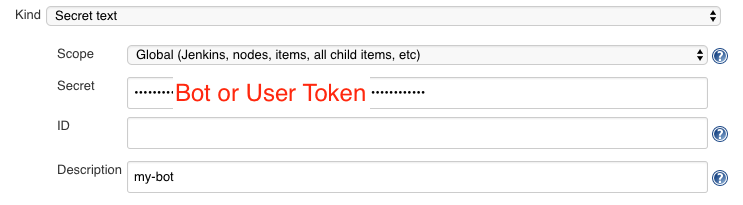
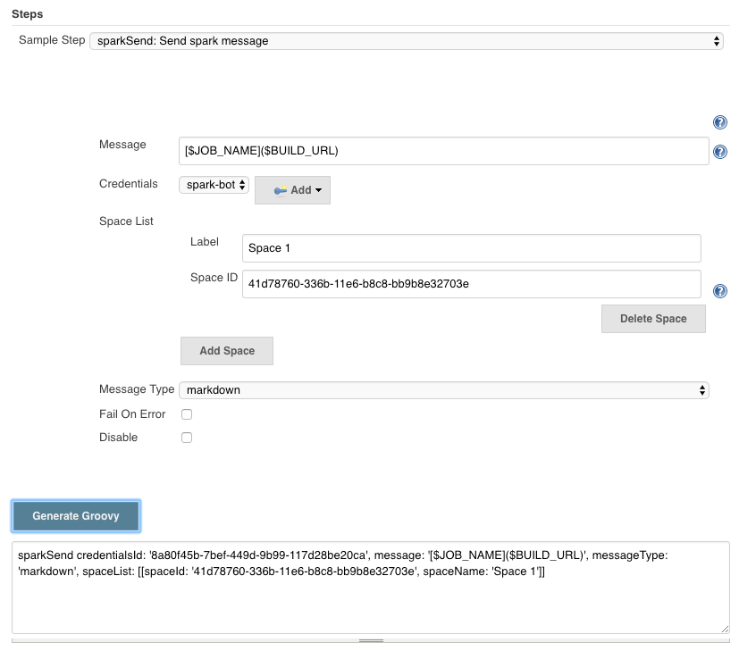
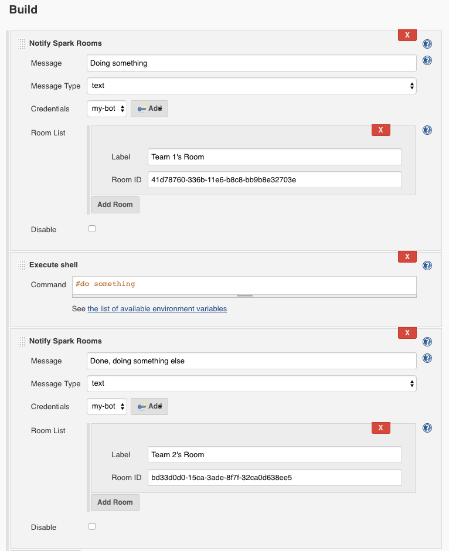
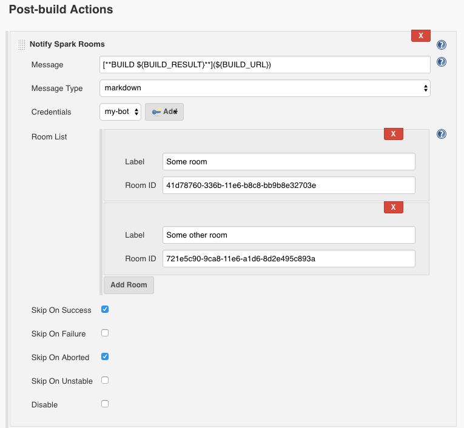

[.conf-macro .output-inline]#Enables Jenkins to notify
https://web.ciscospark.com/[Cisco Spark] Spaces from build, post-build
and pipeline steps#

 

A comprehensive tutorial for using the plugin
exists https://jlestrada.github.io/pages/CiscoSpark/[here] courtesy
of https://jlestrada.github.io/[jlestrada]

Messages can be formatted as plain text, markdown or html (with
limitations)

Click the help icon next to the Message field to see commonly available
environment variables

[[SparkNotifierPlugin-CredentialSetup]]
== *Credential Setup*

. Obtain a bot token (valid for 100 years) from
the https://developer.ciscospark.com/add-bot.html[developer site], or
use your own personal token (not recommended)
. The Bot or User *must* be invited to the Spark Space to send messages
from Jenkins
. Configure a new "String text" credential either globally or within a
folder

[.confluence-embedded-file-wrapper]##

[[SparkNotifierPlugin-PipelineStepExample]]
== *Pipeline Step Example*

You can use the Pipeline Syntax generator to configure the spark message
DSL syntax

[.confluence-embedded-file-wrapper]##

[[SparkNotifierPlugin-BuildStepsExample]]
== *Build Steps Example*

[.confluence-embedded-file-wrapper]##

[[SparkNotifierPlugin-Post-BuildStepExamplewithFormattingandEnvironmentVariables]]
== *Post-Build Step Example with Formatting and Environment Variables *

[.confluence-embedded-file-wrapper]## 

[.confluence-embedded-file-wrapper]##

[[SparkNotifierPlugin-Noteregardingenvironmentvariables:]]
== Note regarding environment variables:

Accepted formats are:

* $\{VARIABLE}
* $VARIABLE
* $\{env.VARIABLE}

Click the help icon next to the message field to see default environment
variables available to use. All parameterized variables to a build are
also available to use.

To use custom variables in build/post-build steps, you need to inject
the variables into the build using Environment Injector Plugin,
Credentials Binding plugin etc.

To use custom variables in pipeline steps, your sparkSend DSL must
reside inside a withEnv, withCredentials etc.

[[SparkNotifierPlugin-Changelog]]
== https://github.com/jenkinsci/docker-plugin/blob/master/CHANGELOG.md[Changelog]

See https://github.com/jenkinsci/cisco-spark-notifier-plugin/blob/master/CHANGELOG.md
