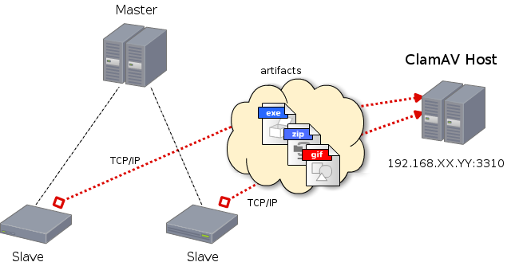
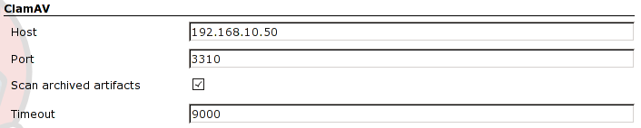
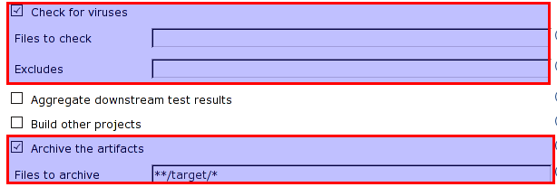
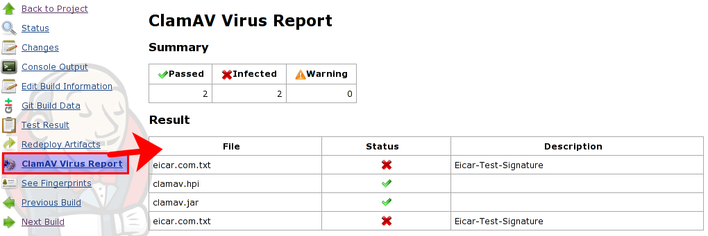

[[ClamAVPlugin-Overview]]
== Overview

This plugin allows you to check the artifacts with
http://www.clamav.net/lang/en/[ClamAV], which is an open source (GPL)
antivirus engine designed for detecting Trojans, viruses, malware and
other malicious threats.

 +

[.confluence-embedded-file-wrapper .image-center-wrapper]## +

The artifacts are sent to ClamAV Host and are scaned. So you have to
configure your ClamAV to enable TCP port in clamd.conf as follows.

*clamd.conf*

[source,syntaxhighlighter-pre]
----
:
# TCP port address.
# Default: no
TCPSocket 3310

# TCP address.
# By default we bind to INADDR_ANY, probably not wise.
# Enable the following to provide some degree of protection
# from the outside world.
# Default: no
#TCPAddr 127.0.0.1

# Close the connection when the data size limit is exceeded.
# The value should match your MTA's limit for a maximum attachment size.
# Default: 25M
StreamMaxLength 100M

:
----

Be Careful

[.aui-icon .aui-icon-small .aui-iconfont-warning .confluence-information-macro-icon]#
#

If you get "Broken Pipe", check "StreammaxLength" parameter.

[[ClamAVPlugin-Systemconfiguration]]
== System configuration

 +

[.confluence-embedded-file-wrapper .image-center-wrapper]##

When "Scan arhived artifacts" checkbox is selected, the artifacts of job
will be scaned if "Archive the artifacts" option is configured in job
configuration page.

[[ClamAVPlugin-JobConfiguration]]
== Job Configuration

 +

[.confluence-embedded-file-wrapper .image-center-wrapper]## +
 +

[.aui-icon .aui-icon-small .aui-iconfont-warning .confluence-information-macro-icon]#
#

To scan a workspace, you may specify "Files to check" option such as
"**/*". But it will take a long time. +
you may specify "Excludes" such as ".git/**/*".

 +

[[ClamAVPlugin-JobpageandVirusreportpage]]
== Job page and Virus report page

 +

[.confluence-embedded-file-wrapper .image-center-wrapper]## +

[.confluence-embedded-file-wrapper .image-center-wrapper]##

[[ClamAVPlugin-TODO]]
== TODO

* add BuildStep to check files.

[[ClamAVPlugin-History]]
== History

[[ClamAVPlugin-0.3(11May,2015)]]
=== 0.3 (11 May, 2015)

* ensure file is closed.
(https://issues.jenkins-ci.org/browse/JENKINS-27954[JENKINS-27954]).
* skipping of PASSED in console (http://jenkins-ci.org/pull/1[pull
request 1]).

[[ClamAVPlugin-0.2(16Oct,2011)]]
=== 0.2 (16 Oct, 2011)

* validate "includes" option, which should be mandatory if "Scan
archived artifacts" option is not checked.
* honor "Scan archived artifacts" option.
* show full path in the virus check list.

[[ClamAVPlugin-0.1.1(26Jun,2011)]]
=== 0.1.1 (26 Jun, 2011)

* failed to check artifacts due to ArrayIndexexception
(https://issues.jenkins-ci.org/browse/JENKINS-10103[JENKINS-10103]).
* timeout should be longer.
* added the help file of timeout.

[[ClamAVPlugin-0.1(26Jun,2011)]]
=== 0.1 (26 Jun, 2011)

* First release.
