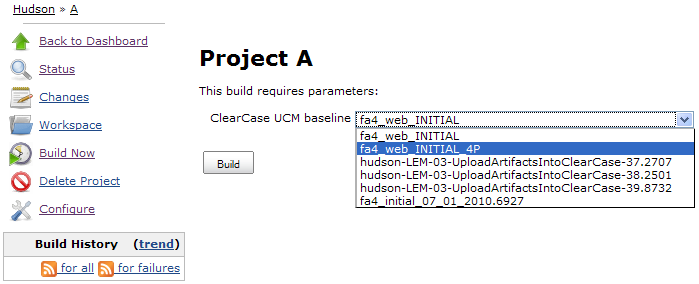
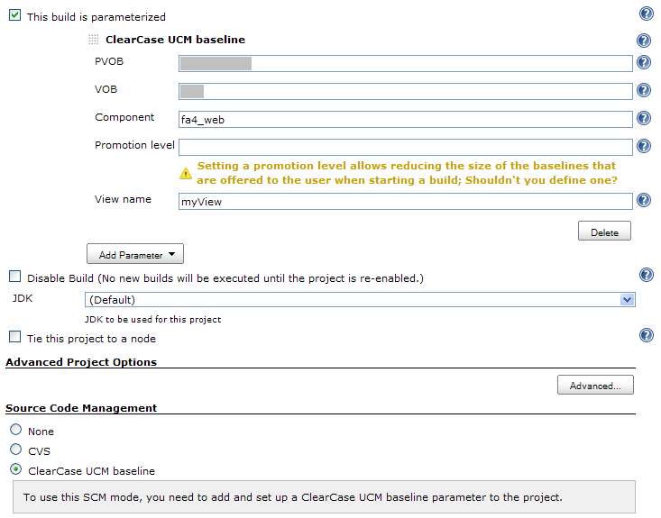

Allows using ClearCase UCM baselines as the input of builds: When using
this SCM, users will be asked at build-time to select the baseline on
which the job has to work.

[.aui-icon .aui-icon-small .aui-iconfont-error .confluence-information-macro-icon]#
#

To use this plugin, you need to install the
https://wiki.jenkins-ci.org/display/JENKINS/ClearCase+Plugin[ClearCase
Plugin] since it relies on it (more precisely, the global configuration
data is shared between the two plugins):

[width="100%",cols="20%,20%,20%,20%,20%",]
|===
| 
|https://wiki.jenkins-ci.org/display/JENKINS/ClearCase+Plugin[ClearCase
Plugin] +
1.0.x
|https://wiki.jenkins-ci.org/display/JENKINS/ClearCase+Plugin[ClearCase
Plugin] +
1.1.x
|https://wiki.jenkins-ci.org/display/JENKINS/ClearCase+Plugin[ClearCase
Plugin] +
1.2.x
|https://wiki.jenkins-ci.org/display/JENKINS/ClearCase+Plugin[ClearCase
Plugin] +
1.3.x

|ClearCase UCM Baseline Plugin +
1.0, 1.1, 1.2
|image:docs/images/check.svg[(tick)]
|image:docs/images/error.svg[(error)]
|image:docs/images/error.svg[(error)]
|image:docs/images/error.svg[(error)]

|ClearCase UCM Baseline Plugin +
1.3, 1.4, 1.5.x
|image:docs/images/check.svg[(tick)]
|image:docs/images/check.svg[(tick)]
|image:docs/images/error.svg[(error)]
|image:docs/images/error.svg[(error)]

|ClearCase UCM Baseline Plugin +
1.6
|image:docs/images/check.svg[(tick)]
|image:docs/images/check.svg[(tick)]
|image:docs/images/check.svg[(tick)]
|image:docs/images/error.svg[(error)]

|ClearCase UCM Baseline Plugin +
1.7.x
|image:docs/images/error.svg[(error)]
|image:docs/images/error.svg[(error)]
|image:docs/images/error.svg[(error)]
|image:docs/images/check.svg[(tick)]
|===

[[ClearCaseUCMBaselinePlugin-Aboutthisplugin]]
== About this plugin

This plugin adds a new *ClearCase UCM baseline* SCM mode to the
projects: It's then possible for a build to start based on a ClearCase
UCM baseline (composite or not) without playing with config specs or
having to modify the job configuration. When using the *ClearCase UCM
baseline* SCM mode, the user will be presented with the following screen
when starting a new build:

[.confluence-embedded-file-wrapper .image-center-wrapper]##

After having clicked on the *Build* button of this screen, a new view
will be created to retrieve the whole content of the selected baseline
and the job will be able to work on this data, as usually.

[[ClearCaseUCMBaselinePlugin-Ausecasebehindthisplugin]]
== A use case behind this plugin

Let's say your development team is using Hudson as their continuous
integration system while developing a new J2EE application. They have
defined a new job in Hudson, which runs twice a day (at noon and at
night) to frequently ensure everything works fine. This job may do the
following:

. It gathers the application source code using the
https://wiki.jenkins-ci.org/display/JENKINS/ClearCase+Plugin[ClearCase
Plugin].
. It builds the application from the source code using the
https://wiki.jenkins-ci.org/display/JENKINS/RAD+Builder+Plugin[RAD
Builder Plugin].
. It runs the unit tests (thank you JUnit).
. It deploys the application on a production-like application server
(for example using the
https://wiki.jenkins-ci.org/display/JENKINS/WAS+Builder+Plugin[WAS
Builder Plugin]), ensuring everything is deployed properly (e.g. JDBC
resources are available, etc.).
. It triggers the execution of non-regression testing.
. At one moment or another in this build-flow (depending on your point
on view), it creates a new ClearCase baseline.

After some time, once the application has been extensively tested and
when most of its functionalities are considered as ready-for-production,
one of the baseline is promoted to the RELEASED level. It means your
infrastructure team will gather this baseline and deploy on the
production environment what has to be deployed. +
Hey, minute, we're talking about deployment, right? Something has
already been defined in the previously described job to do that! It has
run many many times, so it can also surely be used to perform the
deployment on the production environment, no? This is when the ClearCase
UCM Baseline Plugin comes in: It allows you to reuse what has already
been defined in Hudson but to work on promoted baselines rather than
working on the HEAD revision.

[[ClearCaseUCMBaselinePlugin-Userguide]]
== User guide

There's not much to say here, refer to the inline help (the little
question marks at the right of the jobs' configuration screen) to get
detailed information:

* Set the SCM to be *ClearCase UCM baseline*. You'll notice that it has
no parameters (screenshot below).
* If not already done, activate the *This build is parameterized*
option.
* Add one (and only one) *ClearCase UCM baseline* parameter and fill the
various fields.
* You're done!

[.confluence-embedded-file-wrapper .image-center-wrapper]##

Now, when starting a new build, the user will be offered with a
drop-down list allowing him to chose one of the baselines based on the
job's settings:

[.confluence-embedded-file-wrapper .image-center-wrapper]##

Some questions and their answers regarding the configuration of this
plugin:

* What if I define the SCM to be *ClearCase UCM baseline* but without
adding the required parameter? +
_The build will fail, explaining why._
* What if I define the SCM to be *ClearCase UCM baseline* but adding
more than one *ClearCase UCM baseline* parameter? +
_The build will fail explaining why._
* What if I don't set the SCM to be *ClearCase UCM baseline* but adding
some *ClearCase UCM baseline* parameter? +
_Here also, the build will fail explaining why._
* What if I create a string parameter named *ClearCase UCM baseline*
(using the *ClearCase UCM baseline* mode)? +
_The build will fail, explaining why._

[[ClearCaseUCMBaselinePlugin-Roadmap]]
== Roadmap

[[ClearCaseUCMBaselinePlugin-Knownlimitations]]
== Known limitations

* The plugin will not work when using it for a job which is not tied to
a specific node: It won't be able to get the baselines list before the
build is actually assigned to a node.

[[ClearCaseUCMBaselinePlugin-Versionhistory]]
== Version history

[[ClearCaseUCMBaselinePlugin-Version1.7.4(09/19/2011)]]
=== Version 1.7.4 (09/19/2011)

* Implemented
https://issues.jenkins-ci.org/browse/JENKINS-9074[JENKINS-9074]: A
warning message is now displayed if both the *Exclude element
CHECKEDOUT* and *Use snaphost view* options are checked

[[ClearCaseUCMBaselinePlugin-Version1.7.3(02/20/2011)]]
=== Version 1.7.3 (02/20/2011)

* Implemented
http://issues.hudson-ci.org/browse/HUDSON-8013[HUDSON-8013]:
** Baselines are now displayed from the most recent one to the oldest
one.
** Added a new *More recent than* field which allows displaying only
baselines more recent than a given duration.
* Implemented
http://issues.hudson-ci.org/browse/HUDSON-8015[HUDSON-8015]: Baselines
description are now displayed in builds log.
* Fixed http://issues.jenkins-ci.org/browse/JENKINS-8695[JENKINS-8695]:
Baselines spread across several PVOBs are now properly handled.

[[ClearCaseUCMBaselinePlugin-Version1.7.2(01/21/2011)]]
=== Version 1.7.2 (01/21/2011)

* Fixed http://issues.hudson-ci.org/browse/HUDSON-8168[HUDSON-8168]: The
`+cleartool+` command was wrongly generated when adding the `+-stg+`
option in the *Additional mkview arguments* field.

[[ClearCaseUCMBaselinePlugin-Version1.7.1(10/01/2010)]]
=== Version 1.7.1 (10/01/2010)

* Fixed an issue which was preventing to use snapshot views.

[[ClearCaseUCMBaselinePlugin-Version1.7(09/02/2010)]]
=== Version 1.7 (09/02/2010)

* Compatibility with the 1.3.x versions of the ClearCase plugin –
Compatibility with 1.0.x, 1.1.x and 1.2.x has been dropped.

[[ClearCaseUCMBaselinePlugin-Version1.6(06/23/2010)]]
=== Version 1.6 (06/23/2010)

* Upward compatibility with the 1.2.x versions of the ClearCase plugin
(still supporting the 1.0.x and 1.1.x versions).
* Added an option to specify additional `+mkview+` arguments (cf.
http://issues.hudson-ci.org/browse/HUDSON-6409[HUDSON-6409]).
* Added the possibility to use the `+CLEARCASE_BASELINE+` environment
variable within the view name (cf.
http://issues.hudson-ci.org/browse/HUDSON-6410[HUDSON-6410]).
* Added a new option to exclude `+element * CHECKEDOUT+` from config
specs (cf. http://issues.hudson-ci.org/browse/HUDSON-6411[HUDSON-6411]).
* Fixed http://issues.hudson-ci.org/browse/HUDSON-6398[HUDSON-6398]:
** Rootless components are now no more taken into account.
** Load rules are no more duplicated under certain conditions.

[[ClearCaseUCMBaselinePlugin-Version1.5.1(04/02/2010)]]
=== Version 1.5.1 (04/02/2010)

* Fixed http://issues.hudson-ci.org/browse/HUDSON-6152[HUDSON-6152]:
** No config spec elements/load rules were generated for the selected
baseline.
** The config spec was not used.

[[ClearCaseUCMBaselinePlugin-Version1.5(03/29/2010)]]
=== Version 1.5 (03/29/2010)

* Added a new *Stream* option to filter the displayed baselines (cf.
http://issues.hudson-ci.org/browse/HUDSON-6088[HUDSON-6088]).
* Added a new *Use update* option to avoid recreating the view each time
a new build is triggered (cf.
http://issues.hudson-ci.org/browse/HUDSON-6088[HUDSON-6088] too).
* Fixed http://issues.hudson-ci.org/browse/HUDSON-6057[HUDSON-6057]: The
plugin will try to start the node it is tied to if it is offline.
* Fixed http://issues.hudson-ci.org/browse/HUDSON-6029[HUDSON-6029]: The
plugin will behave properly in a mixed Linux/Windows environment (e.g.
the master being Linux and slaves being either Linux or Windows).
* Fixed http://issues.hudson-ci.org/browse/HUDSON-5877[HUDSON-5877]:
Added a new error message to clearly show that the publishers (make
baseline and make composite baseline) from the
https://wiki.jenkins-ci.org/display/JENKINS/ClearCase+Plugin[ClearCase
plugin] can't be used with the *ClearCase UCM baseline* SCM mode.

[[ClearCaseUCMBaselinePlugin-Version1.4(03/02/2010)]]
=== Version 1.4 (03/02/2010)

* Added a new *Use snapshot view* option (activated per default).
* The plugin now better handles '/' characters in front of PVOB names:
If '/' is/was not specified, it will be automatically added.
* The VOB parameter has been removed. If you get the following
exception, you can safely ignore it:
+
[source,syntaxhighlighter-pre]
----
ATTENTION: Skipping a non-existent field vob
com.thoughtworks.xstream.converters.reflection.NonExistentFieldException: No such field com.michelin.cio.hudson.plugins.clearcaseucmbaseline.ClearCaseUcmBaselineParameterValue.vob
----
* The component root dir is now retrieved from the specified component;
In earlier releases, the plugin assumed that the component root dir was
identical to the name of component.

[[ClearCaseUCMBaselinePlugin-Version1.3(02/24/2010)]]
=== Version 1.3 (02/24/2010)

* Upward compatibility with the 1.1.x versions of the ClearCase plugin
(still supporting the 1.0.x versions).
* Added a new *Force rmview* option: If the baseline selected for build
#_n_ is the same as for build #_n-1_ (and if the corresponding view
still exists), by default the view won't be created/loaded again; Set
this option to true so that the view gets recreated anyway.
* Fixed an issue which was displaying an incorrect view name in builds'
history.

[[ClearCaseUCMBaselinePlugin-Version1.2(02/08/2010)]]
=== Version 1.2 (02/08/2010)

* Added a new *CLEARCASE_BASELINE* environment variable.

[[ClearCaseUCMBaselinePlugin-Version1.1(01/22/2010)]]
=== Version 1.1 (01/22/2010)

* Added a new *Restrict folders to* field which allows defining which
folders have to be actually downloaded from the ClearCase UCM baseline.

[[ClearCaseUCMBaselinePlugin-Version1.0.1(01/11/2010)]]
=== Version 1.0.1 (01/11/2010)

* Fixed an issue which was preventing to display the list of the
baselines when the job was running on a tied slave node

[[ClearCaseUCMBaselinePlugin-Version1.0(01/10/2010)]]
=== Version 1.0 (01/10/2010)

* Initial release
