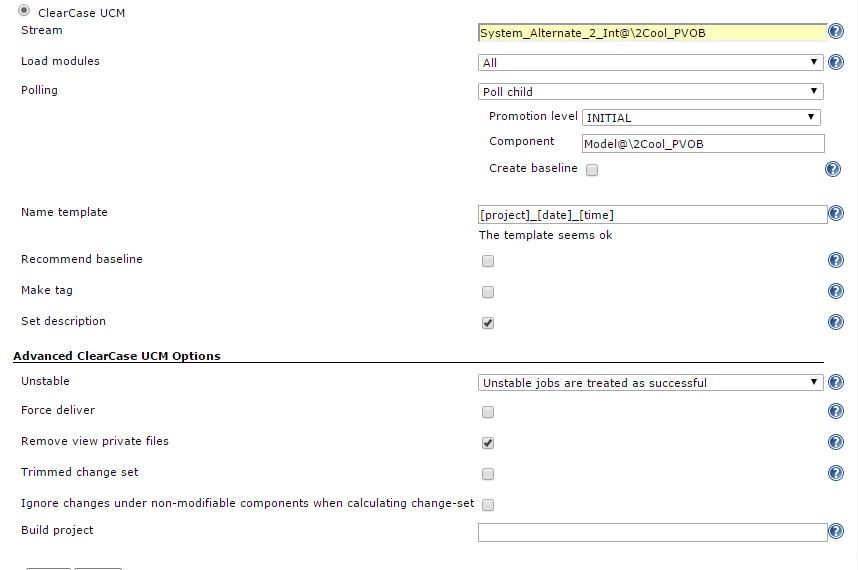
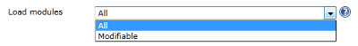
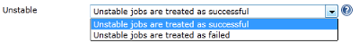
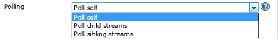
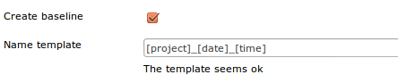
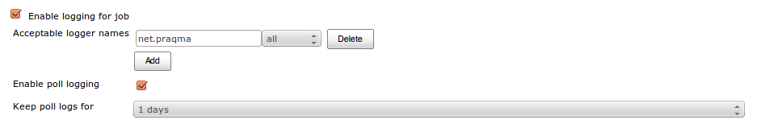
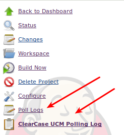

[[ClearCaseUCMPlugin-Developedby]]
===== Developed by

[.confluence-embedded-file-wrapper]#image:docs/images/praqmalogo.png[image]#

[[ClearCaseUCMPlugin-Sponsoredby]]
===== Sponsored by

[.confluence-embedded-file-wrapper .confluence-embedded-manual-size]#image:docs/images/grundfos_logo.jpg[image,width=161,height=33]#

[.confluence-embedded-file-wrapper .confluence-embedded-manual-size]##

[.confluence-embedded-file-wrapper]## +
[.confluence-embedded-file-wrapper .confluence-embedded-manual-size]#image:docs/images/jaguar-landrover.png[image,width=165,height=47]#

[.confluence-embedded-file-wrapper .confluence-embedded-manual-size]##

A Praqmatic integration to ClearCase UCM, simplifying continuous
integration with Jenkins.

 +

*If you use this plugin* - please share your current usage of it - and
read what others have achieved:

https://wiki.jenkins-ci.org/display/JENKINS/ClearCase+UCM+Plugin+Usage[Share
Your Usage of This Plugin].

[[ClearCaseUCMPlugin-AboutthePlugin]]
== About the Plugin

If you are using base ClearCase you should use
https://wiki.jenkins-ci.org/display/JENKINS/ClearCase+Plugin[the old
plugin]. *If you are using ClearCase UCM you should use this one.*

Do you wonder why there is a separate plugin for ClearCase UCM? - Please
read the blog post on "http://www.praqma.com/stories/ccucm[The rationale
behind the ClearCase UCM plugin for Jenkins CI]"! Also read
http://www.praqma.net/stories/ccinterest[some of the attendees reactions
on this plugin] as it was presented on Jenkins User Conference in Paris,
april 2012 or get into depth with pre-tested commits described in our
http://www.praqma.net/papers[paper on the subject].

Older versions of the plugin can be found and
downloaded http://repo.jenkins-ci.org/public/org/jenkins-ci/plugins/clearcase-ucm-plugin/[here]

[[ClearCaseUCMPlugin-WhattheClearCaseUCMPlugincando?]]
== *What the ClearCase UCM Plugin can do?*

* Monitor changes in your ClearCase UCM VOBs by polling for new
baselines on a given stream, in a given component with a given promotion
level.
* Does not require ClearCase to be installed on the master
* No config spec to setup! The plugin establish a snapshot view in the
jobs workspace, which is self-contained an 100% compliant with all the
plugin that allows you to brows the workspace from the web.
* Either PROMOTE or REJECT the baseline given the build result, success,
unstable or failure.
* Sets the description of the individual job, listing the baseline
built, the result and the new promotion level.
* Can recommend the baseline if it is promoted.
* Can tag the baseline with the result of each individual job, so that
history and statistics are persisted, not only in Jenkins, but also in
ClearCase itself.
* Supports concurrent builds - without finding the same baseline twice
even when previously started jobs are still in progress (currently only
supported with one iterator per slave).
* ClearCase MultiSite is fully supported:
** Slaves and masters can be in different ClearCase regions and even at
completely different Sites
** Polling for Posted Deliveries is supported
* Supports pre-tested commits by monitoring either _child streams_
(development streams within the project) or _sibling streams_
(integration streams in other projects) and automatically deliver into
the integration stream and finally complete or cancel the deliver based
on the build result.
* Supports advanced baseline naming templates.
* Runs on both Windows and Linux (since version 1.2)
* ...and even a handful more of nice features.

[[ClearCaseUCMPlugin-Fortheimpatient]]
== For the impatient

Please read
https://wiki.jenkins-ci.org/display/JENKINS/Get+up+and+running+with+ClearCase+UCM+plugin+for+Jenkins+in+11+easy+steps[Get
up and running with ClearCase UCM plugin for Jenkins in 11 easy steps]

[[ClearCaseUCMPlugin-Prerequisites:]]
== *Prerequisites:*

* ClearCase UCM Plugin assumes that a default view storage location is
available in your region (it probably is, and if it's not you can easily
create one using
'http://publib.boulder.ibm.com/infocenter/cchelp/v7r0m1/index.jsp?topic=/com.ibm.rational.clearcase.cc_ref.doc/topics/ct_mkstgloc.htm[cleartool
mkstgloc]').
* If you want to use the 'tag' function in the post-build section, you
have to set up a hyperlink type named 'tag' in your VOB (details below).
* ClearCase Client must be installed on slaves that shall execute the
build (ClearCase is not required on the master). Due to
https://issues.jenkins-ci.org/browse/JENKINS-25342[JENKINS-25342] we
require ClearCase to be installed on the master.
* We assume that all your computers have unique names in your network.

[[ClearCaseUCMPlugin-Configuration]]
== Configuration

Main configuration screen for Clearcase UCM Plugin.

[.confluence-embedded-file-wrapper]##

A short description of the configuration options are listed below

[[ClearCaseUCMPlugin-Basicsettings:StreamandComponentPromotionlevel]]
=== Basic settings: Stream and Component Promotion level

Essentially the plugin is looking for new baselines on a specific stream
belonging to a specify stream. On top op that you have to qualify which
baselines are of interest in this context by applying a Promotion Level.
Only baselines found that matches all three parameters will kick off the
build.

When the build ends, the promotion level will either be stepped one
level up (if successful) or rejected.

If you have a configuration where you use more than one component in
your foundation, you may wonder why we only left room for specifying one
single component - please take the time require to read the blog post on
"[The rationale behind the ClearCase UCM plugin for Jenkins
CI|http://www.praqma.com/stories/ccucm]"

[[ClearCaseUCMPlugin-Basicsettings:LoadModules]]
=== Basic settings: Load Modules

[.confluence-embedded-file-wrapper]##

The plugin will automatically create a snapshot view in a folder named
'view' in the root of the job's workspace. Snapshot views can - as
opposed to dynamic views - be located anywhere, which we exploit to
place it _inside_ the job's workspace. Dynamic Views can only reside on
the location where your mvfs is located and that is _not inside_ the
workspace.

A lot of plugins have browsing features, that allows you to see the code
in the browser, high-lighted to make a point in the context (warnings,
violations, code coverage...) In order to guarantee compliancy with
these type of plugins we only support snapshot views.

In general build performance is also much better in snapshot views that
are hosted by the clients native file system - once they are loaded.

We us a separate view per job, per client, which allows us to reuse
views in a context the only changes very little between builds. Thus you
will find that once you have loaded the view the first time, the
successive updates will be very fast, since deltas are guaranteed to be
small.

You have a small handle of control of what load-rules are applied to the
snapshot views; Either you load all the components or only the
modifiable ones.

[[ClearCaseUCMPlugin-Basicsettings:RecommendBaseline]]
=== Basic settings: Recommend Baseline

If the checkbox _Recommend baseline_ is set, a successful build will
recommend the baseline that was used.

[[ClearCaseUCMPlugin-Basicsettings:Maketag]]
=== Basic settings: Make tag

When the checkbox _Make tag_ is checked, the plugin will persist the
build status in ClearCase, by writing a small summary of the status as a
to-text object at the end of a hyperlink of type _tag_ attached to the
baseline.

NOTE:The if you want to use this feature then the hltype:tag should be
created first

[[ClearCaseUCMPlugin-Basicsettings:Setdescription]]
=== Basic settings: Set description

When _Set description_ is checked, the build description in the left
margin of the job page is updated with the details of the build. Super
crisp feature! Check i out!

[[ClearCaseUCMPlugin-Advanced:Unstablejobs]]
=== Advanced: Unstable jobs

[.confluence-embedded-file-wrapper]##

Some of the features in the post build section to the plugin such as the
pre-tested delivery features available in poll child and poll sibling
mode, and the 'Recommend baseline' checkbox ways to make boolean
decisions; complete or cancel? Recommend or not? But the outcome of a
Jenkins job really has three possible states; Succes, unstable and
failure. You will have to decide if the unstable state should due
treated as success or failure.

[[ClearCaseUCMPlugin-PollingModes]]
=== Polling Modes

ClearCase UCM Plugin supports three types of polling modes.

* Self polling
* Child polling
* Sibling polling
* Rebase polling
* Subscribe polling 

[[ClearCaseUCMPlugin-]]
==== [.confluence-embedded-file-wrapper]##

[[ClearCaseUCMPlugin-SelfMode]]
==== Self Mode

Self mode enables you to find baselines on the stream itself given a
promotion level.

If the build is successful, the plugin can recommend the baseline and it
will promote it to the next level.

If the build has failed, the plugin will demote the baseline to
rejected.

About the streams created in this mode, see the advanced section.

Note that this is the only mode creating auxiliary streams.

[[ClearCaseUCMPlugin-ChildandSiblingMode]]
==== Child and Sibling Mode

This mode enables you to find baselines on related streams of the target
stream. This is either development streams of the target stream(child
mode) or other integration streams having this stream as default
target(sibling mode).

If the build is successful, the baseline is delivered to the target
stream and you can choose to create a baseline on it. The baseline of
the other stream is promoted to the next level.

The plugin can recommend the new baseline on the target stream.

If the build has failed, the plugin will demote the baseline of the
other stream to rejected and no deliver activity is made, and thus no
baseline is created on the target stream.

[[ClearCaseUCMPlugin-RebaseMode]]
==== Rebase Mode

This mode. based on the selected stream will compare the set of
foundation baselines for a given stream, and check to see if there are
newer baselines on any of the component streams. If so, the plugin will
trigger

and the target stream will be rebased to the selected baselines. 

[[ClearCaseUCMPlugin-SubscribeMode]]
==== Subscribe Mode

Special polling mode that subscribes to data about compatibility of a
certain set of baselines. Currently there is only one plugin that
provides information this mode. The Config Rotator plugin. 

https://wiki.jenkins-ci.org/display/JENKINS/Config+Rotator+Plugin

[[ClearCaseUCMPlugin-Createbaselineandbaselinetemplate]]
==== Create baseline and baseline template

Create baseline is supported for all polling modes except Poll Self. 

[[ClearCaseUCMPlugin-.1]]
==== [.confluence-embedded-file-wrapper]##

The option _Create baseline_ and _Name template_ enables you to create a
baseline on the target stream. The name template is made up of free text
with optional keywords, expanding to run time variables:

* *stream* - The given UCM Stream
* *project* - The UCM Project
* *component* - The given UCM Component
* *date* - The date in yyyymmdd
* *time* - The time in hhmm
* *number* - The current Jenkins build number
* *user* - The user created the Baseline
* *env* - Get an environment variable. [env=var]
* *file* - Retrieve the content of a file residing in the workspace.
[file=SOME_FILE]. [file=myfile] will expand to path/to/workspace/myfile
and the content of the file is used. (Only a single, short line of text
is supported, and it goes without saying that the string must conform to
the restrictions to characters supported in baseline names)

Keywords are enclosed in square brackets([]). For example
[project]_[date]_[time] will result in the baseline
myproject_20110915_1128.

The plugin's baseline naming feature is meant to run on the UCM
Project's default baseline naming template just containing "basename".

Although "basename" CAN be combined with other keywords in the template
- it can not be entirely omitted. It's highly recommended, that if you
want to use the plugin's baseline naming strategy you
http://www-01.ibm.com/support/docview.wss?uid=swg21304441[reset the UCM
projects naming template to it's default].

Notice that this option has no meaning for self polling or if the
_Create baseline_ option is not checked.

[[ClearCaseUCMPlugin-LatestBaseline]]
==== Latest Baseline

Like the Git and Mercurial plugins, ClearCase UCM Plugin also supports
polling for the latest baseline. This means, when polling, a build is
scheduled only if there's a new baseline on the stream.

To be able to poll for the latest baseline, the special promotion level
_ANY_ and self polling must must be selected in the setup.

[[ClearCaseUCMPlugin-AdvancedSCMsetupAdvancedSCMSetup]]
==== Advanced SCM setup [#ClearCaseUCMPlugin-AdvancedSCMSetup .confluence-anchor-link .conf-macro .output-inline]# #

* *Build Project* The plugin creates a separate read/only development
stream and snapshot view for every self polling job on every slave that
executes the job. The stream and view is created the first time the job
is executed on the slave and then reused by successive job executions.
If you just go with the defaults settings the streams will be created as
child streams to the integration stream in the project holding the
baseline that is being built, but despite the reuse of these Jenkins
related streams, there is still a tendency that you end up with a lot of
extra streams on behalf of the plugin. You can remove them if you want
to, but the jobs will then just create them again next time they run. In
order to keep your ClearCase Project Explorer tidy we've made the option
to place them in an auxiliary project made specifically for this purpose
(in general, development streams _must_ be in the same UCM project as
the baselines you rebase them against , but
http://publib.boulder.ibm.com/infocenter/cchelp/v7r0m1/index.jsp?topic=/com.ibm.rational.clearcase.cc_ref.doc/topics/ct_rebase.htm[read/only
streams are considered special cases] and they can live safely be in a
separate project). Here's the deal: If you make a project in ClearCase
named 'hudson' or 'jenkins', the plugin will put the auxiliary streams
there. If you prefer another name for this specialCCUCM -related
project, you can specify it in the Build project box in the 'Advanced'
section

* *Tagging* To be able to tag your baselines, you need to create a
ClearCase hyperlink type named "tag" in each UCM project vob, that will
be holdding the baselines, you can do that with the following command:
+
[source,syntaxhighlighter-pre]
----
cleartool mkhltype -shared -global -c "Supports the jenkins CCUCM plugin" tag@<some_vob>
----

* *Do not remove the view private files* By default the view private
files are removed from the workspace every time a build is executed.
This can be avoided by unchecking "Remove view private files". +
[.confluence-embedded-file-wrapper]##

* *Trimming the change log* This is only useful in poll-self mode, and
will filter off changes from contributing activities. +
[.confluence-embedded-file-wrapper]##

[[ClearCaseUCMPlugin-Buildaspecificbaselinewithaparameterizedbuild]]
=== *Build a specific baseline with a parameterized build*

Parameterizing your build with a string called *baseline* will let you
build a specific named baseline. This baseline name is the value of the
parameter. This feature will let you have one job, that does the polling
on SCM and then has a post-build step orchestrated by
the https://wiki.jenkins-ci.org/display/JENKINS/Parameterized+Trigger+Plugin[Parameterized
Trigger Plugin] which builds the same baseline. The downstream job,
should have the same settings for stream and component - and if you set
the promotion level to ANY, the downstream job will not change the built
baseline's promotion level.

[[ClearCaseUCMPlugin-Buildvariables]]
=== *Build variables*

The ClearCase UCM plugin introduces several build variables:

* *CC_BASELINE*  the baseline being build
* *CC_VIEWTAG* the view tag
* *CC_VIEWPATH* the path of the view(the same as %WORKSPACE%\view)

[[ClearCaseUCMPlugin-Limitations]]
== Limitations

* The plugin supports concurrent builds.
* Currently you can only have one build at the time _per node_. Set # of
executors to 1 in your node configuration if you want to use concurrent
builds with _ClearCase UCM Plugin_.
* Only one deliver activity per stream, which means child and sibling
modes cannot be executed concurrently.

[[ClearCaseUCMPlugin-RunJenkinsserviceunderavalidClearCaseaccount]]
== Run Jenkins service under a valid ClearCase account

Jenkins needs to be authenticated by ClearCase, so it's important that
you run the Jenkins service under an account that has the sufficient
access to ClearCase. The _ClearCase UCM Plugin_ fully supports that a
slave can be in a different ClearCase region or even at a completely
different ClearCase MultiSite than the master.If you utilize this
feature, it's required that the slave is running Jenkins under an
account which has the sufficient credential on the _remote_ site

[[ClearCaseUCMPlugin-ClearCaseunavailable]]
=== ClearCase unavailable

The plugin will state in the console output, when ClearCase is not
available. This concerns both when it is not installed and when there
are no licenses available. If a build has been scheduled, its
description is set with the cause.

If you don't get any scheduled builds, check your poll log. This is
where to find information, if ClearCase is unavailable.

[[ClearCaseUCMPlugin-MultiSite-tagyournodes]]
== MultiSite - tag your nodes

If you have slaves in different MultiSites than the master, you can tie
the jobs that monitors stream that has mastership on foreign sites to
slaves that belongs to those sites. A simple strategy for this is that
you add a tag to all you slaves telling which MultiSite they belong to
and then you tie the jobs to those labeled slaves.

[[ClearCaseUCMPlugin-MultiSite-pollingforposteddeliveries]]
== MultiSite - polling for posted deliveries

The plugin supports polling for posted deliveries in a MultiSite
environment. This feature must be turned on at the Jenkins global
settings for the plugin, and only has effect in child polling mode.
Normally in this mode, the plugin will harvest all baselines made in
child streams. If the stream is at a different site, this is not
possible. In this setup, the plugin can work in two different modes:

* *Standalone mode:* The process is a bit different from normal: on top
of making the baseline, the developer must issue a Deliver Baseline
command. A special "Posted deliver" object is then created, and the
mastership of the development stream is transferred to the integration
stream site. The plugin will detect the posted delivery, and resume and
complete (or cancel) the delivery. As a result of this, the mastership
of the stream will be transferred back to the origin. Notice: The
ClearCase posted delivery process does not transfer the mastership of
the baseline - for that reason the promotion level of the baseline
cannot be changed, but is left as INITIAL. Tags can also not be updated.
* *ClearCase trigger mode*: We have developed a ClearCase trigger to set
and reset the mastership of the baselines - if this trigger is installed
on both the development and integration site, the plugin will behave
exactly the same way as in a single site setup: the developer just
creates baselines, and everything else will happen automatically. The
trigger can be found here:
http://wiki.praqma.net/acc/comp/triggers/acc_deliver_baseline. For more
information, or help to set this up, please contact Praqma.

[[ClearCaseUCMPlugin-Specialdebuggingparameters]]
== Special debugging parameters

[[ClearCaseUCMPlugin-Setuploggingwithpluginversionspriorto1.2.0]]
=== _Setup logging with plugin versions prior to 1.2.0_

For debugging purposes a job can be parametrized to output debug log
information to a file. The parameters are string parameters.

* ccucm_logall - Enable logging(the value part is empty)
* ccucm_loglevel - The severity of the log level
** DEBUG - Huge amount of output
** VERBOSE
** INFO
** WARNING
** ERROR
** FATAL - Only the worst 

Note that these names are case sensitive!

The logs can be found in the jobs build folder under each specific build
folder where the debug has been enabled. This means you have to browse
into the master Jenkins server.

The SCM log is named ccucmSCM.log and the post-build log is named
ccucmNOTIFIER.log.

[[ClearCaseUCMPlugin-Setuploggingwithpluginversionsafter1.2.0]]
=== _Setup logging with plugin versions after 1.2.0_

From version 1.2.0
the https://wiki.jenkins-ci.org/display/JENKINS/Logging+Plugin[Logging
Plugin] is required.

So install the Logging Plugin and restart Jenkins, then go to the Job
Configuration for the job, and enable logging, use "*net.praqma*" as
logger name:

[.confluence-embedded-file-wrapper]##

and then you will find links to the logs from the jobs front page:

[.confluence-embedded-file-wrapper]##

[[ClearCaseUCMPlugin-JenkinsJobDSL]]
== Jenkins Job DSL

[[ClearCaseUCMPlugin-Availableoptions]]
=== _Available options_

[source,syntaxhighlighter-pre]
----
job {
    scm {
        clearCaseUCM (String stream) {
            loadModules (String loadModules)                    // loadModules can be: 'ALL', 'MODIFIABLE'. Defaults to 'ALL'
            nameTemplate (String nameTemplate)                  // Defaults to '[project]_[date]_[time]'
            recommendBaseline (boolean recommend = true)        // Defaults to false
            makeTag (boolean makeTag = true)                    // Defaults to false
            setDescription (boolean setDescription = true)      // Defaults to true

            treatUnstableAsSuccessful (boolean success = true)  // Defaults to true
            forceDeliver (boolean forceDeliver = true)          // Defaults to false
            removeViewPrivateFiles (boolean remove = true)      // Defaults to true
            trimmedChangeset (boolean trim = true)              // Defaults to false
            ignoreUnmodifiableChanges (boolean ignore = true)   // Defaults to false
            buildProject (String project)

            pollingMode(String mode, String component) {                        //mode can be: 'CHILD','REBASE','SELF','SIBLING','SUBSCRIBE'. Defaults to 'CHILD'.
            pollingMode(String mode, String component, String promotionLevel){  //promotionLevel can be: 'ANY','INITIAL','BUILT','TESTED','RELEASED','REJECTED'. Defaults to lowest available.
                    //Applicable: All
                    promotionLevel (String promotionLevel)                      //promotionLevel can be: 'ANY','INITIAL','BUILT','TESTED','RELEASED','REJECTED'.

                    //Applicable: CHILD, REBASE, SIBLING
                    createBaseline (boolean create = true)      // Defaults to true

                    //Applicable: REBASE
                    excludeList (String excludeList)

                    //Applicable: SIBLING
                    hyperlinkPolling (String polling = true)    // Defaults to false

                    //Applicable: SUBSCRIBE, SELF, CHILD, SIBLING
                    useNewest (boolean useNewest = true)        // Defaults to false

                    //Applicable: SUBSCRIBE
                    cascadePromotion (boolean cascade = true)   // Defaults to true
                    components {
                        component (String selection)
                    }
                    jobs {
                        job (String name, String ignores = null)
                    }
                }
            }
        }
    }
}
----

[[ClearCaseUCMPlugin-Example]]
=== _Example_

[source,syntaxhighlighter-pre]
----
job('foo_GEN') {
    scm {
        clearCaseUCM ('bar_dev@\\myVob') {
            loadModules('ALL')
            nameTemplate('[project]_[date]_[time]')
            recommendBaseline()
            makeTag(false)
            setDescription(false)
            treatUnstableAsSuccessful(false)
            forceDeliver()
            removeViewPrivateFiles()
            trimmedChangeset()
            ignoreUnmodifiableChanges(false)
            pollingMode('CHILD', 'bar_dev_baz@\\myVob', 'TESTED'){
                createBaseline(true)
            }
        }
    }
}
----

[[ClearCaseUCMPlugin-KnownIssues]]
== Known Issues

http://www.praqma.com/services/jcisupport[[.confluence-embedded-file-wrapper .confluence-embedded-manual-size]##]http://www.praqma.com/services/jcisupport[If
it's broken ...We Can Fix It!]

type

key

summary

[.icon-in-pdf]# # Data cannot be retrieved due to an unexpected error.

http://issues.jenkins-ci.org/secure/IssueNavigator.jspa?reset=true&jqlQuery=project%20=%20JENKINS%20AND%20status%20in%20%28Open,%20%22In%20Progress%22,%20Reopened%29%20AND%20component%20=%20%27clearcase-ucm-plugin%27&src=confmacro[View
these issues in Jira]

[[ClearCaseUCMPlugin-ReleaseNotes]]
== Release Notes

[[ClearCaseUCMPlugin-1.7.0(August25,2016)]]
=== 1.7.0(August 25, 2016)

* Major performance improvement: Do not synchronize all command line
calls

[[ClearCaseUCMPlugin-1.6.9(Febuary15,2016)]]
=== 1.6.9(Febuary 15, 2016)

* Fixed an issue with poll-sibling not checking mastership of source and
target
(https://issues.jenkins-ci.org/browse/JENKINS-32490[JENKINS-32490])

[[ClearCaseUCMPlugin-1.6.8(December9,2015)]]
=== 1.6.8(December 9, 2015)

* Fixed an issue with poll rebase and false negatives
(https://issues.jenkins-ci.org/browse/JENKINS-31974[JENKINS-31974])

[[ClearCaseUCMPlugin-1.6.7(November5,2015)]]
=== 1.6.7(November 5, 2015)

* Smarter implementaion
of (https://issues.jenkins-ci.org/browse/JENKINS-30795[JENKINS-30795])
* Upped core dependency to 1.580.

[[ClearCaseUCMPlugin-1.6.6(October16,2015)]]
=== 1.6.6(October 16, 2015)

* Allow manual rebuild of failed integrations
(https://issues.jenkins-ci.org/browse/JENKINS-30795[JENKINS-30795])
* Fixed an issue where polling could start prematurely
(https://issues.jenkins-ci.org/browse/JENKINS-30507[JENKINS-30507])

[[ClearCaseUCMPlugin-1.6.5(September16,2015)]]
=== 1.6.5(September 16, 2015)

* Added Job DSL support
(https://issues.jenkins-ci.org/browse/JENKINS-30261[JENKINS-30261])
* Fixed a small spelling mistake in UI for poll rebase
(https://issues.jenkins-ci.org/browse/JENKINS-30344[JENKINS-30344])
* Fixed a regression with use newest and poll subsciibe
(http://https//issues.jenkins-ci.org/browse/JENKINS-30438[JENKINS-30438])

[[ClearCaseUCMPlugin-1.6.4(September3,2015)]]
=== 1.6.4(September 3, 2015)

* Implemented 'Use newest' for poll others
(https://issues.jenkins-ci.org/browse/JENKINS-30191[JENKINS-30191])

[[ClearCaseUCMPlugin-1.6.3(July6,2015)]]
=== 1.6.3(July 6, 2015)

* Introduced the poll subscribe mode
(https://issues.jenkins-ci.org/browse/JENKINS-29033[JENKINS-29033])
* Added Job DSL support
(https://issues.jenkins-ci.org/browse/JENKINS-30261[JENKINS-30261])

[[ClearCaseUCMPlugin-1.6.2(June16,2015)]]
=== 1.6.2 (June 16, 2015)

* Fixed an issue for poll rebase with baseline creation
(https://issues.jenkins-ci.org/browse/JENKINS-28835[JENKINS-28835])

[[ClearCaseUCMPlugin-1.6.1(April14,2015)]]
=== 1.6.1 (April 14, 2015)

* Added a poll rebase mode.
(https://issues.jenkins-ci.org/browse/JENKINS-26985[JENKINS-26985])

[[ClearCaseUCMPlugin-1.6.0(Febuary17,2015)]]
=== 1.6.0 (Febuary 17, 2015)

* Implemeneted a new poll sibling mode using hyperlinks
(https://issues.jenkins-ci.org/browse/JENKINS-26484[JENKINS-26484])
* Fixed a performance issue when dealing with large changesets.
(https://issues.jenkins-ci.org/browse/JENKINS-26593[JENKINS-26593])

[[ClearCaseUCMPlugin-1.5.5(November20,2014)]]
=== 1.5.5 (November 20, 2014)

* Fixed an issue with loadrules not used properly
(https://issues.jenkins-ci.org/browse/JENKINS-25647[JENKINS-25647])
* Project templates are now calculated on the executing node
(https://issues.jenkins-ci.org/browse/JENKINS-25342[JENKINS-25342])

[[ClearCaseUCMPlugin-1.5.4(November4,2014)]]
=== 1.5.4 (November 4, 2014)

* Fixed an issue with poll sibling and calculation of changeset
(https://issues.jenkins-ci.org/browse/JENKINS-25059[JENKINS-25059])
* Implemented the option to filter changes under read-only components.
(https://issues.jenkins-ci.org/browse/JENKINS-23533[JENKINS-23533])

[[ClearCaseUCMPlugin-1.5.3(August15,2014)]]
=== 1.5.3 (August 15, 2014)

* Performance improvement, use catcs for loadrules
(https://issues.jenkins-ci.org/browse/JENKINS-23245[JENKINS-23245])
* Performance improvement, load rules for swipe
(https://issues.jenkins-ci.org/browse/JENKINS-23246[JENKINS-23246])
* Implemented tests to run on slaves
(https://issues.jenkins-ci.org/browse/JENKINS-19658[JENKINS-19658])
* Fixed an issue where output is accidently sent to wrong log
(https://issues.jenkins-ci.org/browse/JENKINS-18107[JENKINS-18107])
* Warn me when version becomes too long, run relatively to view.
(https://issues.jenkins-ci.org/browse/JENKINS-23268[JENKINS-23268])
* Escape the object selector if '&' is present
(https://issues.jenkins-ci.org/browse/JENKINS-23920[JENKINS-23920])

[[ClearCaseUCMPlugin-1.5.2]]
=== 1.5.2

* Changed maintainer

[[ClearCaseUCMPlugin-1.5.1(January23,2014)]]
=== 1.5.1 (January 23, 2014)

* Fixed an issue with listing baselines on unix systems
(https://issues.jenkins-ci.org/browse/JENKINS-20747[JENKINS-20747])
* Only check templates when they are used
(https://issues.jenkins-ci.org/browse/JENKINS-19657[JENKINS-19657]) 

[[ClearCaseUCMPlugin-1.5.0(November19,2013)]]
=== 1.5.0 (November 19, 2013)

This release includes a major bump in Jenkins core requirements. This
was done in order to implement the change listed below. Users of a
Jenkins version older than 1.534 should use version 1.4.4

* Changeset is now not lost, when a deliver fails.
(https://issues.jenkins-ci.org/browse/JENKINS-19558[JENKINS-19558])

[[ClearCaseUCMPlugin-1.4.4(November17,2013)]]
=== 1.4.4(November 17, 2013)

* Improved performance when generating changelog
(https://issues.jenkins-ci.org/browse/JENKINS-19823[JENKINS-19823])
* Sanitized changelog layout
(https://issues.jenkins-ci.org/browse/JENKINS-19824[JENKINS-19824])
* Corrected .pom group id
(https://issues.jenkins-ci.org/browse/JENKINS-19069[JENKINS-19069])
* Improved baseline comparison
(https://issues.jenkins-ci.org/browse/JENKINS-19809[JENKINS-19809])

[[ClearCaseUCMPlugin-1.4.3(September19,2013)]]
=== 1.4.3(September 19, 2013)

* Fixed a serialization regression issue introduced in 1.4.2

[[ClearCaseUCMPlugin-1.4.2(September18,2013)]]
=== 1.4.2(September 18, 2013)

* Incorrect promotion level displayed at ClearCase failure
(https://issues.jenkins-ci.org/browse/JENKINS-19410[JENKINS-19410])
* Remove reminiscent of old logging method
(https://issues.jenkins-ci.org/browse/JENKINS-19404[JENKINS-19404])
* Possibility to remove the contributing activities from the change set
of the build
(https://issues.jenkins-ci.org/browse/JENKINS-18281[JENKINS-18281])
* Provide an option to not delete view-private files at the start of
each build
(https://issues.jenkins-ci.org/browse/JENKINS-18280[JENKINS-18280])
* Keep the snapshot update files in the workarea
(https://issues.jenkins-ci.org/browse/JENKINS-18279[JENKINS-18279])
* Change set is not correctly calculated after a rebase of the
integration stream
(https://issues.jenkins-ci.org/browse/JENKINS-18278[JENKINS-18278])

[[ClearCaseUCMPlugin-1.4.1(September16,2013)Faultyrelease]]
=== 1.4.1(September 16, 2013) Faulty release

[[ClearCaseUCMPlugin-1.3.8(June4,2013)]]
=== 1.3.8(June 4, 2013)

* Iteratively finding view private files
(https://issues.jenkins-ci.org/browse/JENKINS-18101[JENKINS-18101])
* Baseline not loaded when paramerized
(https://issues.jenkins-ci.org/browse/JENKINS-18026[JENKINS-18026])
* Posted deliver baselines are not found
(https://issues.jenkins-ci.org/browse/JENKINS-17992[JENKINS-17992])

[[ClearCaseUCMPlugin-1.3.7(May17,2013)]]
=== 1.3.7(May 17, 2013)

* Wrongful error message on failed update
(https://issues.jenkins-ci.org/browse/JENKINS-17993[JENKINS-17993])

[[ClearCaseUCMPlugin-1.3.6(April2,2013)]]
=== 1.3.6(April 2, 2013)

* If Jenkins job fails cancel deliver Jenkins can never get out of this
situation
(https://issues.jenkins-ci.org/browse/JENKINS-17445[JENKINS-17445])
* Finding the correct delivering Stream to cancel
(https://issues.jenkins-ci.org/browse/JENKINS-17067[JENKINS-17067])

[[ClearCaseUCMPlugin-1.3.5(February15,2013)]]
=== 1.3.5(February 15, 2013)

* Better exception handling in core
(https://issues.jenkins-ci.org/browse/JENKINS-16804[JENKINS-16804])
* Pruning too many baselines
(https://issues.jenkins-ci.org/browse/JENKINS-16764[JENKINS-16764])
* Wrong file delimiters
(https://issues.jenkins-ci.org/browse/JENKINS-16704[JENKINS-16704])

[[ClearCaseUCMPlugin-1.3.4(February6,2013)]]
=== 1.3.4(February 6, 2013)

* Better exception handling
(https://issues.jenkins-ci.org/browse/JENKINS-16641[JENKINS-16641])
* No new baseline found, but the job builds anyway
(https://issues.jenkins-ci.org/browse/JENKINS-16636[JENKINS-16636])
* Cancelled builds cannot be rebuild
(https://issues.jenkins-ci.org/browse/JENKINS-16620[JENKINS-16620])
* Self-Polling Recommendation and Description
(https://issues.jenkins-ci.org/browse/JENKINS-15676[JENKINS-15676])

[[ClearCaseUCMPlugin-1.3.3(January31,2013)]]
=== 1.3.3(January 31, 2013)

* Fixed an issue when using the FilePattern for baseline template
(https://issues.jenkins-ci.org/browse/JENKINS-16541[JENKINS-16541])

Note: (Only)This release mistakenly will never process baselines again
even though the promotion level is flipped manually.

[[ClearCaseUCMPlugin-1.3.2(January23,2013)]]
=== 1.3.2(January 23, 2013)

* Fixed display issue for jobs using ANY as promotion level, was
displayed as null in console
(https://issues.jenkins-ci.org/browse/JENKINS-16447[JENKINS-16447])
* Fixed 'Enabling poll for posted deliveries' breaks polling for poll
self (https://issues.jenkins-ci.org/browse/JENKINS-16422[JENKINS-16422])
* Fixed 'Allow for non composites in posted deliver'
(https://issues.jenkins-ci.org/browse/JENKINS-16371[JENKINS-16371])
* Implemented table format for changesets
(https://issues.jenkins-ci.org/browse/JENKINS-16271[JENKINS-16271])
* Fixed 'Missing baseline' for manually triggered jobs using PollSelf
(https://issues.jenkins-ci.org/browse/JENKINS-16072[JENKINS-16072])

[[ClearCaseUCMPlugin-1.3.1(December12,2012)]]
=== 1.3.1(December 12, 2012)

* Fixed missing baseline issue with latest plugin
(https://issues.jenkins-ci.org/browse/JENKINS-16072[#16072])

[[ClearCaseUCMPlugin-1.3.0(December3,2012)-Deprecated.]]
=== 1.3.0(December 3, 2012) - Deprecated.

* Resolved issue with polling
(https://issues.jenkins-ci.org/browse/JENKINS-16763[#16763])
* The build-data layout changed in 1.3.X, so we cannot guarantee
backwards compatibility with existing jobs, where there are old jobs
built in 1.2.0.

[[ClearCaseUCMPlugin-1.2.0(September21,2012)]]
=== 1.2.0(September 21, 2012)

* Linux support
(https://issues.jenkins-ci.org/browse/JENKINS-16761[#16761])
* Changed logger
(https://issues.jenkins-ci.org/browse/JENKINS-16762[#16762])

[[ClearCaseUCMPlugin-1.1.7(September10,2012)]]
=== 1.1.7(September 10, 2012)

* Stream is not loaded
(https://issues.jenkins-ci.org/browse/JENKINS-15089[#15089])
* Add headline to changes
(https://issues.jenkins-ci.org/browse/JENKINS-15092[#15092])

[[ClearCaseUCMPlugin-1.1.6(August17,2012)]]
=== 1.1.6(August 17, 2012)

* Multisite polling finds the same baseline
(https://issues.jenkins-ci.org/browse/JENKINS-14806[#14806])

[[ClearCaseUCMPlugin-1.1.5(August7,2012)]]
=== 1.1.5(August 7, 2012)

* Use the current streams project, if the jenkins build project is not
found (https://issues.jenkins-ci.org/browse/JENKINS-14702[#14702])

[[ClearCaseUCMPlugin-1.1.4(July16,2012)]]
=== 1.1.4(July 16, 2012)

* Don't display all versions in the changeset
(https://issues.jenkins-ci.org/browse/JENKINS-14436[#14436])
* If deliver fails an undo deliver must always be executed
(https://issues.jenkins-ci.org/browse/JENKINS-14318[#14318])
* Deliver being cancelled not detected
(https://issues.jenkins-ci.org/browse/JENKINS-14317[#14317])
* CCUCM mistreats deliver error
(https://issues.jenkins-ci.org/browse/JENKINS-14241[#14241])
* Changlelog is missing user names
(https://issues.jenkins-ci.org/browse/JENKINS-14240[#14240])
* Sometimes CCUCM finds baselines in other masterships
(https://issues.jenkins-ci.org/browse/JENKINS-14239[#14239])
* Missing hyperlink type "tag" in Clearcase does not fail the build
(https://issues.jenkins-ci.org/browse/JENKINS-13944[#13944])

[[ClearCaseUCMPlugin-1.1.3(July13,2012)]]
=== 1.1.3(July 13, 2012)

* Faulty release, please wait for version 1.1.4 on July 16.

[[ClearCaseUCMPlugin-1.1.2(June19,2012)]]
=== 1.1.2(June 19, 2012)

* Fail gracefully when no ClearCase licenses
(https://issues.jenkins-ci.org/browse/JENKINS-14147[#14147])

[[ClearCaseUCMPlugin-1.1.1(June6,2012)]]
=== 1.1.1(June 6, 2012)

* Build variable CC_BASELINE not populated with used baseline
(https://issues.jenkins-ci.org/browse/JENKINS-13970[#13970])

[[ClearCaseUCMPlugin-1.1.0(May31,2012)]]
=== 1.1.0(May 31, 2012)

* Enhance the posted deliveries polling, so it can work 'as normal'
(https://issues.jenkins-ci.org/browse/JENKINS-13964[#13964])
* Logger error crashes server
(https://issues.jenkins-ci.org/browse/JENKINS-13983[#13983])
* Console output shows the wrong version number
(https://issues.jenkins-ci.org/browse/JENKINS-13984[#13984])
* ClearCase UCM post build step issue
(https://issues.jenkins-ci.org/browse/JENKINS-13985[#13985])
* Baseline template stalls jenkins
(https://issues.jenkins-ci.org/browse/JENKINS-13986[#13986])

[[ClearCaseUCMPlugin-1.0.7(Mar19,2012)]]
=== 1.0.7(Mar 19, 2012)

* Added support for polling for posted deliveries
(https://issues.jenkins-ci.org/browse/JENKINS-13574[#13574])
* Streams with different mastership are ignored - unless Polling for
Posted Deliveries is turned on
(https://issues.jenkins-ci.org/browse/JENKINS-13575[#13575])

[[ClearCaseUCMPlugin-1.0.6(Mar14,2012)]]
=== 1.0.6(Mar 14, 2012)

*  Baselines are created with -identical switch: Don't do that
(https://issues.jenkins-ci.org/browse/JENKINS-13067[issue #13067])

[[ClearCaseUCMPlugin-1.0.5(Feb10,2012)]]
=== 1.0.5(Feb 10, 2012)

*  This version was just a release #€&%#? - nothing change between 1.04
and 1.0.5 ...except the version number in the POM ;-)

[[ClearCaseUCMPlugin-1.0.4(Feb10,2012)]]
=== 1.0.4(Feb 10, 2012)

*  Null pointer execption in buildEnvVars
(https://issues.jenkins-ci.org/browse/JENKINS-12708[issue #12708])
*  Fixing empty logs on non-remote slaves
(https://issues.jenkins-ci.org/browse/JENKINS-12709[issue #12709])
*  A build must fail, if the baseline name template is erroneous
(https://issues.jenkins-ci.org/browse/JENKINS-12705[issue #12705])
*  Correct the message if there is not an available hltype:tag
(https://issues.jenkins-ci.org/browse/JENKINS-12706[issue #12706])
*  Add env and file as baseline template parameters
(https://issues.jenkins-ci.org/browse/JENKINS-12707[issue #12707])

[[ClearCaseUCMPlugin-1.0.3(Jan9,2012)]]
=== 1.0.3(Jan 9, 2012)

*  Problems with recommending baselines
(https://issues.jenkins-ci.org/browse/JENKINS-12711[issue #12711])

[[ClearCaseUCMPlugin-1.0.2(Dec16,2011)]]
=== 1.0.2(Dec 16, 2011)

* Adding filename template
* Polling.log should be split into several log files
(https://issues.jenkins-ci.org/browse/JENKINS-12710[issue #12710])

[[ClearCaseUCMPlugin-1.0.1(Nov17,2011)]]
=== 1.0.1(Nov 17, 2011)

*  baseline template support env vars
*  Problems with recommending baselines
(https://issues.jenkins-ci.org/browse/JENKINS-12712[issue #12712])

[[ClearCaseUCMPlugin-1.0.0(Oct25,2011)]]
=== 1.0.0(Oct 25, 2011)

*  Fail when stream policy is incorrect is not reported clearly
(https://issues.jenkins-ci.org/browse/JENKINS-12727[issue #12727])
*  Baseline not created on integration stream after successful deliver
(https://issues.jenkins-ci.org/browse/JENKINS-12726[issue #12726])
*  merge conflict leaves a hanging deliver process
(https://issues.jenkins-ci.org/browse/JENKINS-12725[issue #12725])
*  Update before rebase?
(https://issues.jenkins-ci.org/browse/JENKINS-12724[issue #12724])
*  Failed deliver is not canceled
(https://issues.jenkins-ci.org/browse/JENKINS-12723[issue #12723])
*  Merge conflict - error message
(https://issues.jenkins-ci.org/browse/JENKINS-12722[issue #12722])
*  Change set reported empty -when it's not
(https://issues.jenkins-ci.org/browse/JENKINS-12721[issue #12721])
*  Basline template reportet invalid - when it's not
(https://issues.jenkins-ci.org/browse/JENKINS-12720[issue #12720])
*  Create help texts to all fields
(https://issues.jenkins-ci.org/browse/JENKINS-12719[issue #12719])
*  Help text til baseline template
(https://issues.jenkins-ci.org/browse/JENKINS-12718[issue #12718])
*  Help text to the post build action
(https://issues.jenkins-ci.org/browse/JENKINS-12717[issue #12717])
*  net.sf.json.JSONException:
JSONObjecthttps://wiki.jenkins-ci.org/display/JENKINS/ClearCase+UCM+Plugin#["CCUCM.multiSiteFrequency"]
not found (https://issues.jenkins-ci.org/browse/JENKINS-12716[issue
#12716])
*  ClearCase ucm gives a NullPointer Exception
(https://issues.jenkins-ci.org/browse/JENKINS-12715[issue #12715])
*  CC UCM polling does not work
(https://issues.jenkins-ci.org/browse/JENKINS-12714[issue #12714])
*  Support for ANY promotion level
(https://issues.jenkins-ci.org/browse/JENKINS-12713[issue #12713])
