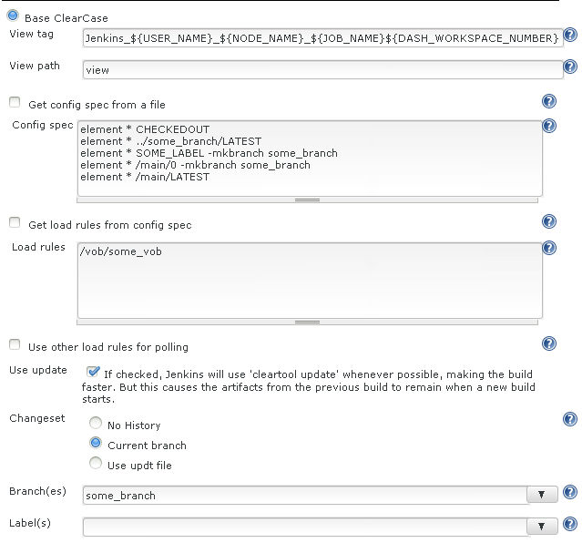
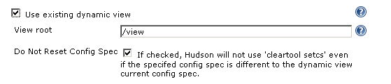

[.conf-macro .output-inline]#Integrates Jenkins with
http://www.ibm.com/software/awdtools/clearcase/[ClearCase].#

This plugin allows you to use either base ClearCase and UCM ClearCase as
the SCM for your Jenkins projects.

The plugin uses the *cleartool* executable to work with a ClearCase
server. This requires that the cleartool command (and therefore the
*full ClearCase client*) be installed on master and all slaves on which
you wish to run ClearCase jobs.

This plugin doesn't support CCRC (Clearcase Remote Client), and probably
never will, given the large differences of implementation between this
client and the full client.

The SCM also supports polling, so it can start a build when changes are
detected on the branch, label or stream specified in the job
configuration.

[[ClearCasePlugin-Usage]]
== Usage

[[ClearCasePlugin-Globalconfiguration]]
=== Global configuration

* Set up the cleartool executable in the Jenkins configuration. To
verify that the executable can be used by Jenkins press the "Check
cleartool version"
* Choose the default view storage location strategy. This will be
applied to all jobs using the plugin. The configuration can be overriden
at job level within the advanced section.
** Default : when issuing the mkview command no additional option to
specify the view storage is issued. The behaviour will depend on the
server configuration.
** Use explicit path : generates -vws argument to the mkview command.
The setting specifies a prefix per OS, then the <viewtag>.vws is
appended.
** Use server storage location : generates -stgloc argument. You can
either use auto or a specific view storage. You'll need to input a label
to determine where the command to list storage locations should be
issued (since it can vary depending on the host).

[[ClearCasePlugin-BaseClearCase]]
=== Base ClearCase

[[ClearCasePlugin-Basicconfiguration]]
==== Basic configuration

[.confluence-embedded-file-wrapper]##

* View tag : It has to be unique in the ClearCase region the
master/slaves are using. The default value should ensure that, but you
can customize it if you know what you are doing. During the build, this
value can be referenced using CLEARCASE_VIEWTAG
* View path : the folder where the clearcase view will be created within
the workspace. You can use CLEARCASE_VIEWPATH during the build in order
to get the absolute path to the view directory.
* You can provide the config spec either inline or by reading it from a
file. The file must be reachable from the master node.
* You can provide a command to execute prior to read the config spec in
order to refresh it.
* You can then provide either load rules, or choose to read them from
the config spec. Load rules are required even for dynamic views, as they
are used for polling and also to generate changelogs.
** Load rules should be separated by newlines.
** Load rules should be a path to a file or directory within the view,
i.e., "vob/some_vob" or "\some_other_vob\directory". The path can have a
leading file separator, or not. You can also have load rules starting
with "load", as you would in a snapshot config spec outside of Jenkins -
the "load " will be removed and the path will be processed as normal.

* It is possible to poll on different load rules. This allows you to
only monitor part of the view.
* Check "Use update" if you wish to use the same view for every build -
this will greatly speed up your builds, since the view won't be
recreated and repopulated every build, but build output will be left in
the view.
** This option is only applicable to snapshot views. Dynamic views are
not removed and recreated.
* Specify one or more branches - these branches will be used for polling
for changes and assembling changelogs.
* Specify one or more labels - allows to detect changes by addition or
removal of given labels. The plugin will no longer look at checkins,
only label addition/removal.

[[ClearCasePlugin-Advancedconfiguration]]
==== Advanced configuration

* Click the "Advanced" button to reveal the advanced options, including
the dynamic view options.
* Excluded regions
** Optionally, specify one or more regular expressions representing
files or directories which you wish to ignore when polling and
generating changelogs. In this example, any changes to a file named
"version.properties" or "Version.properties" anywhere in the source tree
will be ignored.

* Override view storage : this allows you to override the global
strategy (see global configuration above for details)
* Additional mkview arguments
** If you need to pass additional arguments to "cleartool mkview", such
as -gpath, -hpath, -server, etc, do that here. You can refer to the
workspace the view will be under as $WORKSPACE, and the view name as
$CLEARCASE_VIEWNAME. These will be replaced before being passed to
_cleartool mkview_.
* Filter destroy sub-branch events
** If selected, _destroy sub-branch_ events, which are generally the
result of removing a version 0 of a file, will be ignored in polling.
* Remove ClearCase view on rename
** If selected, the view will be removed, via _cleartool rmview_, if the
job is renamed, since the workspace directory will change and the
existing view will no longer be valid.
* Multi-site poll buffer
** Optionally, if you wish to have polling check for changes since the
last build plus an additional period of time, in case of changes made at
another site before the build which had not yet been synced to the build
site by build time, enter that buffer period here, in minutes.

[[ClearCasePlugin-Dynamicviewconfiguration]]
==== Dynamic view configuration

[.confluence-embedded-file-wrapper]##

* Optionally, you can use an existing dynamic view, rather than a new
snapshot view. To do so, check "Use dynamic view" under the advanced
options.
* View root
** Required for dynamic view use - this is the directory or drive under
which dynamic views live. On Unix, this is generally "/view", while on
Windows, it's generally "M:\".
* Do Not Reset Config Spec
** If selected, the dynamic view's config spec won't be changed,
regardless of whether it matches the config spec specified in the job
configuration.

[[ClearCasePlugin-UCMClearCase]]
=== UCM ClearCase

[[ClearCasePlugin-Basicconfiguration.1]]
==== Basic configuration 

* View tag : It has to be unique in the ClearCase region the
master/slaves are using. The default value should ensure that, but you
can customize it if you know what you are doing. During the build, this
value can be referenced using CLEARCASE_VIEWTAG
* View path : the folder where the clearcase view will be created within
the workspace. You can use CLEARCASE_VIEWPATH during the build in order
to get the absolute path to the view directory.
* Stream selector : the specification for the stream you want to create
the view on.
* Define load rules manually : usually load rules can be determined
automatically based on the foundation baselines of the given stream
selector, but if you wish to use only a part of the load rules defined
for the given stream, you will need to specify the load rules to use.
* Check "Use update" if you wish to use the same view for every build -
this will greatly speed up your builds, since the view won't be
recreated and repopulated every build, but build output will be left in
the view.
** This option is only applicable to snapshot views. Dynamic views are
not removed and recreated.
* Changeset : this defines what level of details you wish to appear in
the resulting changeset. Generating the changeset has a time cost, so
depending on what kind of job you run, you may not want everything to
appear.
* Build foundation baseline : this option will change the behaviour of
the plugin by creating a view not on the stream itself, but rather based
on its foundation baseline. When polling, only change of foundation
baselines (resulting from rebase operation) will trigger a build.

[[ClearCasePlugin-Advancedconfiguration.1]]
==== Advanced configuration

Most of advanced configuation are common with the Base Clearcase
section. With UCM, the following additional options applies :

* Filter _Destroy sub branch_ event : as its name suggests, this will
filter out events deleting branches, as this is an operation that is
often done through Clearcase hooks.
* Branch name : if specified, the branch name will be used for polling
and to build changelogs, rather than extrapolating from the UCM stream
name.

[[ClearCasePlugin-Dynamicviewconfiguration.1]]
==== Dynamic view configuration

Freeze code : This options will create a child stream under the
configured stream and will use it for the build. On each build, Jenkins
will rebase the build stream with the latest baselines found the
configured stream.

[[ClearCasePlugin-Gettingsupport]]
== Getting support

* Start by reading the FAQ section below.
* If you don't find what you are looking for, have a look on the
http://jenkins-ci.org/content/mailing-lists[jenkinsci-users] group.
* Comments on this page aren't monitored regularly, so prefer the user
group if you have any question.

[[ClearCasePlugin-Frequentlyaskedquestions]]
== Frequently asked questions

[[ClearCasePlugin-Aretheviewattributesavailableinthebuildscripts?]]
=== Are the view attributes available in the build scripts?

There are three environment variables set after checkout :

* CLEARCASE_VIEWNAME : The path of the view relative to the workspace
* CLEARCASE_VIEWPATH : The absolute path of the view
* CLEARCASE_VIEWTAG : The view tag

[[ClearCasePlugin-Cantheviewnamebeupdatedwiththenameofthejob?]]
=== Can the view name be updated with the name of the job ?

Yes, it is possible to add $\{USER_NAME}, $\{NODE_NAME}, $\{JOB_NAME}
and $\{DASH_WORKSPACE_NUMBER} in a view name which are replaced with the
name of the user, node and job.

We recommend you to use the default view tag, which is
jenkins_$\{USER_NAME}__$\{NODE_NAME}__$\{JOB_NAME}$\{DASH_WORKSPACE_NUMBER}.
This will allow you to generate unique view tag whatever your
configuration is.

[[ClearCasePlugin-Errorwhencreatingview(storagedirectorymustbeinUNCstyle)]]
=== Error when creating view _(storage directory must be in UNC style)_

This can happen if no server storage location has been defined for your
ClearCase region (this has to be done by ClearCase administrators).

In that case, you can use Override view storage > Use explicit path. The
plugin will generate a -vws argument for the _cleartool mkview_ command
based on the view tag that you provided and view storage directory that
you provided. +

[[ClearCasePlugin-Errorwhenretrievinghistory(Error:Notanobjectinavob:"vobs")]]
=== Error when retrieving history _(Error: Not an object in a vob: "vobs")_

On Linux and Solaris there are sometimes problems retrieving the
ClearCase history using lshistory. In the Advanced section in the
configuration it is possible to specify one or several paths in the *VOB
path(s)* field that will be used when retrieving the history. If the
config spec contains "vobs/gtx2" then the *VOB path(s)* field should be
set to gtx2.
(http://www.nabble.com/Clearcase-plugin-and-the-lshistory-command-td13384131.html[Mail
thread],
https://issues.jenkins-ci.org/browse/JENKINS-1053[JENKINS-1053])

[[ClearCasePlugin-Changelog]]
== https://wiki.jenkins-ci.org/display/JENKINS/ClearCase+Plugin+Changelog[Changelog]

[[ClearCasePlugin-Upgradenotes]]
== https://wiki.jenkins-ci.org/display/JENKINS/ClearCase+plugin+Upgrade+notes[Upgrade notes]
