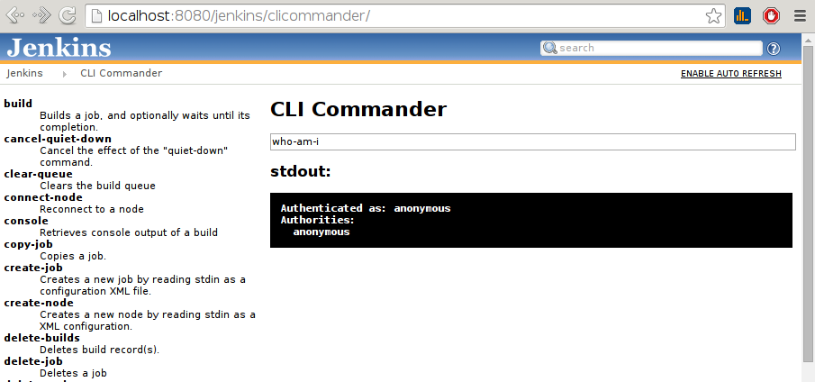

[[CLICommanderPlugin-CLICommanderPlugin]]
== CLI Commander Plugin

[.conf-macro .output-inline]#Run
https://wiki.jenkins-ci.org/display/JENKINS/Jenkins+CLI[CLI commands]
from Jenkins web UI.#

[[CLICommanderPlugin-What?Why?]]
=== What? Why?

While some operations are easy to perform from UI, other are easier to
do using CLI commands. Users often decide not to use Jenkins CLI as the
setup is not trivial, especially when authentication is required. CLI
Commander Plugin give users instant access to CLI features for
experiments or occasional use.

[.confluence-embedded-file-wrapper]##
