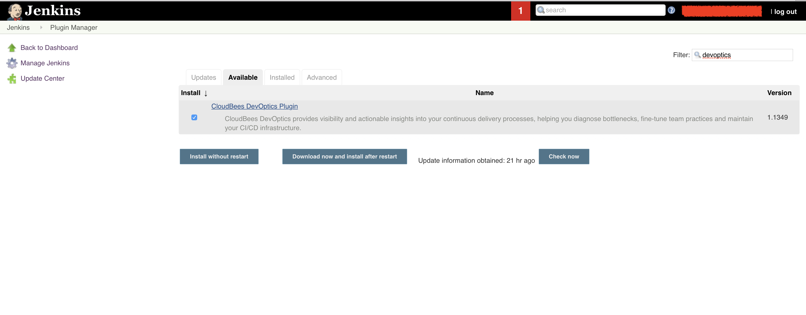
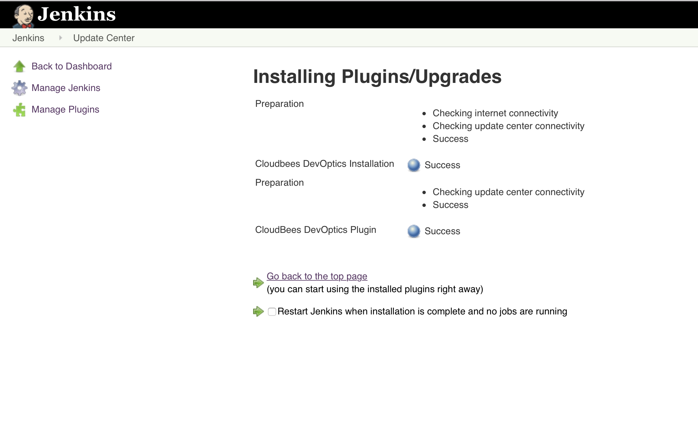
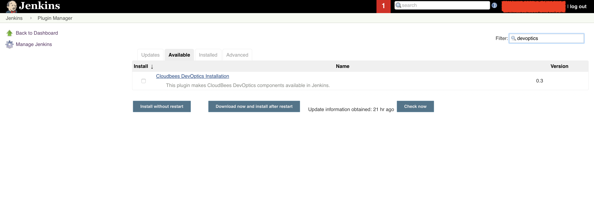

This plugin makes the CloudBees DevOptics data collecting plugin
available in OSS installations of Jenkins.

[[CloudBeesDevOpticsInstallationPlugin-DevOpticsPluginInstallationInstructions]]
== DevOptics Plugin Installation Instructions

. Install this plugin from the Jenkins Plugin Manager.  
.. A restart is not necessary, however, the "Check now" button needs to
be clicked to update the Available Offerings.
. Install the DevOptics plugin.  
.. A restart is not necessary.  Then proceed to configure the DevOptics
plugin.  https://go.cloudbees.com/docs/cloudbees-documentation/devoptics-user-guide/#_installation[Please
refer to the DevOptics installation instructions for details.]

[[CloudBeesDevOpticsInstallationPlugin-Screenshots]]
== Screenshots

[.confluence-embedded-file-wrapper .confluence-embedded-manual-size]####[.confluence-embedded-file-wrapper .confluence-embedded-manual-size]####[.confluence-embedded-file-wrapper .confluence-embedded-manual-size]##

[[CloudBeesDevOpticsInstallationPlugin-HelpandSupport]]
== Help and Support

For Help and support please use the
https://groups.google.com/group/jenkinsci-users[Jenkins Users] mailing
list. +
To report a bug please
http://issues.jenkins-ci.org/secure/IssueNavigator.jspa?mode=hide&reset=true&jqlQuery=project+%3D+JENKINS+AND+status+in+(Open,+%22In+Progress%22,+Reopened)+AND+component+%3D+cucumber-testresulthttp://issues.jenkins-ci.org/secure/IssueNavigator.jspa?mode=hide&reset=true&jqlQuery=project+%3D+JENKINS+AND+status+in+(Open,+%22In+Progress%22,+Reopened)+AND+component+%3D+cucumber-testresulthttp://issues.jenkins-ci.org/secure/IssueNavigator.jspa?mode=hide&reset=true&jqlQuery=project+%3D+JENKINS+AND+status+in+(Open,+%22In+Progress%22,+Reopened)+AND+component+%3D+cucumber-testresult-plugin[check
the bug tracker] to see if the issue has been reported before
http://issues.jenkins-ci.org/secure/IssueNavigator.jspa?mode=show&createNew=true[creating
a new issue].

[[CloudBeesDevOpticsInstallationPlugin-VersionHistory]]
== Version History

[[CloudBeesDevOpticsInstallationPlugin-0.4(4December2018)]]
=== 0.4 (4 December 2018)

Update wiki link, style fixes, and bump minimum Jenkins version.

[[CloudBeesDevOpticsInstallationPlugin-0.3(31January2018)]]
=== 0.3 (31 January 2018)

Documentation update and change plugin display name.

[[CloudBeesDevOpticsInstallationPlugin-0.2(25January2018)]]
=== 0.2 (25 January 2018)

Initial release.

[[CloudBeesDevOpticsInstallationPlugin-0.1(25January2018)]]
=== 0.1 (25 January 2018)

Test release.
