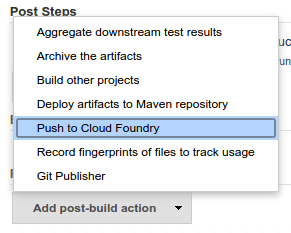
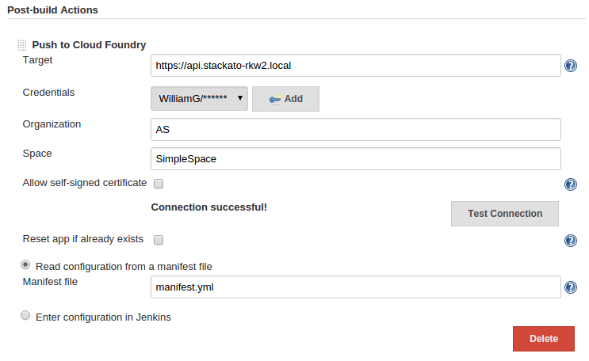

[.conf-macro .output-inline]##

[cols="",options="header",]
|===
|Plugin Information
|View Cloud Foundry https://plugins.jenkins.io/cloudfoundry[on the
plugin site] for more information.
|===

[.aui-icon .aui-icon-small .aui-iconfont-info .confluence-information-macro-icon]##

Older versions of this plugin may not be safe to use. Please review the
following warnings before using an older version:

* https://jenkins.io/security/advisory/2019-02-19/#SECURITY-876[CSRF
vulnerability and missing permission checks allowed capturing
credentials]

Pushes a project to Cloud Foundry or a CF-based platform (e.g. Stackato)
at the end of a build.

[[CloudFoundryPlugin-Usage]]
== Usage

You will find the plugin in the list of post-build actions in your
build's configuration page. +
(Note: as of version 2.1, the plugin is also available as a build step)

[.confluence-embedded-file-wrapper]##

Enter your target URL and your credentials, then test your connection to
make sure you won't have problems during the build. Check the "Allow
self-signed certificate" if you're using a Stackato micro cloud, or any
other PaaS without signed SSL certificates.

If your application already has a manifest.yml in its root directory,
you can leave the “Read app info from manifest.yml” checked. Unchecking
it will reveal additional settings that you will need to fill out.

[.confluence-embedded-file-wrapper]##

That’s it! Start a new build, and your application will be pushed at the
end of it.

[[CloudFoundryPlugin-Advanced]]
=== Advanced

[[CloudFoundryPlugin-Services]]
==== Services

You can specify services that will be bound to your app, either in the
manifest file or in the Jenkins config. However, this only binds
existing services, it does not create them. +
You can either create the services beforehand manually, or use the
"Create services before pushing" option.

[[CloudFoundryPlugin-Proxy]]
==== Proxy

The plugin will push applications through the proxy used by Jenkins. You
can change these settings in Manage Plugins → Advanced → Proxy
configuration.

[[CloudFoundryPlugin-TokenMacros]]
==== Token Macros

You can use
https://wiki.jenkins-ci.org/display/JENKINS/Token+Macro+Plugin[Token
Macros] in any configuration field that accepts a string. This allows
you to use https://ci.jenkins-ci.org/env-vars.html/[Jenkins' environment
variables] as well as any token generated by other plugins, such as the
https://wiki.jenkins-ci.org/display/JENKINS/Git+Plugin[Git Plugin]. +
For example, you can set your application name to:

[source,syntaxhighlighter-pre]
----
#{JOB_NAME}-#{GIT_REVISION}
----

[[CloudFoundryPlugin-PipelineDSL]]
=== Pipeline DSL

*Declarative Pipeline (minimal configuration)*

[source,syntaxhighlighter-pre]
----
pushToCloudFoundry(
  target: 'api.local.pcfdev.io',
  organization: 'pcfdev-org',
  cloudSpace: 'pcfdev-space',
  credentialsId: 'pcfdev_user'
)
----

*Minimal configuration with explicit manifest file*

[source,syntaxhighlighter-pre]
----
 pushToCloudFoundry(
  target: 'api.local.pcfdev.io',
  organization: 'pcfdev-org',
  cloudSpace: 'pcfdev-space',
  credentialsId: 'pcfdev_user',
  manifestChoice: [manifestFile: 'path/to/manifest.yml']
 )
----

*Inline manifest with service creation and binding*

[source,syntaxhighlighter-pre]
----
pushToCloudFoundry(
  target: 'api.local.pcfdev.io',
  organization: 'pcfdev-org',
  cloudSpace: 'pcfdev-space',
  credentialsId: 'pcfdev_user',
  selfSigned: true,
  servicesToCreate: [
    [name: 'mysql-spring', type: 'p-mysql', plan: '512', resetService: true]
  ],
  manifestChoice: [
    value: 'jenkinsConfig',
    appName: 'hello-spring-mysql',
    memory: 512,
    instances: 2,
    services: ['mysql-spring'],
    envVars: [
      [key: 'FOO', value: 'bar']
    ],
    appPath: 'test-apps/hello-spring-mysql/target/hello-spring-mysql.war'
  ]
)
----

 

[[CloudFoundryPlugin-Changelog]]
=== Changelog

[[CloudFoundryPlugin-Version2.3.02.3.1(June24,2018)]]
==== Version [line-through]*2.3.0* 2.3.1 (June 24, 2018)

* Fixes [.jira-issue .conf-macro .output-block]#
https://issues.jenkins-ci.org/browse/JENKINS-31208[[.aui-icon .aui-icon-wait .issue-placeholder]##
##JENKINS-31208] - [.summary]#Getting issue details...#
[.aui-lozenge .aui-lozenge-subtle .aui-lozenge-default .issue-placeholder]#STATUS#
#   Support variable expansion in token macros.

[[CloudFoundryPlugin-Version2.2.0(October9,2017)]]
==== Version 2.2.0 (October 9, 2017)

* {blank}
+
CF Java Client dependency upgraded to
https://github.com/cloudfoundry/cf-java-client/releases/tag/v2.20.0.RELEASE[2.2.0.RELEASE]
* {blank}
+
Fixes  [.jira-issue .conf-macro .output-block]#
https://issues.jenkins-ci.org/browse/JENKINS-46049[[.aui-icon .aui-icon-wait .issue-placeholder]##
##JENKINS-46049] - [.summary]#Getting issue details...#
[.aui-lozenge .aui-lozenge-subtle .aui-lozenge-default .issue-placeholder]#STATUS#
#

[[CloudFoundryPlugin-Version2.1.1(August8,2017)]]
==== Version 2.1.1 (August 8, 2017)

* Bugfix for communicating to CloudFoundry API endpoints over plain http
(see 2.1 release notes)
* Can also specify port (use `+cloudfoundry.api.target:12345+`,
`+http://cloudfoundry.api.target:12345+`, or
`+https://cloudfoundry.api.target:12345+`)

[[CloudFoundryPlugin-Version2.1(August5,2017)]]
==== Version 2.1 (August 5, 2017)

* Re-enabled support for Cloudfoundry over unsecure http
(use `+http://cloudfoundry.api.target+` instead of
just `+cloudfoundry.api.target+`)
* Cloudfoundry push is now available as a build step in addition to the
post-build action
* The build step is also available as a pipeline step
(`+pushToCloudFoundry+`)

[[CloudFoundryPlugin-Version2.0(July29,2017)]]
==== Version 2.0 (July 29, 2017)

* The plugin is now based on cf-java-client 2.
* Minimum Java version raised to 1.8 (due to lambdas)
* Pushes are implemented by
calling `+org.cloudfoundry.operations.applications.Applications.pushManifest+`.
This should hopefully ensure the behaviour is as close as possible to
calling `+cf push+` via the CLI
* As a result of using the cf push approach,
the `+Reset app if already exists+` setting is now a no-op.
* Now uses the plugin-first classloader instead of shaded cf-java-client
jar
* Requires accessing the cloudfoundry api over https. Ignoring ssl
validation errors is still an option, but plain http is not.

[[CloudFoundryPlugin-Version1.5(October21,2015)]]
==== Version 1.5 (October 21, 2015)

* Add plugin timeout parameter. This lets you set the timeout before the
plugin marks the build a failure, independently from the target. This is
similar to the "client timeout" option of the cf client.
* Updating the environment variables of an existing app will no longer
overwrite existing variables. This is the behavior of the cf client.

[[CloudFoundryPlugin-Version1.4.4(September30,2015)]]
==== Version 1.4.4 (September 30, 2015)

* Fix temporary directory not being deleted.
* Fix exception when using a memory value without a unit.
* Add support for more memory units (All units from
https://docs.cloudfoundry.org/devguide/deploy-apps/manifest.html#memory[the
CF documentation]).
* Ignore unknown macro token in environment variables, to allow dollar
signs without escaping.

[[CloudFoundryPlugin-Version1.4.3(September17,2015)]]
==== Version 1.4.3 (September 17, 2015)

* Add support for pushing an app with a non-default stack.

[[CloudFoundryPlugin-Version1.4.2(August24,2015)]]
==== Version 1.4.2 (August 24, 2015)

* Fix ClassCastException on push in some cases.
* Fix "Could not read JSON" error hiding the true error coming from the
target.
* Fix backwards compatibility with the saved configuration of older
versions.

[[CloudFoundryPlugin-Version1.4.1(July21,2015)]]
==== Version 1.4.1 (July 21, 2015)

* Fix temporary files not being correctly deleted at the end of a push.

[[CloudFoundryPlugin-Version1.4(June11,2015)]]
==== Version 1.4 (June 11, 2015)

* Add an option to create services before the push of the application.
* The default domain for application URIs is now queried from the
target, instead of calculated from its URL.

[[CloudFoundryPlugin-Version1.3.3(May28,2015)]]
==== Version 1.3.3 (May 28, 2015)

* Fix `WsContainerProvider not a subtype` crash that would happen on
some Jenkins instances.

[[CloudFoundryPlugin-Version1.3.1(Apr21,2015)]]
==== Version 1.3.1 (Apr 21, 2015)

* Fix the ArrayIndexOutOfBoundsException that happened using older
versions of Java.
* Add additional stack trace info in case of unknown or CF exception.
* Internal changes.

[[CloudFoundryPlugin-Version1.3(Mar9,2015)]]
==== Version 1.3 (Mar 9, 2015)

* Add support for
https://wiki.jenkins-ci.org/display/JENKINS/Token+Macro+Plugin[Token
Macros] in configuration fields that accept a string.
* The behavior of the `no-route` option has been changed in accordance
to Cloud Foundry docs. It will now unbind every route attached to the
app.
* The `path` option of a manifest file will now be relative to the
location of the manifest file. (This is important when using a custom
manifest file location)

[[CloudFoundryPlugin-Version1.2(Feb16,2015)]]
==== Version 1.2 (Feb 16, 2015)

* Add support for pushing an app through a proxy.
* The plugin now uses credentials from the
https://wiki.jenkins-ci.org/display/JENKINS/Credentials+Plugin[Credentials
Plugin] instead of text fields.
* Support for custom manifest file location.

[[CloudFoundryPlugin-Version1.1(Jan23,2015)]]
==== Version 1.1 (Jan 23, 2015)

* Add support for distributed jobs.
* Add support for multi-apps manifest.yml files. (They will be pushed in
order, but the entire build will be marked as failed if one app fails)
* Fix UI bug where services configured would not show up on reload.
* Print more useful info in case of unknown CloudFoundryException.

[[CloudFoundryPlugin-Version1.0.3(Nov17,2014)]]
==== Version 1.0.3 (Nov 17, 2014)

* Initial release.
