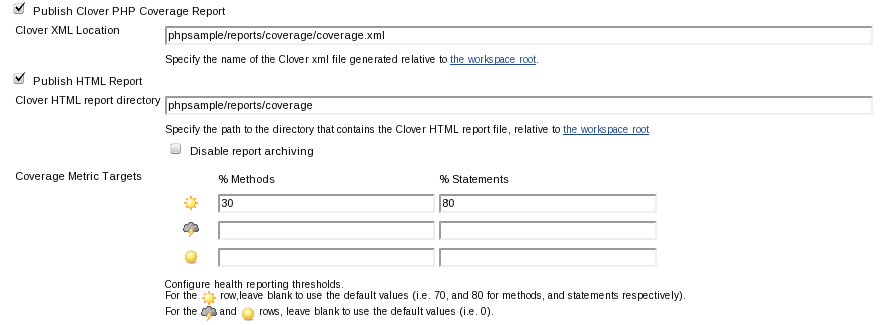
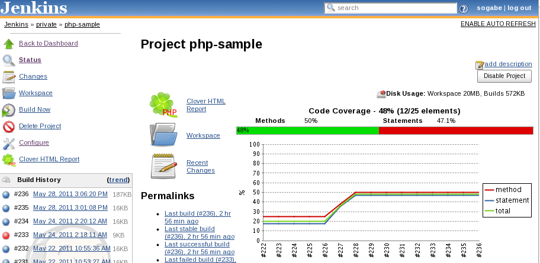
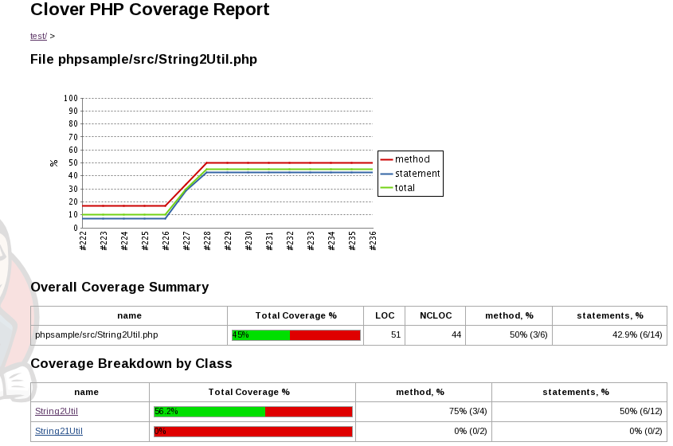

[.conf-macro .output-inline]#This plugin allows you to capture code
coverage reports from *PHPUnit*. For more information on how to set up
PHP projects with Jenkins have a look at the
http://jenkins-php.org/[Template for Jenkins Jobs for PHP Projects].#

[[CloverPHPPlugin-PHPUnit]]
== PHPUnit

You have to use *"--coverage-clover"* option to generate clover style
coverage report. +
The following setting is for Phing.

*build.xml*

[source,syntaxhighlighter-pre]
----
<exec dir="."
      command="phpunit --log-junit 'reports/unitreport.xml'
                       --coverage-html 'reports/coverage'
                       --coverage-clover 'reports/coverage/coverage.xml'
                       test/"
/>
----

Or use phpunit task with *clover* style formatter.

*build.xml with phpunit task*

[source,syntaxhighlighter-pre]
----
<phpunit codecoverage="true" haltonfailure="true" haltonerror="true">
  <formatter type="clover" usefile="false"/>
  <batchtest>
    <fileset dir="tests">
      <include name="**/*Test*.php"/>
    </fileset>
  </batchtest>
</phpunit>
----

[[CloverPHPPlugin-Projectconfiguration]]
== Project configuration

* the location of clover xml(required).
* the location of clover html report (optional).

[.confluence-embedded-file-wrapper]##

[[CloverPHPPlugin-Projectscreen]]
== Project screen

[.confluence-embedded-file-wrapper]##

[.confluence-embedded-file-wrapper]##

[[CloverPHPPlugin-TODO]]
== TODO

* Make compatible with pipelines

[[CloverPHPPlugin-Changelog]]
== Changelog

[[CloverPHPPlugin-0.5(20Nov,2015)]]
=== 0.5 (20 Nov, 2015)

* include namespaced classes
(https://issues.jenkins-ci.org/browse/JENKINS-26722[JENKINS-26722])
* pay attention to target coverage
(https://issues.jenkins-ci.org/browse/JENKINS-20233[JENKINS-20233])
* specifically publish the plugin under MIT license
(https://issues.jenkins-ci.org/browse/JENKINS-30215[JENKINS-30215])

[[CloverPHPPlugin-0.4(6Apr,2015)]]
=== 0.4 (6 Apr, 2015)

* support variables for configuration.
* option to generate clover report regardless of build
(https://issues.jenkins-ci.org/browse/JENKINS-21046[JENKINS-21046]).
* The CloverPHP red/green coverage bar is too wide
(https://issues.jenkins-ci.org/browse/JENKINS-25717[JENKINS-25717]).

[[CloverPHPPlugin-0.3.3(21Mar,2013)]]
=== 0.3.3 (21 Mar, 2013)

* added message if clover xml is incompatible with clover style
(https://issues.jenkins-ci.org/browse/JENKINS-17037[JENKINS-17037]).
* Conflict with standard clover plugin
(https://issues.jenkins-ci.org/browse/JENKINS-15626[JENKINS-15626]).

[[CloverPHPPlugin-0.3.2(21Oct,2011)]]
=== 0.3.2 (21 Oct, 2011)

* NPE when Clover HTML report directory is not defined
(https://issues.jenkins-ci.org/browse/JENKINS-11408[JENKINS-11408]).
* Fixed breadcrumb.
* Fixed IE6 rendering.

[[CloverPHPPlugin-0.3.1(27July,2011)]]
=== 0.3.1 (27 July, 2011)

* roll back the dependency to Jenkins 1.409 for 1.409.x LTS
releases.(https://github.com/jenkinsci/cloverphp-plugin/commit/c768bb5f1239db297965f457700f4668081af634#commitcomment-499465[Comment]).
* Report page rendering performance boost
(https://github.com/jenkinsci/cloverphp-plugin/pull/1[pull request]).

[[CloverPHPPlugin-0.3(3Jun,2011)]]
=== 0.3 (3 Jun, 2011)

* Support FreeStyle and Matrix projects only.
* NPE in Clover PHP Plugin when XML config is empty
(https://issues.jenkins-ci.org/browse/JENKINS-9821[JENKINS-9821]).
* save clover.xml and html report in builds/XX/cloverphp directory.

[[CloverPHPPlugin-0.2(28May,2011)]]
=== 0.2 (28 May, 2011)

* Fixed a path when built on slave.
* Added breadcrumb.
* Added test classes.
* fixed configuration page.

[[CloverPHPPlugin-0.1(16May,2011)]]
=== 0.1 (16 May, 2011)

* First release
