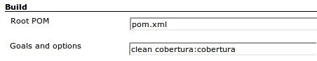

[.aui-icon .aui-icon-small .aui-iconfont-info .confluence-information-macro-icon]#
#

The current thinking is to merge this plugin into more generic coverage
plugin. Help appreciated.

[.conf-macro .output-inline]##This plugin allows you to capture code
coverage report from http://cobertura.sourceforge.net/[Cobertura].
Jenkins will generate the trend report of coverage.##The Cobertura
plugin can be
http://updates.jenkins-ci.org/download/plugins/cobertura/[downloaded
here].

[[CoberturaPlugin-ConfiguringtheCoberturaPlugin]]
== Configuring the Cobertura Plugin

. Install the cobertura plugin (via Manage Jenkins -> Manage Plugins)
. Configure your project's build script to generate cobertura XML
reports (See below for examples with Ant and Maven2)
. Enable the "Publish Cobertura Coverage Report" publisher
. Specify the directory where the coverage.xml report is generated.
. (Optional) Configure the coverage metric targets to reflect your
goals.

[[CoberturaPlugin-Configuringbuildtools]]
== Configuring build tools

Here are the configuration details for common build tools. Please feel
free to update this with corrections or additions.

[[CoberturaPlugin-Maven2]]
=== Maven 2

[[CoberturaPlugin-Quickconfiguration]]
==== Quick configuration

You can either, enable "cobertura" analysis in your 'pom.xml' files or
just tell Jenkins to run "cobertura" goal.

If you don't want to change your pom files, just add the goal
'cobertura:cobertura' to your Maven project in Jenkins. +
[.confluence-embedded-file-wrapper]##

[[CoberturaPlugin-SingleProject]]
==== Single Project

If you are using a single module configuration, add the following into
your pom.xml. This will cause cobertura to be called each time you run
"mvn package".

[source,syntaxhighlighter-pre]
----
<project ...>
    ...
    <build>
        ...
        <plugins>
            ...
            <plugin>
                <groupId>org.codehaus.mojo</groupId>
                <artifactId>cobertura-maven-plugin</artifactId>
                <version>2.5.1</version>
                <configuration>
                    <formats>
                        <format>xml</format>
                    </formats>
                </configuration>
                <executions>
                    <execution>
                        <phase>package</phase>
                        <goals>
                            <goal>cobertura</goal>
                        </goals>
                    </execution>
                </executions>
            </plugin>
            ...
        </plugins>
        ...
    </build>
    ...
</project>
----

 

[[CoberturaPlugin-ExecutecoberturaonlyfromJenkinsusingprofiles]]
===== Execute cobertura only from Jenkins using profiles

You can reduce the load of your developer machine by using maven
profiles to execute the plugin only if you are running within Jenkins.
The configuration below shows how to enable the plugin based on the
information if maven was started by Jenkins.

 

[source,syntaxhighlighter-pre]
----
<project ...>
    ...
    <profiles>
        <!-- Jenkins by default defines a property BUILD_NUMBER which is used to enable the profile. -->
        <profile>
            <id>jenkins</id>
            <activation>
                <property>
                    <name>env.BUILD_NUMBER</name>
                </property>
            </activation>
            <build>
                <plugins>
                    <plugin>
                        <groupId>org.codehaus.mojo</groupId>
                        <artifactId>cobertura-maven-plugin</artifactId>
                        <version>2.2</version>
                        <configuration>
                            <formats>
                                <format>xml</format>
                            </formats>
                        </configuration>
                        <executions>
                            <execution>
                                <phase>package</phase>
                                <goals>
                                    <goal>cobertura</goal>
                                </goals>
                            </execution>
                        </executions>
                    </plugin>
                </plugins>
            </build>
        </profile>
    </profiles>
    ...
</project>
----

[[CoberturaPlugin-Projecthierarchies]]
==== Project hierarchies

If you are using a common parent for all Maven2 modules you can move the
plugin configuration to the pluginManagement section of the common
_parent_...

[source,syntaxhighlighter-pre]
----
<project ...>
    ...
    <build>
        ...
        <pluginManagement>
            <plugins>
                ...
                <plugin>
                    <groupId>org.codehaus.mojo</groupId>
                    <artifactId>cobertura-maven-plugin</artifactId>
                    <version>2.2</version>
                    <configuration>
                        <formats>
                            <format>xml</format>
                        </formats>
                    </configuration>
                    <executions>
                        <execution>
                            <phase>package</phase>
                            <goals>
                                <goal>cobertura</goal>
                            </goals>
                        </execution>
                    </executions>
                </plugin>
                ...
            </plugins>
        </pluginManagement>
        ...
    </build>
    ...
</project>
----

 And add the plugin group and artifact to the children

[source,syntaxhighlighter-pre]
----
<project ...>
    ...
    <build>
        ...
        <plugins>
            ...
            <plugin>
                <groupId>org.codehaus.mojo</groupId>
                <artifactId>cobertura-maven-plugin</artifactId>
            </plugin>
            ...
        </plugins>
        ...
    </build>
    ...
</project>
----

[[CoberturaPlugin-ExecutecoberturaonlyfromJenkinsusingprofiles.1]]
===== Execute cobertura only from Jenkins using profiles

It is highly recommend to reduce the workload of the developers machines
by disabling the cobertura plugin and only using it from within Jenkins.
The following excerpt from the _parent_ shows how to do so:

[source,syntaxhighlighter-pre]
----
<project ...>
    ...
    <profiles>
        <!-- Jenkins by default defines a property BUILD_NUMBER which is used to enable the profile. -->
        <profile>
            <id>jenkins</id>
            <activation>
                <property>
                    <name>env.BUILD_NUMBER</name>
                </property>
            </activation>
            <build>
                <pluginManagement>
                    <plugins>
                        <plugin>
                            <groupId>org.codehaus.mojo</groupId>
                            <artifactId>cobertura-maven-plugin</artifactId>
                            <version>2.2</version>
                            <configuration>
                                <formats>
                                    <format>xml</format>
                                </formats>
                            </configuration>
                            <executions>
                                <execution>
                                    <phase>package</phase>
                                    <goals>
                                        <goal>cobertura</goal>
                                    </goals>
                                </execution>
                            </executions>
                        </plugin>
                    </plugins>
                </pluginManagement>
            </build>
        </profile>
    </profiles>
    ...
</project>
----

 Now that your parent is only using the plugin management section if it
is running from within Jenkins, you need the childern poms adapted as
well:

[source,syntaxhighlighter-pre]
----
<project ...>
    ...
    <!-- If we are running in Jenkins use cobertura. -->
    <profiles>
        <profile>
            <id>jenkins</id>
            <activation>
                <property>
                    <name>env.BUILD_NUMBER</name>
                </property>
            </activation>
            <build>
                <plugins>
                    <plugin>
                        <groupId>org.codehaus.mojo</groupId>
                        <artifactId>cobertura-maven-plugin</artifactId>
                    </plugin>
                </plugins>
            </build>
        </profile>
    </profiles>
    ...
</project>
----

[[CoberturaPlugin-Ant]]
=== Ant

You must first tell Ant about the Cobertura Ant tasks using a taskdef
statement. The best place to do this is near the top of your build.xml
script, before any target statements.

[source,syntaxhighlighter-pre]
----
<property name="cobertura.dir" value="C:/javastuff/cobertura" />

<path id="cobertura.classpath">
    <fileset dir="${cobertura.dir}">
        <include name="cobertura.jar" />
        <include name="lib/**/*.jar" />
    </fileset>
</path>

<taskdef classpathref="cobertura.classpath" resource="tasks.properties" />
----

You'll need to instrument the classes that JUnit will be testing (not
the test classes themselves) as such:

[source,syntaxhighlighter-pre]
----
<cobertura-instrument todir="${instrumented.dir}">
    <ignore regex="org.apache.log4j.*" />
    <fileset dir="${classes.dir}">
        <include name="**/*.class" />
        <exclude name="**/*Test.class" />
    </fileset>
    <fileset dir="${guiclasses.dir}">
        <include name="**/*.class" />
        <exclude name="**/*Test.class" />
    </fileset>
    <fileset dir="${jars.dir}">
        <include name="my-simple-plugin.jar" />
    </fileset>
</cobertura-instrument>
----

Here's an example call to the JUnit ant task that has been modified to
work with Cobertura. 

[source,syntaxhighlighter-pre]
----
<junit fork="yes" dir="${basedir}" failureProperty="test.failed">
    <!--
        Specify the name of the coverage data file to use.
        The value specified below is the default.
    -->
    <sysproperty key="net.sourceforge.cobertura.datafile"
        file="${basedir}/cobertura.ser" />

    <!--
        Note the classpath order: instrumented classes are before the
        original (uninstrumented) classes.  This is important.
    -->
    <classpath location="${instrumented.dir}" />
    <classpath location="${classes.dir}" />

    <!--
        The instrumented classes reference classes used by the
        Cobertura runtime, so Cobertura and its dependencies
        must be on your classpath.
    -->
    <classpath refid="cobertura.classpath" />

    <formatter type="xml" />
    <test name="${testcase}" todir="${reports.xml.dir}" if="testcase" />
    <batchtest todir="${reports.xml.dir}" unless="testcase">
        <fileset dir="${src.dir}">
            <include name="**/*Test.java" />
        </fileset>
    </batchtest>
</junit>
----

Finally, you need a task to generate the xml report, where 'destdir' is
where you want the report (coverage.xml) generated.

Your cobertura.ser is generated to your module root.

srcdir is where your *.java files are located. If you use multiple
modules in one build process you need to include the module name, if you
use the simple srcdir parameter. It is not required to include module
name if you use fileset.

[source,syntaxhighlighter-pre]
----
<cobertura-report format="xml" destdir="${coveragereport.dir}" srcdir="${src.dir}" />
You can use multiple source directories this way:
<cobertura-report format="xml" destdir="${coveragereport.dir}" >

    <fileset dir="${src.dir.java}">

        <include name="**/*.java" />

    </fileset>

    <fileset dir="${src.dir.main}">

        <include name="**/*.java" />

    </fileset>

</cobertura-report>
----

[[CoberturaPlugin-Gradle]]
=== Gradle

Running Cobertura in gradle, copied from Piotr Gabryanczyk's post at
http://piotrga.wordpress.com/2010/04/17/gradle-cobertura-integration-revisited/ and
tweaked to work for gradle 1.5:

Create cobertura.gradle in the root of your project:

[source,syntaxhighlighter-pre]
----
logger.info "Configuring Cobertura Plugin"

configurations{
  coberturaRuntime {extendsFrom testRuntime}
}

dependencies {
  coberturaRuntime 'net.sourceforge.cobertura:cobertura:1.9.4'
}

def serFile="${project.buildDir}/cobertura.ser"
def classes="${project.buildDir}/classes/main"
def classesCopy="${classes}-copy"

task cobertura(type: Test){
  dependencies {
    testRuntime 'net.sourceforge.cobertura:cobertura:1.9.4'
  }

  systemProperty "net.sourceforge.cobertura.datafile", serFile
}

cobertura.doFirst  {
  logger.quiet "Instrumenting classes for Cobertura"
  ant {
    delete(file:serFile, failonerror:false)
    delete(dir: classesCopy, failonerror:false)
    copy(todir: classesCopy) { fileset(dir: classes) }

    taskdef(resource:'tasks.properties', classpath: configurations.coberturaRuntime.asPath)
    'cobertura-instrument'(datafile: serFile) {
      fileset(dir: classes,
              includes:"**/*.class",
              excludes:"**/*Test.class")
    }
  }
}

cobertura.doLast{
  if (new File(classesCopy).exists()) {
    //create html cobertura report
    ant.'cobertura-report'(destdir:"${project.reportsDir}/cobertura",
            format:'html', srcdir:"src/main/java", datafile: serFile)
    //create xml cobertura report
     ant.'cobertura-report'(destdir:"${project.reportsDir}/cobertura",
            format:'xml', srcdir:"src/main/java", datafile: serFile)
    ant.delete(file: classes)
    ant.move(file: classesCopy, tofile: classes)
  }
}
----

Apply Cobertura.gradle in your build.gradle

Either (if single project build)

[source,syntaxhighlighter-pre]
----
apply plugin: 'java'
apply from: 'cobertura.gradle'
----

Or (if multi project build)

[source,syntaxhighlighter-pre]
----
subprojects {
  apply plugin: 'java'
  apply from: "${parent.projectDir.canonicalPath}/cobertura.gradle"
}
----

[[CoberturaPlugin-VersionHistory]]
== Version History

[[CoberturaPlugin-Version1.12.1(10-May-2018)]]
=== Version 1.12.1 (10-May-2018)

* Failed to scout
hudson.plugins.cobertura.MavenCoberturaPublisher (https://issues.jenkins-ci.org/browse/JENKINS-44200[JENKINS-44200])
* Fix highlight for partially covered
branches (https://issues.jenkins-ci.org/browse/JENKINS-13489[JENKINS-13489])
* Don't round up 99.x% coverage to
100% (https://issues.jenkins-ci.org/browse/JENKINS-43866[JENKINS-43866])

[[CoberturaPlugin-Version1.12(12-Nov-2017)]]
=== Version 1.12 (12-Nov-2017)

* Show why build failed when it missed coverage targets
(https://issues.jenkins-ci.org/browse/JENKINS-47639[JENKINS-47639])
* Prefix all logs with `[Cobertura]`
(https://issues.jenkins-ci.org/browse/JENKINS-25781[JENKINS-25781])
* Fix Phabricator compatibility regression
(https://github.com/jenkinsci/cobertura-plugin/issues/73[Issue #73])
* Add support for pipeline snippet generator

[[CoberturaPlugin-Version1.11(09-Aug-2017)]]
=== Version 1.11 (09-Aug-2017)

* Added pipline support for coverage targets
(https://github.com/jenkinsci/cobertura-plugin/issues/67[Issue #67])
* Publish jobs when onlyStable is false even if job fails
(https://github.com/jenkinsci/cobertura-plugin/issues/59[Issue #59])

[[CoberturaPlugin-Version1.10(25-Apr-2017)]]
=== Version 1.10 (25-Apr-2017)

* Support Jenkins pipeline
(https://issues.jenkins-ci.org/browse/JENKINS-30700[JENKINS-30700])
* Avoid error when CoverageMetric EnumSet is empty
(https://issues.jenkins-ci.org/browse/JENKINS-6425[JENKINS-6425])
* Remove deprecated use of ChartUtil.generateGraph
(https://issues.jenkins-ci.org/browse/JENKINS-17800[JENKINS-17800])
* Fix typo in Spanish properties

[[CoberturaPlugin-Version1.9.8(8-May-2016)]]
=== Version 1.9.8 (8-May-2016)

* Allow later concurrent builds to finish
first (https://issues.jenkins-ci.org/browse/JENKINS-26823[JENKINS-26823])
* Find code from Python
coverage (https://issues.jenkins-ci.org/browse/JENKINS-13889[JENKINS-13889])

[[CoberturaPlugin-Version1.9.7(4-Mar-2015)]]
=== Version 1.9.7  (4-Mar-2015)

* Fixes broken dashboard links when inside folder
(https://issues.jenkins-ci.org/browse/JENKINS-26410[JENKINS-26410])

[[CoberturaPlugin-Version1.9.6(25-Oct-2014)]]
=== Version 1.9.6 (25-Oct-2014)

* Fixed URL to coverage results in views and folders
(https://issues.jenkins-ci.org/browse/JENKINS-24436[JENKINS-24436])

[[CoberturaPlugin-Version1.9.5(24-Apr-2014)]]
=== Version 1.9.5 (24-Apr-2014)

* Added coverage column that shows line/branch coverage in views

[[CoberturaPlugin-Version1.9.4(17-Apr-2014)]]
=== Version 1.9.4 (17-Apr-2014)

* Fix display when data for one of the columns is missing
(https://issues.jenkins-ci.org/browse/JENKINS-22412[JENKINS-22412])

[[CoberturaPlugin-Version1.9.3(16-Oct-2013)]]
=== Version 1.9.3 (16-Oct-2013)

* More fixes of file descriptor leaks

[[CoberturaPlugin-Version1.9.2(9-Aug-2013)]]
=== Version 1.9.2 (9-Aug-2013)

* Cobertura Unable to delete coverage.xml on windows
(https://issues.jenkins-ci.org/browse/JENKINS-18858[JENKINS-18858]).

[[CoberturaPlugin-Version1.9.1(14-Jun-2013)]]
=== Version 1.9.1 (14-Jun-2013)

* Added "most recent N builds" limiting option for coverage graph.
* Fixed columns order on
dashboard(https://issues.jenkins-ci.org/browse/JENKINS-18218[JENKINS-18218]).

[[CoberturaPlugin-Version1.9(28-Apr-2013)]]
=== Version 1.9 (28-Apr-2013)

* SourceCodePainter overwrites original files
(https://issues.jenkins-ci.org/browse/JENKINS-16252[JENKINS-16252]).
* table.source font-family should not specify courier
(https://issues.jenkins-ci.org/browse/JENKINS-3567[JENKINS-3567]).
* show greenbar collectly in IE Quirks Mode
(https://issues.jenkins-ci.org/browse/JENKINS-8568[JENKINS-8568]).
* There should be a cobertura summary item on the build status page
(https://issues.jenkins-ci.org/browse/JENKINS-8441[JENKINS-8441]).
* show legend under the graph.
* sort order of metrics. package, file, class, method, line, condition.
* Cobertura plugin does not provide data to the REST API
(https://issues.jenkins-ci.org/browse/JENKINS-13877[JENKINS-13877]).
* Cobertura ClassCastException
(https://issues.jenkins-ci.org/browse/JENKINS-15703[JENKINS-15703]).

[[CoberturaPlugin-Version1.8(15-Dec-2012)]]
=== Version 1.8 (15-Dec-2012)

* Crop unusaged whitespace in coverage
graph(https://issues.jenkins-ci.org/browse/JENKINS-16038[JENKINS-16038]).
* testing if workspace permissions
* fixed layout: added align="right" to be displayed collectly
* Cannot plublish cobertura reports if
org.codehaus.mojo:cobertura-maven-plugin is not
invoked(https://issues.jenkins-ci.org/browse/JENKINS-14552[JENKINS-14552]).
* Cobertura - add option to make build as unstable (or not at all)
instead of failed when no coverage xml files are found
(https://issues.jenkins-ci.org/browse/JENKINS-12857[JENKINS-12857]).

[[CoberturaPlugin-Version1.7.1(17-Oct-2012)]]
=== Version 1.7.1 (17-Oct-2012)

* fix regression
https://issues.jenkins-ci.org/browse/JENKINS-15518[JENKINS-15518]

[[CoberturaPlugin-Version1.7(11-Oct-2012)]]
=== Version 1.7 (11-Oct-2012)

* Memory footprint reduction.
* https://issues.jenkins-ci.org/browse/JENKINS-15035[JENKINS-15035]

[[CoberturaPlugin-Version1.6(17-Aug-2012)]]
=== Version 1.6 (17-Aug-2012)

* Inconsistent delete
button(https://issues.jenkins-ci.org/browse/JENKINS-14589[JENKINS-14589]).
* Allow the build to fail on low coverage
(https://issues.jenkins-ci.org/browse/JENKINS-11025[JENKINS-11025]).
* Support for ratcheting
(https://issues.jenkins-ci.org/browse/JENKINS-8326[JENKINS-8326]).
* include support for
http://code.google.com/p/cobertura-it-maven-plugin/['cobertura-it-maven-plugin'].

[[CoberturaPlugin-Version1.5(20-May-2012)]]
=== Version 1.5 (20-May-2012)

* Code Coverages dashboard portlet missing column("METHODS")
(https://issues.jenkins-ci.org/browse/JENKINS-7366[JENKINS-7366]).
* cobertura coverage dashboard portlet not using numeric sort for
percent columns
(https://issues.jenkins-ci.org/browse/JENKINS-13250[JENKINS-13250]).
* updated Japanese localization.
* some fixes.

[[CoberturaPlugin-Version1.4(5-May-2012)]]
=== Version 1.4 (5-May-2012)

* cobertura conditionals not available with a French server + regexps
optimizations
(https://issues.jenkins-ci.org/browse/JENKINS-7540[JENKINS-7540]).
* Cobertura gives LinkageError in new Jenkins version
(https://issues.jenkins-ci.org/browse/JENKINS-11398[JENKINS-11398]).
* Cobertura plugin should not fail maven build for maven release
(https://issues.jenkins-ci.org/browse/JENKINS-12640[JENKINS-12640])
(https://github.com/jenkinsci/cobertura-plugin/pull/6[pull-6]).

[[CoberturaPlugin-Version1.3(13-Aug-2011)]]
=== Version 1.3 (13-Aug-2011)

* Change so output format will be in alphabetical order by default
* Put <pre>...</pre> tags around source code content in case cobertura
directory is linked to source code
* Added description of the Source Encoding

[[CoberturaPlugin-Version1.2(25-Feb-2011)]]
=== Version 1.2 (25-Feb-2011)

* Update for Jenkins

[[CoberturaPlugin-Version1.1(11-Jan-2011)]]
=== Version 1.1 (11-Jan-2011)

* Fix http://issues.jenkins-ci.org/browse/JENKINS-8362 : cobertura
plugin and maven3.

[[CoberturaPlugin-Version1.0(30-Jul-2010)]]
=== Version 1.0 (30-Jul-2010)

* Fix so 0/0 is counted as 100% instead of 0% coverage (ie, a method
with no conditionals).
(https://issues.jenkins-ci.org/browse/JENKINS-6790[JENKINS-6790])
* Fix in source viewer so "\n" and "\r" (backslash+n/r, not actual
newlines) are not omitted.
(https://issues.jenkins-ci.org/browse/JENKINS-3566[JENKINS-3566])
* Add support for dashboard plugin

[[CoberturaPlugin-Version0.8.11(22-Mar-2010)]]
=== Version 0.8.11 (22-Mar-2010)

* Fixed: source code unavailable when unstable
(https://issues.jenkins-ci.org/browse/JENKINS-4803[JENKINS-4803])
* Fixed an issue in internationalization on static enum clases which
made some texts be shown in English.
* Fixed a bug in the way the tables were sorted (same problem than emma
https://issues.jenkins-ci.org/browse/JENKINS-4173[JENKINS-4173]). Now
they are sorted numerically instead of alphabetically.
* Added Spanish internationalization.

[[CoberturaPlugin-Version0.8.10(15-Jan-2010)]]
=== Version 0.8.10 (15-Jan-2010)

* Reorganize data structures to allow processing larger result files
* Use EnumMap and EnumSet for more compact in-memory representation of
data
* Update code for more recent Hudson
* Change report colors as described
http://n4.nabble.com/cobertura-plugin-color-change-td932633.html[here]
* Internationalize messages
(https://issues.jenkins-ci.org/browse/JENKINS-4920[JENKINS-4920])

[[CoberturaPlugin-Version0.8.9(8-Jul-2009)]]
=== Version 0.8.9 (8-Jul-2009)

* Added green/red results bars to statistic blocks
(https://issues.jenkins-ci.org/browse/JENKINS-3869[JENKINS-3869])
* Improved support for multi-module SCMs other than Subversion (such as
CVS) (https://issues.jenkins-ci.org/browse/JENKINS-1323[JENKINS-1323])
* Fixed an issue that broke source highlighting for module build result
pages (https://issues.jenkins-ci.org/browse/JENKINS-3938[JENKINS-3938])

[[CoberturaPlugin-Version0.8.8(11-Jun-2009)]]
=== Version 0.8.8 (11-Jun-2009)

* Revert the memory usage fixes in 0.8.7, since they were breaking
source highlighting
(https://issues.jenkins-ci.org/browse/JENKINS-3597[JENKINS-3597])

[[CoberturaPlugin-Version0.8.7(4-Jun-2009)]]
=== Version 0.8.7 (4-Jun-2009)

* Improved help and error messages to attempt to avoid "Can not find
coverage-results"
(https://issues.jenkins-ci.org/browse/JENKINS-1423[JENKINS-1423])
* Fixed "Consider only stable builds" setting
(https://issues.jenkins-ci.org/browse/JENKINS-3475[JENKINS-3475])
* Improved memory usage when drawing trend graphs
(https://issues.jenkins-ci.org/browse/JENKINS-3597[JENKINS-3597])

[[CoberturaPlugin-Version0.8.6(7-May-2009)]]
=== Version 0.8.6 (7-May-2009)

* The plugin runs before notifications are sent out, to avoid
inconsistency in build status reporting
(https://issues.jenkins-ci.org/browse/JENKINS-1285[JENKINS-1285])
* The cobertura statistics graphic on a project window isn't rendered
(https://issues.jenkins-ci.org/browse/JENKINS-2851[JENKINS-2851])

[[CoberturaPlugin-Version0.8.4(21-Oct-2007)]]
=== Version 0.8.4 (21-Oct-2007)

* ???

[[CoberturaPlugin-Version0.8.3(12-Oct-2007)]]
=== Version 0.8.3 (12-Oct-2007)

* Fixes https://issues.jenkins-ci.org/browse/JENKINS-915[JENKINS-915]
for SubversionSCM only

[[CoberturaPlugin-Version0.8.2(4-Oct-2007)]]
=== Version 0.8.2 (4-Oct-2007)

* Hopefully fixed
https://issues.jenkins-ci.org/browse/JENKINS-846[JENKINS-846]

[[CoberturaPlugin-Version0.8.1(28-Sep-2007)]]
=== Version 0.8.1 (28-Sep-2007)

* Fixes issues running under JDK 1.5
* Fixes some issues with finding source code

[[CoberturaPlugin-Version0.8(20-Sep-2007)]]
=== Version 0.8 (20-Sep-2007)

* Works with JDK 5 as well as JDK 6 (removing JDK dependency introduced
during regression fixing)

[[CoberturaPlugin-Version0.7(20-Sep-2007)]]
=== Version 0.7 (20-Sep-2007)

* Better fix of regressions introduced in 0.5

[[CoberturaPlugin-Version0.6(20-Sep-2007)]]
=== Version 0.6 (20-Sep-2007)

* Fix of regressions introduced in 0.5

[[CoberturaPlugin-Version0.5(20-Sep-2007)]]
=== Version 0.5 (20-Sep-2007)

* Now with built in source code painting! (Source code is available at
the file level for the latest stable build only).

*Note* that the conditional coverage is the highest coverage from all
the cobertura reports aggregated in  each build.  Thus if you have two
reports and one covers only 50% of a conditional and the other covers a
_different_ 25%, conditional coverage will be reported as 50% and not
the 75% that you could argue it should be!

* The trend graph now works when there are broken builds in the build
history.

[[CoberturaPlugin-Version0.4(29-Aug-2007)]]
=== Version 0.4 (29-Aug-2007)

* Initial support for multi-report aggregation (may get totals incorrect
if reports overlap for individual classes - I'll need to get source file
painting support implemented to remove that issue.  However, this is
just how the files are parsed.  This version will archive the files
correctly so when it is fixed your history should report correctly)

[[CoberturaPlugin-Version0.3(28-Aug-2007)]]
=== Version 0.3 (28-Aug-2007)

* Fixed NPE parsing some cobertura reports generated by Cobertura
version 1.8.
* Project level report should now work (except possibly when a build is
in progress) 

[[CoberturaPlugin-Version0.2(28-Aug-2007)]]
=== Version 0.2 (28-Aug-2007)

* Fixed problem with configuration (was not persisting configuration
details)

* Changed health reporting configuration (now handles the more generic
code)

* Tidy-up of reports

* Known issues:
** Project level report does not work in all cases
** Class and Method level reports should display source code with
coverage if source code is available (in workspace) 

[[CoberturaPlugin-Version0.1(27-Aug-2007)]]
=== Version 0.1 (27-Aug-2007)

* Initial release.  Only parses xml report. Some rough edges in the UI.

 +

 +
