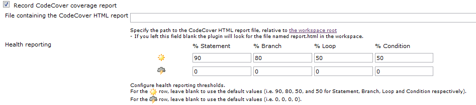

[.conf-macro .output-inline]#This plugin allows you to capture code
coverage report from http://codecover.org/[CodeCover]. Jenkins will
generate the trend report of coverage. #

[[CodeCoverPlugin-JenkinsConfiguration]]
== Jenkins Configuration

1.- Enable recording CodeCover coverage report, and configure it. +
[.confluence-embedded-file-wrapper]##

[[CodeCoverPlugin-UsagewithANT]]
== Usage with ANT

1.- Make sure you include the CodeCover ant jars in your classpath, and
the CodeCover taskdef:

[source,syntaxhighlighter-pre]
----
<!-- Defines the CodeCover tasks -->
<taskdef name="codecover" classname="org.codecover.ant.CodecoverTask" classpath="${codecoverDir}/lib/codecover-ant.jar" />
----

2.- Then, the code you want to cover needs to be instrumented

[source,syntaxhighlighter-pre]
----
<target name="instrument-sources" depends="clean">
  <codecover>
    <instrument containerId="c" language="java" destination="${instrumentedSourceDir}" charset="utf-8" copyUninstrumented="yes">
      <source dir="${sourceDir}">
        <include name="**/*.java"/>
      </source>
    </instrument>
    <save containerId="c" filename="codecover.xml"/>
  </codecover>
</target>
----

3.- If you need non-instrumented code (like your unit tests), move them
to the instrumented folder so they are compiled together

[source,syntaxhighlighter-pre]
----
<target name="collect">
  <copy todir="${instrumentedSourceDir}">
    <fileset dir="${test-dir}" />
  </copy>
</target>
----

4.- The instrumented code needs to be compiled

[source,syntaxhighlighter-pre]
----
<target name="compile-instrumented" depends="instrument-sources">
  <javac srcdir="${instrumentedSourceDir}" destdir="${instrumentedSourceDir}" encoding="utf-8" target="1.5" debug="true" classpath="${codecoverDir}/lib/codecover-instrumentation-java.jar" includeAntRuntime="false"></javac>
</target>
----

5.- Run the compiled, instrumented code

[source,syntaxhighlighter-pre]
----
<target name="run-instrumented" depends="compile-instrumented">
  <java classpath="${instrumentedSourceDir}:${codecoverDir}/lib/codecover-instrumentation-java.jar" fork="true" failonerror="true" classname="${mainClassName}">
    <jvmarg value="-Dorg.codecover.coverage-log-file=test.clf"/>
  </java>
</target>
----

5a.- If you're using JUnit, the following method of running instrumented
is used.

[source,syntaxhighlighter-pre]
----
<target name="run-instrumented" depends="compile-instrumented">
  <junit printsummary="yes" fork="yes">
    <classpath refid="project.classpath" />
    <classpath>
      <pathelement location="${codecoverDir}/lib/JUnit-TestRunner.jar" />
      <pathelement location="${codecoverDir}/lib/codecover-ant.jar" />
      <pathelement location="${codecoverDir}/lib/codecover-batch.jar" />
      <pathelement location="${codecoverDir}/lib/codecover-core.jar" />
      <pathelement path="${instrumentedSourceDir}" />
    </classpath>
    <formatter type="xml" />
    <test name="${master-test-suite}" />
    <jvmarg value="-Dorg.codecover.coverage-log-file=test.clf" />
  </junit>
</target>
----

6.- Analyze the code.

[source,syntaxhighlighter-pre]
----
<target name="create-report" depends="run-instrumented">
  <codecover>
    <load containerId="c" filename="codecover.xml"/>
    <analyze containerId="c" coverageLog="test.clf" name="Test Session"/>
    <save containerId="c" filename="codecover.xml"/>
    <report containerId="c" destination="report.html" template="${codecoverDir}/report-templates/HTML_Report_hierarchic.xml">
      <testCases>
        <testSession pattern=".*">
          <testCase pattern=".*"/>
        </testSession>
      </testCases>
    </report>
  </codecover>
</target>
----

[[CodeCoverPlugin-ChangeLog]]
== Change Log

[[CodeCoverPlugin-Version1.0]]
=== Version 1.0

* Initial Release
