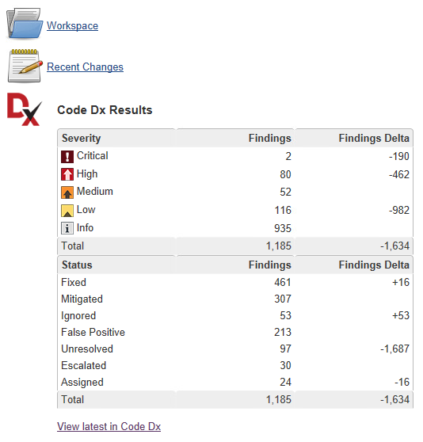
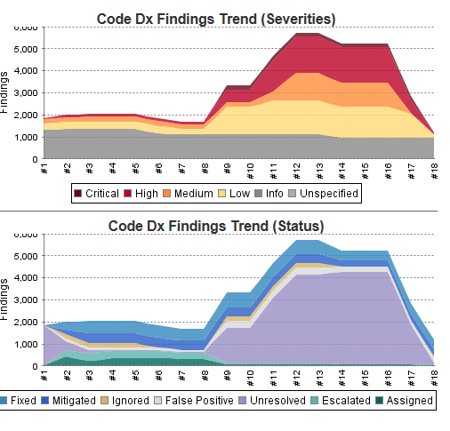

Allows Jenkins to push source and build artifacts to
http://codedx.com/[Code Dx] and display the aggregated results of its
http://codedx.com/supported-tools/[full suite] of analysis tools.

[[CodeDxPlugin-Note:]]
== _Note:_

* This plugin is maintained by Code Dx, Inc.
* Plugin version 2.4 supports Code Dx 2.0+ (any edition)

*Features*

* Upload your source, binaries, and/or scan file(s) from your Jenkins
jobs to your Code Dx installation easily
* Scan your source and binaries for potential vulnerabilities and
quality issues using Code Dx
* Code Dx is an application vulnerability correlation and management
system that supports C/C++, C#, Java/JSP, Javascript, PHP, Python, Ruby
on Rails, Scala, and Visual Basic .NET
* See Code Dx finding trends right in Jenkins
* Prevent serious issues from slipping through the cracks by configuring
Jenkins to fail your builds with customizable Code Dx findings criteria
* For more information see the http://codedx.com/product-overview/[Code
Dx overview]

[.confluence-embedded-file-wrapper]##

[.confluence-embedded-file-wrapper]##

*Requirements*

A http://www.codedx.com/[Code Dx server] deployment with an API Key
created from the Code Dx admin page.

[[CodeDxPlugin-Documentation]]
== Documentation

Consult the latest
http://codedx.com/Documentation/PluginsGuide.html#Jenkins[Code Dx online
documentation] for instructions on how to configure your build.

[[CodeDxPlugin-Contact]]
== Contact

support@codedx.com
