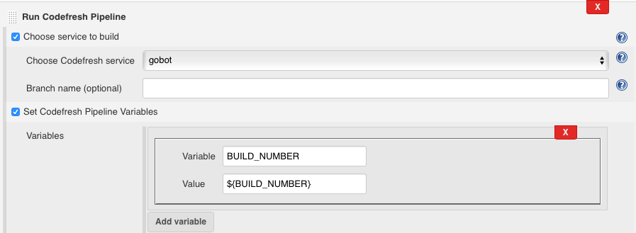
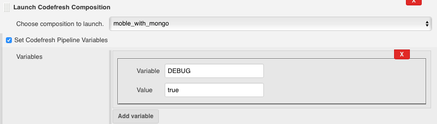

[.conf-macro .output-inline]##

[cols="",options="header",]
|===
|Plugin Information
|View Codefresh Integration https://plugins.jenkins.io/codefresh[on the
plugin site] for more information.
|===

[.aui-icon .aui-icon-small .aui-iconfont-error .confluence-information-macro-icon]##

The current version of this plugin may not be safe to use. Please review
the following warnings before use:

* https://jenkins.io/security/advisory/2019-08-07/#SECURITY-931[SSL/TLS
certificate validation globally and unconditionally disabled]

[.conf-macro .output-inline]#[.confluence-embedded-file-wrapper .confluence-embedded-manual-size]#image:docs/images/codefresh_logo_f_left-nc_(1).png[image,width=400]##

Allows integrating https://codefresh.io/[Codefresh] docker flow
pipelines into your existing Jenkins flows.

 

[[CodefreshPlugin-Features:]]
== Features:

* Define Codefresh account details (currently limited to a single
account)
* Trigger Codefresh pipelines as a build step in Jenkins jobs
** Codefresh Pipeline ID is concluded automatically from the git
repository URL (if git SCM is used in the job)
** Another Codefresh pipeline can be selected instead.
** Pass environment variables from Jenkins to Codefresh.
** Codefresh build logs are presented on Jenkins console output page.
* A badge with Codefresh build status and a link to Codefresh build page
is shown for each build.
* Launch Codefresh composition environments.
** Pass environment variables from Jenkins to Codefresh.
** Codefresh environment launch logs are presented on Jenkins console
output page.
* A badge with environment URL shown in build history.
* Triggered build URL available as Jenkins env variable -
CODEFRESH_BUILD_URL.
* Launched environment URL available as Jenkins env variable -
CODEFRESH_ENV_URL (for subsequent testing).
* Ability to terminate Codefresh environment as post-build action.
* Jenkins Pipeline DSL support :
https://jenkins.io/doc/pipeline/steps/codefresh/[codefresh step
reference]

[[CodefreshPlugin-Upcomingfeatures:]]
==  Upcoming features:

* Display environment status (running/stopped) and link on Jenkins UI.
* Live log streaming (currently the logs are presented after Codefresh
process finishes)
* Enhanced Codefresh docker image tagging from Jenkins pipeline.

[[CodefreshPlugin-GettingStarted:]]
=== Getting Started:

* Define the connection to Codefresh in Jenkins system config (Manage
Jenkins->Configure system-> scroll down to find '_Define Codefresh
Integration_'). This requires filling out your user name and Codefresh
auth token. You can verify the authentication by using the '_Test
Connection_' button. 

   To find your auth token:

* {blank}
** Log in to Codefresh and then open https://g.codefresh.io/api/ in
another tab of the same browser.
** Copy your token from the right-hand text field on the Swagger header.

Screenshot:

[.confluence-embedded-file-wrapper]#image:https://camo.githubusercontent.com/32623f74ca6582f8cd95953667d8503d3242b3d0/687474703a2f2f6f746f6d61746f2e6c696e6b2f77702d636f6e74656e742f75706c6f6164732f323031362f30372f53637265656e2d53686f742d323031362d30372d32312d61742d31312e31352e34342d414d2e706e67[image]#

* Trigger Codefresh pipeline execution from your freestyle Jenkins jobs:
** 'Add Build Step' -> 'Run Codefresh Pipeline'
** By default - this will trigger the pipeline that corresponds to the
git repo defined in the job's SCM configuration.
** If there's no SCM defined for current job or you would like to
trigger a different service pipeline - check the '_Choose service to
build_' option. This will present you with drop-down selectable list of
all your defined Codefresh pipelines.
** Check the 'Set Codefresh Pipeline Variables' option to pass
environment variables to the pipeline execution.

Screenshot:

[.confluence-embedded-file-wrapper]##

Once configured - the plugin will trigger Codefresh, run your tests and
report the results. On job completion a Codefresh badge will appear next
to the build execution. Clicking on it will take you to the build
results page on Codefresh:

[.confluence-embedded-file-wrapper]#image:https://camo.githubusercontent.com/502f233f8fd56fcd5a89c60160f0df31719658f5/687474703a2f2f6f746f6d61746f2e6c696e6b2f77702d636f6e74656e742f75706c6f6164732f323031362f30372f53637265656e2d53686f742d323031362d30372d32312d61742d31312e33392e30342d414d2e706e67[image]#

* Launch Codefresh composition environment:
** Check the 'Launch a composition' option. 
** You will be presented with a drop-down selection list of all Docker
compositions you have defined on Codefresh.
** Choose one, save configuration and run the build.
** Check the 'Set Codefresh Environment Variables' option to pass
variables to the launched environment.
** If composition launch is successfull - the new envrionment URL will
be printed to job console output and made available through a Codefresh
green leaves badge on build history.

Screenshot

:
[.confluence-embedded-file-wrapper]##
