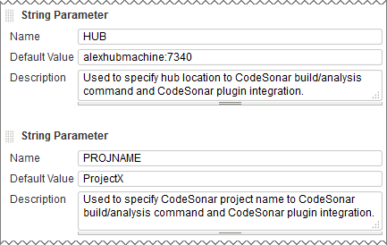
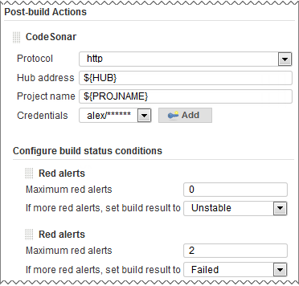

[[CodeSonarPlugin-Developedby]]
===== Developed by

[.confluence-embedded-file-wrapper]#image:docs/images/praqmalogo.png[image]#

[[CodeSonarPlugin-Sponsoredby]]
===== Sponsored by

http://www.grammatech.com/[[.confluence-embedded-file-wrapper]##]

The CodeSonar plugin for Jenkins is developed by Praqma and sponsored by
http://www.grammatech.com/[GrammaTech, Inc]. It is maintained in the
scope of http://www.josra.org/[Joint Open Source Roadmap Alliance]
(JOSRA).

[[CodeSonarPlugin-Introduction]]
== Introduction

The CodeSonar plugin collects project analysis data from a designated
CodeSonar hub.

* Historical data about CodeSonar warning counts and code size is
presented in the Job Dashboard.
* The plugin can be configured to change the build result if the
CodeSonar analysis results meet specified conditions.

The following documentation cites relevant sections in the CodeSonar
manual. These citations take the form +
MANUAL: Subject > ... > Page Title +
where Subject > .... > Page Title denotes a navigation path through the
CodeSonar manual table of contents.

[[CodeSonarPlugin-AboutCodeSonar®]]
=== About CodeSonar ^®^

http://www.grammatech.com/codesonar[CodeSonar], GrammaTech's flagship
static analysis software, identifies programming bugs that can result in
system crashes, memory corruption, leaks, data races, and security
vulnerabilities.

By analyzing both source code and binaries, CodeSonar empowers
developers to eliminate the most costly and hard-to-find defects early
in the application development lifecycle.

[[CodeSonarPlugin-SettingUpThePlugin]]
== Setting Up The Plugin

These instructions assume that you have...

* ...
https://wiki.jenkins-ci.org/display/JENKINS/Installing+Jenkins[installed
Jenkins].
* ...
https://wiki.jenkins-ci.org/display/JENKINS/Building+a+software+project[established
a Jenkins job] to build your software.
* ... installed CodeSonar.
* ... https://wiki.jenkins-ci.org/display/JENKINS/Plugins[installed the
CodeSonar plugin for Jenkins].

Setting up the plugin involves three steps, each detailed below.

* https://wiki.jenkins-ci.org/display/JENKINS/CodeSonar+Plugin#CodeSonarPlugin-cso_ready[A.
Make sure CodeSonar is ready to analyze your software]
* https://wiki.jenkins-ci.org/display/JENKINS/CodeSonar+Plugin#CodeSonarPlugin-cso_job[B.
Incorporate the CodeSonar build/analysis in your Jenkins job]
* https://wiki.jenkins-ci.org/display/JENKINS/CodeSonar+Plugin#CodeSonarPlugin-apply_plugin[C.
Apply the CodeSonar plugin to your Jenkins job]

[[CodeSonarPlugin-cso_readyA.MakesureCodeSonarisreadytoanalyzeyoursoftware]]
=== [#CodeSonarPlugin-cso_ready .confluence-anchor-link .conf-macro .output-inline]## ##A. Make sure CodeSonar is ready to analyze your software

Work through the following steps to make sure that CodeSonar is in a
suitable state to be invoked by your Jenkins job.

. Make sure that the path to `+/codesonar/bin+` is in the `+PATH+` of
the user who is running Jenkins.
* Otherwise, your `+codesonar analyze+` command will have to specify the
path to the `+codesonar+` executable.
. Start the CodeSonar hub to use for recording the analysis results (if
it is not already running). +
MANUAL: How CodeSonar Works > CodeSonar Structure > Hub > Starting a
Hub +
The remainder of these instructions will refer to the hub location as
_host:port_.
. Establish a project directory and project name for the CodeSonar
project that will be built and analyzed.
* If you have previously analyzed your software with CodeSonar, you can
use the existing project infrastructure.
* Otherwise, choose a project directory, and create the directory if it
does not already exist. +
In either case, make sure the project directory has a suitable location
and read/write settings. If Jenkins is running with different OS
credentials to your own, remember to take this into account.
* Use the same project directory and project name every time you perform
the CodeSonar build/analysis for a given project.
* The project directory should not be deleted at the end of the build:
the CodeSonar GUI needs to interact with its contents, and incremental
builds need information that is stored there.
** Make sure that the project directory is in a location where Jenkins
will not automatically delete it after running the job. For example, it
is probably a good idea to locate it outside the Jenkins workspace.
** Similarly, take steps to ensure that your other build tools will not
delete the project directory.
* Set the project directory permissions to allow the Jenkins process to
read and write to it. +
The remainder of these instructions will refer to the project directory
as _projdir_ and the project name as _proj-name_.
. If the project directory does not include a general project
configuration file (for example, because you just created the directory
in the previous step), create one now:
+
[source,syntaxhighlighter-pre]
----
codesonar create-conf projdir/proj-name
----
+
MANUAL: Using CodeSonar > Building and Analyzing Projects > Options,
Preferences, and Configuration Files > Configuration Files
. Edit the general project configuration file
(_projdir_/_proj-name_.conf) to specify your required configuration
parameter settings (unless the factory settings are suitable). +
MANUAL: Using CodeSonar > Building and Analyzing Projects > Options,
Preferences, and Configuration Files > Compiler-Independent
Configuration File Parameters for CodeSonar +
In particular:
* You may wish to specify one or more `+CFLAGS_APPEND+` rules.
* If you are performing a clean build every time, set
`+INCREMENTAL_BUILD=No+`.
. Make sure there is a CodeSonar launch daemon running on the analysis
machine, with the same owner as the Jenkins process. +
MANUAL: How CodeSonar Works > Build and Analysis > cslaunchd: The
CodeSonar Launch Daemon
* _If the analysis machine is running Windows_, check to see whether
there is a `+cslaunchd+` service on the analysis machine, with the same
owner as the Jenkins process. If not, set one up. +
MANUAL: Using CodeSonar > Building and Analyzing Projects > Continuous
Integration > Using CodeSonar With Continuous Integration Tools +
Note that if Jenkins is running as a service, its owner will usually be
SYSTEM.
* _Otherwise_, arrange to start the launch daemon at system startup.
. Go on to *Incorporate the CodeSonar build/analysis in your Jenkins
job*.

[[CodeSonarPlugin-cso_jobB.IncorporatetheCodeSonarbuild/analysisinyourJenkinsjob]]
=== [#CodeSonarPlugin-cso_job .confluence-anchor-link .conf-macro .output-inline]## ##B. Incorporate the CodeSonar build/analysis in your Jenkins job

You will incorporate the CodeSonar build/analysis in your Jenkins job by
extending the current contents of the *Build* section as described in
the following steps.

. View the Job Dashboard for the Jenkins job that is building your
software.
. Click *Configure* to open the *Job Configurations* page.
. [#CodeSonarPlugin-def_hub .confluence-anchor-link .conf-macro .output-inline]##
##Define a `+HUB+` parameter for the job so you can use it both for the
CodeSonar analysis invocation and to configure the CodeSonar plugin
later:
.. Make sure *This build is parameterized* is selected.
.. Under *This build is parameterized*, click *Add Parameter*, then
select *String Parameter* from the menu that pops up.
.. Jenkins will display a set of fields for setting up your new
parameter. Fill them out as follows.
* Name: `+HUB+`
* Default Value: the location (_host:port_) of your CodeSonar hub. For
example, `+alexhubmachine:7340+`.
* Description: you may want to enter a short description to remind
yourself why you have this variable.
. [#CodeSonarPlugin-def_projname .confluence-anchor-link .conf-macro .output-inline]##
##Use the same process to define a `+PROJNAME+` parameter whose value
matches your established CodeSonar project name (_proj-name_). +
[.confluence-embedded-file-wrapper]##
. Edit the *Build* section to integrate the CodeSonar build/analysis. +
Remember to specify authentication options in your build/analysis
commands if they will be required by your hub. +
MANUAL: How CodeSonar Works > CodeSonar Structure > Hub > Authentication
and Access Control
+
[cols=",",options="header",]
|===
|Project Language |Editing the Build Section
|C, C++ a|
For every existing build step that involves C/C++ compilation, edit the
build step to incorporate the CodeSonar build/analysis command. If the
current build step or steps contain one command that involves C/C++
compilation, this will involve constructing a single
`+codesonar analyze+` command. Otherwise there are two possible
approaches:

* Accumulate components into a CodeSonar project by constructing a
`+codesonar build+` command for each software build command that
involves C/C++ compilation, then add a final `+codesonar analyze+`
command to analyze the project. +
_or_
* Replace the text of the build step or steps with an invocation of a
shell script or batch file with equivalent contents, then construct a
single `+codesonar analyze+` command based on that invocation. +
 +
The `+codesonar analyze+` command must include the `+-foreground+`
option. +
See
https://wiki.jenkins-ci.org/display/JENKINS/CodeSonar+Plugin#CodeSonarPlugin-ex1[Example
1] and
https://wiki.jenkins-ci.org/display/JENKINS/CodeSonar+Plugin#CodeSonarPlugin-ex2[Example
2].

|Java |Add a new, final build step that executes the CodeSonar Java
build/analysis on the bytecode produced by the other build steps. The
`+codesonar analyze+` command must include the `+-foreground+` option. +
 +
See
https://wiki.jenkins-ci.org/display/JENKINS/CodeSonar+Plugin#CodeSonarPlugin-ex3[Example
3]. +
 +
MANUAL: Using CodeSonar > Building and Analyzing Projects  > Java >
Build and Analysis for Java Projects

|Mixed Java and C/C++ a|
Combine the approaches for Java-only and C/C++-only projects:

.. Edit the build steps to incorporate a `+codesonar build+` command for
each software build command that involves C/C++ compilation.
.. Add a new build step that executes `+codesonar build+` on any Java
bytecode produced by earlier build steps.
.. Add a new, final build step that invokes `+codesonar analyze+` to
analyze the project. +
 +
See
https://wiki.jenkins-ci.org/display/JENKINS/CodeSonar+Plugin#CodeSonarPlugin-ex4[Example
4] and
https://wiki.jenkins-ci.org/display/JENKINS/CodeSonar+Plugin#CodeSonarPlugin-ex5[Example
5].

|===
. Click *Save*.
. Check that everything is working properly:
.. Click *Build with Parameters*, check that the parameter settings are
correct, and click *Build*. +
Jenkins will execute the updated job.
.. Check that the Jenkins job executed successfully, and check the job's
*Console Output* to ensure that the build proceeded as you expected.
* If necessary, click *Configure* and adjust your edits, and make any
other changes necessary to get your job running correctly.
* If the CodeSonar build/analysis is not running to completion, the
manual section on Troubleshooting the build may be helpful. +
MANUAL: Using CodeSonar > Building and Analyzing Projects >
Troubleshooting the Build
.. Open the CodeSonar GUI in your web browser and inspect your analysis
results on the Analysis page. +
MANUAL: Using CodeSonar > GUI Reference > GUI Reference
. Go on to *Apply the CodeSonar plugin to your Jenkins job*.

[[CodeSonarPlugin-apply_pluginC.ApplytheCodeSonarplugintoyourJenkinsjob]]
=== [#CodeSonarPlugin-apply_plugin .confluence-anchor-link .conf-macro .output-inline]## ##C. Apply the CodeSonar plugin to your Jenkins job

Once your Jenkins job is correctly invoking the CodeSonar analysis, you
can apply the CodeSonar plugin to collect analysis information from the
hub.

. Go back to *Job Configurations* page for the Jenkins job that is
building your software.
. Under *Post-build Actions*, click *Add post-build action*, and select
*CodeSonar* from the menu that pops up.
* If CodeSonar is not a menu option, the plugin may not be installed.
. Jenkins will display fields for you to configure this application of
the plugin.
.. Select the protocol used by your hub from the *Protocol* menu: either
`+http+` or `+https+`.
.. Enter `+${HUB+`} in the *hub address* field.
.. Enter `+${PROJNAME+`} in the *Project name* field.
.. Click the *Add* button next to the *Credentials* field, then fill in
the *Add Credentials* form that opens and click *Add*.
... Set *Kind* to "Username with password" or "Certificate".
... Set *Scope* to Global.
... Use the remaining fields to specify the hub user account credentials
that the plug-in should use in obtaining analysis information from the
hub. See
https://wiki.jenkins-ci.org/display/JENKINS/CodeSonar+Plugin#CodeSonarPlugin-credentials[below]
for information about the permissions required and additional manual
references. +
These credentials will _not_ be applied to the build/analysis commands
you
https://wiki.jenkins-ci.org/display/JENKINS/CodeSonar+Plugin#CodeSonarPlugin-cso-job[specified
in the previous step]. If you want to specify authentication credentials
for those commands, use the appropriate command-line authentication
options.
.. [Optional] If you want to configure one or more "CodeSonar
conditions", see the descriptions
https://wiki.jenkins-ci.org/display/JENKINS/CodeSonar+Plugin#CodeSonarPlugin-cso_cond[below].
. Click *Save*.
* The list of links at the left hand side of the Job Dashboard will now
include a *Latest CodeSonar Analysis* link. This navigates to the
CodeSonar GUI Analysis page for the most recently executed analysis of
this project.
. Check that everything is working properly:
.. Click *Build with Parameters*, check that the parameter settings are
correct, and click *Build*. +
Jenkins will execute the updated job.
.. Check that the Jenkins job executed successfully, and check the job's
*Console Output* to ensure that the build proceeded as you expected.
* If necessary, click *Configure* and adjust your edits, and make any
other changes necessary to get your job running correctly.
. Notice that the dashboard now contains charts of "Total number of
warnings" and "Lines of Code" (if it doesn't, reload the page). These
charts represent CodeSonar analysis history for this project.

[[CodeSonarPlugin-BuildStepExamples]]
== Build Step Examples

These examples all assume the following:

* Build parameter `+${HUB+`} has been established and set to the hub
location.
* Build parameter `+${PROJNAME+`} has been established and set to the
CodeSonar project name.
* The project directory is `+/myfiles/csonar_projects/projX+`

[[CodeSonarPlugin-ex1Example1:C/C++project;JenkinsbuildstepsincludeonecommandthatinvolvesC/C++compilation.]]
=== [#CodeSonarPlugin-ex1 .confluence-anchor-link .conf-macro .output-inline]## ##Example 1: C/C++ project; Jenkins build steps include one command that involves C/C++ compilation.

Suppose that the Jenkins job build step text is:

[source,syntaxhighlighter-pre]
----
cd /myfiles/src/projX && make normal
----

Then replace the build step text with:

[source,syntaxhighlighter-pre]
----
cd /myfiles/src/projX && codesonar analyze /myfiles/csonar_projects/projX/${PROJNAME} -foreground ${HUB} make normal
----

[[CodeSonarPlugin-ex2Example2:C/C++project;JenkinsbuildstepsincludemultiplecommandsthatinvolveC/C++compilation.]]
=== [#CodeSonarPlugin-ex2 .confluence-anchor-link .conf-macro .output-inline]## ##Example 2: C/C++ project; Jenkins build steps include multiple commands that involve C/C++ compilation.

Suppose that the Jenkins job build step text is:

[source,syntaxhighlighter-pre]
----
cd /myfiles/src/projX
rm -f *.o
gcc -c A.c
gcc -c B.c
gcc -c C.c
----

There are several possible approaches.

[width="100%",cols="50%,50%",]
|===
|*Option 1* a|
Replace the build step text with:

[source,syntaxhighlighter-pre]
----
cd /myfiles/src/projX
rm -f *.o
codesonar build /myfiles/csonar_projects/projX/${PROJNAME} -foreground  ${HUB} gcc -c A.c
codesonar build /myfiles/csonar_projects/projX/${PROJNAME} -foreground ${HUB} gcc -c B.c
codesonar build /myfiles/csonar_projects/projX/${PROJNAME} -foreground ${HUB} gcc -c C.c
codesonar analyze /myfiles/csonar_projects/projX/${PROJNAME} -foreground ${HUB}
----

|*Option 2* a|
Collect the build step text into a single shell script
`+/path/to/dir/mybuildscript.sh+`:

[source,syntaxhighlighter-pre]
----
cd /myfiles/src/projX
rm -f *.o
gcc -c A.c
gcc -c B.c
gcc -c C.c
----

then replace the build step text with:

[source,syntaxhighlighter-pre]
----
cd /path/to/dir && codesonar analyze ${PROJNAME} -foreground ${HUB} sh -xe mybuildscript.sh
----

|*Option 3* a|
Collect the build step text into a single batch file
`+path\to\dir\mybuildbat.bat+`:

[source,syntaxhighlighter-pre]
----
cd \myfiles\src\projX
rm -f *.o
gcc -c A.c
gcc -c B.c
gcc -c C.c
----

then replace the build step text with:

[source,syntaxhighlighter-pre]
----
codesonar analyze ${PROJNAME} -foreground ${HUB} path\to\dir\mybuildbat.bat
----

|===

[[CodeSonarPlugin-ex3Example3:Javaproject]]
=== [#CodeSonarPlugin-ex3 .confluence-anchor-link .conf-macro .output-inline]## ##Example 3: Java project

Suppose that the Jenkins job writes Java build output to
`+/myfiles/buildoutput/classes+`.

Then add a new "Execute shell" build step with the following contents.

[source,syntaxhighlighter-pre]
----
codesonar analyze /myfiles/csonar_projects/projX/${PROJNAME} -foreground ${HUB} cs-java-scan /myfiles/buildoutput/classes
----

[[CodeSonarPlugin-ex4Example4:MixedC/C++andJavaproject;singlebuildcommand]]
=== [#CodeSonarPlugin-ex4 .confluence-anchor-link .conf-macro .output-inline]## ##Example 4: Mixed C/C++ and Java project; single build command

Suppose that the Jenkins job build step text is:

[source,syntaxhighlighter-pre]
----
cd /myfiles/src/projX
make all
----

and that the Jenkins job writes Java build output to
`+/myfiles/buildoutput/classes+`.

Then replace the build step text with:

[source,syntaxhighlighter-pre]
----
cd /myfiles/src/projX
codesonar build /myfiles/csonar_projects/projX/${PROJNAME} -foreground ${HUB} make all
codesonar build /myfiles/csonar_projects/projX/${PROJNAME} -foreground ${HUB} cs-java-scan /myfiles/buildoutput/classes
codesonar analyze /myfiles/csonar_projects/projX/${PROJNAME} -foreground ${HUB} 
----

[[CodeSonarPlugin-ex5Example5:MixedC/C++andJavaproject;multiplebuildcommands]]
=== [#CodeSonarPlugin-ex5 .confluence-anchor-link .conf-macro .output-inline]## ##Example 5: Mixed C/C++ and Java project; multiple build commands

Suppose the Jenkins job build step text is:

[source,syntaxhighlighter-pre]
----
cd /myfiles/src/projX
rm -f *.o
rm -f *.class
gcc -c A.c
gcc -c B.c
javac J.java
----

and that the Jenkins job writes Java build output to
`+/myfiles/buildoutput/classes+`.

There are several possible approaches.

[width="100%",cols="50%,50%",]
|===
|*Option 1* |Move the build text to a Makefile, shell script, batch
file, or similar, then follow the approach illustrated in
https://wiki.jenkins-ci.org/display/JENKINS/CodeSonar+Plugin#CodeSonarPlugin-ex4[Example
4].

|*Option 2* a|
Replace the build step text with:

[source,syntaxhighlighter-pre]
----
cd /myfiles/src/projX
rm  \-f  *.o
rm  \-f  *.class
codesonar build /myfiles/csonar_projects/projX/${PROJNAME} -foreground  ${HUB} gcc -c A.c
codesonar build /myfiles/csonar_projects/projX/${PROJNAME} -foreground ${HUB} gcc -c B.c
javac J.java
codesonar build /myfiles/csonar_projects/projX/${PROJNAME} -foreground ${HUB} cs-java-scan /myfiles/buildoutput/classes
codesonar analyze /myfiles/csonar_projects/projX/${PROJNAME} -foreground ${HUB}
----

|===

[[CodeSonarPlugin-ConfigurationSettings]]
== Configuration Settings

The CodeSonar plugin for Jenkins has two required configuration settings
and a number of optional ones.

* https://wiki.jenkins-ci.org/display/JENKINS/CodeSonar+Plugin#CodeSonarPlugin-protocol[Protocol],
https://wiki.jenkins-ci.org/display/JENKINS/CodeSonar+Plugin#CodeSonarPlugin-hub_address[Hub
address],
https://wiki.jenkins-ci.org/display/JENKINS/CodeSonar+Plugin#CodeSonarPlugin-project_name[Project
name] are always required.
* The
https://wiki.jenkins-ci.org/display/JENKINS/CodeSonar+Plugin#CodeSonarPlugin-credentials[Credentials]
setting is required if special user `+Anonymous+` does not have
sufficient permissions to interact with the CodeSonar analysis
information on the hub.
* Users can also specify zero or more
https://wiki.jenkins-ci.org/display/JENKINS/CodeSonar+Plugin#CodeSonarPlugin-cso_cond[CodeSonar
conditions].

[[CodeSonarPlugin-RequiredConfigurationSettings]]
=== Required Configuration Settings

[cols=",,",options="header",]
|===
|Setting Name |Description |Notes
a|
[#CodeSonarPlugin-protocol .confluence-anchor-link .conf-macro .output-inline]##
##**Protocol**

|The protocol that should be used to communicate with the hub: either
`+http+` or `+https+`. +
MANUAL: How CodeSonar Works > CodeSonar Structure > Hub > Hub Location
|Always explicitly specify `+https+` if you are concerned about
security, otherwise you may be sending unencrypted data to an imposter
hub.

a|
[#CodeSonarPlugin-hub_address .confluence-anchor-link .conf-macro .output-inline]#
# *Hub address*

|The location of the CodeSonar hub that you are using to manage your
analysis results, in format `+hostname:port+`. +
MANUAL: How CodeSonar Works > CodeSonar Structure > Hub > Hub Location
|If you have
https://wiki.jenkins-ci.org/display/JENKINS/CodeSonar+Plugin#CodeSonarPlugin-set_hub[set
up a $\{HUB} parameter for the job], you can use it here.

a|
[#CodeSonarPlugin-project_name .confluence-anchor-link .conf-macro .output-inline]#
# *Project name*

|The CodeSonar project name. +
MANUAL: How CodeSonar Works > CodeSonar Structure > Project |If you have
https://wiki.jenkins-ci.org/display/JENKINS/CodeSonar+Plugin#CodeSonarPlugin-set_projname[set
up a $\{PROJNAME} parameter for the job], you can use it here.
|===

[[CodeSonarPlugin-OptionalConfigurationSettings]]
=== Optional Configuration Settings

[cols=",,",options="header",]
|===
|Setting Name |Description |Notes
a|
[#CodeSonarPlugin-credentials .confluence-anchor-link .conf-macro .output-inline]##
##**Credentials**

|The hub user account credentials that the plugin should use when
obtaining analysis information from the hub. +
MANUAL: How CodeSonar Works > CodeSonar Structure > Hub > Hub User
Accounts +
MANUAL: Role-Based Access Control (RBAC) > RBAC: Role-Permissions a|
The hub user account you specify here must have sufficient permissions
to access the relevant analysis information:

[width="100%",cols="50%,50%",]
|===
|Global Permissions |`+G_LIST_PROPERTIES+` +
`+G_LIST_USERS+` +
`+G_SIGN_IN+` +
`+G_SIGN_IN_CERTIFICATE+` or `+G_SIGN_IN_PASSWORD+`, depending on the
*Kind* of credentials you are specifying.

|Permissions on analyzed project `+${PROJNAME+`}
|`+ANALYSIS_ANNOTATE+` +
`+ANALYSIS_EXISTS+` +
`+ANALYSIS_READ+` +
`+ANALYSIS_WARNING_EXISTS+` +
`+ANALYSIS_WRITE+` +
`+PROJECT_EXISTS+` +
`+PROJECT_READ+`

|Permissions on Named Searches |`+NAMEDSEARCH_READ+` for the following
built-in warning searches: active, new, active and new.
|===

 +
You do not need to configure credentials if special user `+Anonymous+`
has sufficient permissions to obtain analysis information from the hub:
in this case, the plugin will interact with the hub in an anonymous
session (`+Anonymous+` does not need `+G_SIGN_IN_CERTIFICATE+` or
`+G_SIGN_IN_PASSWORD+`). +
Note that these credentials are not used to authenticate CodeSonar
build/analysis commands issued by your Jenkins job. If you want to
specify authentication credentials for those commands, use the
appropriate command line authentication options.

|===

[#CodeSonarPlugin-cso_cond .confluence-anchor-link .conf-macro .output-inline]#
#

[[CodeSonarPlugin-CodeSonarConditions]]
=== CodeSonar Conditions

Users can specify zero or more _CodeSonar conditions_. Each condition
specifies a bound on some particular property of the CodeSonar analysis
results, along with the build result setting to be applied if the
property's value lies outside the specified bound.

There are six different condition types.

[cols=",",options="header",]
|===
|CodeSonar Condition Type |Set the build result to the specified value
if ...
|*Cyclomatic complexity* |... one or more procedures has cyclomatic
complexity (as determined by CodeSonar) that exceeds the specified
limit. +
MANUAL: How CodeSonar Works > CodeSonar Structure > Metrics

|*Red alerts* |... the number of red alerts from CodeSonar analysis
exceeds the specified limit. +
MANUAL: Using CodeSonar > GUI Reference > Alerts

|*Warning count increase: new only* |... the number of _new_ warnings
issued by the CodeSonar analysis exceeds the number issued for the
https://wiki.jenkins-ci.org/display/JENKINS/CodeSonar+Plugin#CodeSonarPlugin-prev_analysis[previous
analysis] by more than the specified percentage. +
MANUAL: How CodeSonar Works > CodeSonar Structure > Warnings > Warnings:
Instances and Groups

|*Warning count increase: overall* |... the number of warnings issued by
the CodeSonar analysis exceeds the number issued for the
https://wiki.jenkins-ci.org/display/JENKINS/CodeSonar+Plugin#CodeSonarPlugin-prev_analysis[previous
analysis] by more than the specified percentage. +
MANUAL: How CodeSonar Works > CodeSonar Structure > Warnings > Warnings:
Instances and Groups

|*Warnings count increase: specified score and higher* |... the number
of warnings in the specified score range issued by the CodeSonar
analysis exceeds the number issued for the
https://wiki.jenkins-ci.org/display/JENKINS/CodeSonar+Plugin#CodeSonarPlugin-prev_analysis[previous
analysis] by more than the specified percentage. +
MANUAL: How CodeSonar Works > CodeSonar Structure > Warnings > Warnings:
Instances and Groups

|*Yellow alerts* |... the number of yellow alerts from the CodeSonar
analysis exceeds the specified limit. +
MANUAL: Using CodeSonar > GUI Reference > Alerts
|===

Where conditions are concerned with increase with respect to
a[#CodeSonarPlugin-prev_analysis .confluence-anchor-link .conf-macro .output-inline]##
##"previous analysis", the previous analysis is considered to be the
CodeSonar analysis invoked by the previous Jenkins build. Note that
there may be more recent analyses on the CodeSonar hub if they were
invoked from outside Jenkins. The first analysis of the project has no
"previous analysis": in this case, the increase-based conditions are
considered to be unsatisfied. Warning count for these conditions is
determined with respect to the default warning visibility setting for
the hub user account whose
https://wiki.jenkins-ci.org/display/JENKINS/CodeSonar+Plugin#CodeSonarPlugin-credentials[credentials]
you have supplied.

You can specify multiple conditions, including multiple conditions of a
single type. When multiple conditions are specified they are all checked
and the "worst" marking from the set of satisfied conditions is applied.
That is:

* If any satisfied condition specifies "Failed", the plugin will mark
the build as "Failed".
* If no satisfied condition specifies "Failed" but at least one
satisfied condition specifies "Unstable", the plugin will mark the build
as "Unstable".

[[CodeSonarPlugin-ConfigurationExample]]
==== Configuration Example

With this configuration, the plugin will mark the build as "Unstable" if
the CodeSonar analysis produces one or two red alerts, but "Failed" if
there are three or more.
[.confluence-embedded-file-wrapper]##

[[CodeSonarPlugin-JenkinsJobDSL]]
== Jenkins Job DSL

[[CodeSonarPlugin-Availableoptions]]
=== _Available options_

[source,syntaxhighlighter-pre]
----
job{
    publishers{
        codeSonar(String hubAddress, String projectName){
            cyclomaticComplexity(int maxComplexity, boolean markAsFailed)
            redAlert(int maxAlerts, boolean markAsFailed)
            yellowAlert(int maxAlerts, boolean markAsFailed)
            newWarningCountIncrease(float percentage, boolean markAsFailed)
            overallWarningCountIncrease(float percentage, boolean markAsFailed)
            rankedWarningCountIncrease(int minRank, float percentage, boolean markAsFailed)
        }
    }
}
----

[[CodeSonarPlugin-Example]]
=== _Example_

[source,syntaxhighlighter-pre]
----
job('myProject_GEN'){
    publishers{
        codeSonar('hub','proj'){
            cyclomaticComplexity(20, false)
            redAlert(3, true)
            yellowAlert(10, false)
            newWarningCountIncrease(5, true)
            overallWarningCountIncrease(5, false)
            rankedWarningCountIncrease(30, 5, true)
        }
    }
}
----

[[CodeSonarPlugin-SupportandContact]]
== Support and Contact

Please send us an email on support@praqma.net if you have a request or
question regarding the plugin.

[[CodeSonarPlugin-Issues]]
== Issues

type

key

summary

[.icon-in-pdf]# # Data cannot be retrieved due to an unexpected error.

http://issues.jenkins-ci.org/secure/IssueNavigator.jspa?reset=true&jqlQuery=project%20=%20JENKINS%20AND%20status%20in%20%28Open,%20%22In%20Progress%22,%20Reopened%29%20AND%20component%20=%20%27codesonar-plugin%27&src=confmacro[View
these issues in Jira]

[[CodeSonarPlugin-Changes]]
== *Changes*

[[CodeSonarPlugin-Version2.0.9(TBD)]]
=== Version 2.0.9 (TBD)

* Java 11 compatibility
* Jenkins core requirement is upped to 2.164 

[[CodeSonarPlugin-Version2.0.8(March1,2019)]]
=== Version 2.0.8 (March 1, 2019)

* Added new threshold
option: https://github.com/Praqma/codesonar-plugin/issues/51

[[CodeSonarPlugin-Version2.0.6(February6,2018)]]
=== Version 2.0.6 (February 6, 2018)

* The plugin is now more memory efficient
* Less data is stored on master 

[[CodeSonarPlugin-Version2.0.5(March22,2017)]]
=== Version 2.0.5 (March 22, 2017)

* Added support for pipeline job types.
* Added support for projects inside tree structures on the hub.

[[CodeSonarPlugin-Version2.0.4(September12,2016)]]
=== Version 2.0.4 (September 12, 2016)

* Fixed compatibility bugs regarding codesonar 4.2
* fixed bug where plugin used to fail with a nullpointer exception after
a fresh restart

[[CodeSonarPlugin-Version2.0.2(August9,2016)]]
=== Version 2.0.2 (August 9, 2016)

* Fixed compatibility bug for Jenkins 1.609.2

[[CodeSonarPlugin-Version2.0.1(June16,2016)]]
=== Version 2.0.1 (June 16, 2016)

* Fixed a possible NPE related to alerts
(https://github.com/Praqma/codesonar-plugin/issues/2[#2])

[[CodeSonarPlugin-Version2.0.0(June13,2016)]]
=== Version 2.0.0 (June 13, 2016)

* Added compatability for codesonar 4.2+

[[CodeSonarPlugin-Version1.0.1(October15,2015)]]
=== Version 1.0.1 (October 15, 2015)

* Better error messages in console
(https://issues.jenkins-ci.org/browse/JENKINS-30386[JENKINS-30386])
* Added JobDSL support
(https://issues.jenkins-ci.org/browse/JENKINS-30888[JENKINS-30888])

[[CodeSonarPlugin-Version1.0]]
=== Version 1.0

* Release of the first stable version
