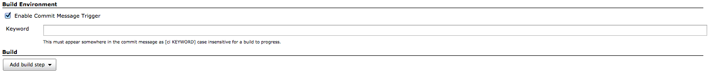

This plugin allows builds to be made only for certain text in the commit
message.

[[CommitMessageTriggerPlugin-TableofContents]]
== Table of Contents

[[CommitMessageTriggerPlugin-Description]]
== Description

Commit Message Trigger Plugin

[[CommitMessageTriggerPlugin-Setup]]
=== Setup

This allows you when using a gitflow/hubflow to have Jenkins monitor
feature branches but only build/merge develop when a feature has been
completed by having the developer add [ci build] in the final commit.  
This skips the step of creating a pull request in the general gitflow
methodology.  You could also use [ci deploy] to cause a job which
deploys to a staging server to run.

A skipped build will be marked as NOT BUILT, not FAILED or SUCCESS.

Enable the plugin in your build environment: +
[.confluence-embedded-file-wrapper]##

[[CommitMessageTriggerPlugin-Knownissues]]
== Known issues

type

key

summary

assignee

reporter

priority

status

resolution

created

updated

due

[.icon-in-pdf]# # Data cannot be retrieved due to an unexpected error.

http://issues.jenkins-ci.org/secure/IssueNavigator.jspa?reset=true&jqlQuery=component%20=%20commit-message-trigger%20AND%20project%20=%20JENKINS%20AND%20resolution%20=%20Unresolved%20ORDER%20BY%20updated%20DESC&tempMax=1000&src=confmacro[View
these issues in Jira]

[[CommitMessageTriggerPlugin-Versionhistory]]
== Version history

[[CommitMessageTriggerPlugin-0.1(September30,2014)]]
=== 0.1 (September 30, 2014)

* First release.
