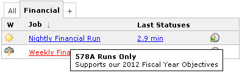
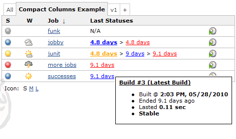
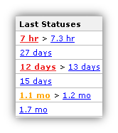
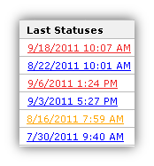
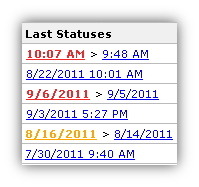
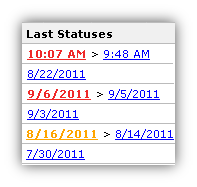
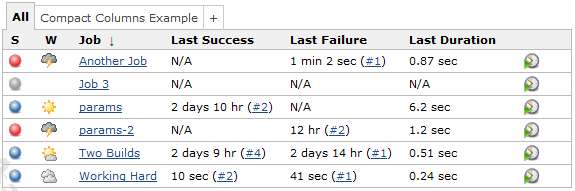
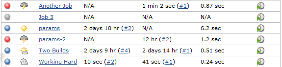
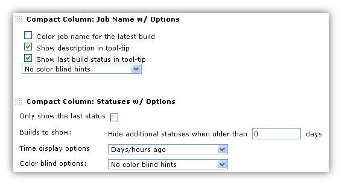

More compact columns for showing last success and failure. +
Easier to understand, and takes less room in your view.

[[CompactColumns-Whatarethe"JobName"columns?]]
== What are the "Job Name" columns?

* *Job Name* -- Adds the job description as a tooltip
* *Job Name w/ Status Color* -- also Colors the job name according to
the last build status

 
[.confluence-embedded-file-wrapper]##

[[CompactColumns-Whatarethe"LatestStatuses"columns?]]
== What are the "Latest Statuses" columns?

These columns take the "Last Success" and "Last Failure" columns and
combine them into one easier to understand, and real-estate friendly
column. You can click on the status links to go to that build, and can
hover over the link to see additional information in the tool-tip.

[.confluence-embedded-file-wrapper]##

[[CompactColumns-Someexamplesofthe"LastStatuses"columns]]
=== Some examples of the "Last Statuses" columns

Based on the configuration options you choose, you can get columns like
these examples.

[.confluence-embedded-file-wrapper]##
[.confluence-embedded-file-wrapper]##
[.confluence-embedded-file-wrapper]##
[.confluence-embedded-file-wrapper]##

[[CompactColumns-Why?]]
== Why?

Even in this small screen-shot you can see how busy the "Last Success"
and "Last Failure" columns are. Quite frankly, it's hard to really get
the information you need "at a glance" like you should. +
[.confluence-embedded-file-wrapper]##

The problem is compounded if you have many jobs and scroll down and lose
the column headers. You can't remember which column is for which
information. +
[.confluence-embedded-file-wrapper]##

This becomes even more useful when you are using some of the plugins
that provide additional columns (e.g.
https://wiki.jenkins-ci.org/display/JENKINS/Maven+Info+Plugin[Maven Info
Plugin]) or alternate view layouts (e.g.
https://wiki.jenkins-ci.org/display/JENKINS/Sectioned+View+Plugin[Sectioned
View Plugin]).

[[CompactColumns-HowdoIuseit?]]
== How do I use it?

Follow these steps

. If the only view you have is the "All" view, and you want to edit that
view see
https://wiki.jenkins-ci.org/display/JENKINS/Editing+or+Replacing+the+All+View[Editing
or Replacing the All View]. If you would like to add another view
instead, do that.
. Once you have a view you want to edit, see
https://wiki.jenkins-ci.org/display/JENKINS/Changing+the+Columns+of+a+View[Changing
the Columns of a View]
. When changing columns, look for the "Compact Column" columns.  There
are several columns to choose from
.. *Compact Column: Job Name w/ Options* -- Adds the job description,
plus colors the job name according to the last status.  Also contains
the following options
... Color the Job Name according to the last build's status
... Add the job's description to the tool-tip
... Add the job's last status summary to the tool-tip - same look and
feel as the status column tool-tips
... Enable/disable colorblind support
.. *Compact Column: All Statuses w/ Options* -- This column always shows
you the last build for each of the statuses fail/stable/unstable. Also
contains the following options
... Show only the last status
... Hide statuses that are older than a certain number of days
... Enable/disable colorblind support
... Choose either
.... Days ago - like "4 days" or "17 mins"
.... Date/time
.. *Compact Column: Unstable + Stable* -- This column prefers to show
you just the latest un/stable builds, but will also show you if the last
build failed
.. *Compact Column: Stable + Failed* -- This column prefers to show you
just the latest stable/fail builds, but will also show you if the last
build was unstable
.. *Compact Column: Job Name* -- Adds the job description as a tool
tip.  (simpler version of Job Name w/ Options - kept only for backwards
compatibility)

This screenshot shows what this configuration looks like. It is a little
different than most columns because you can configure the details
per-view. For example, you could have one view that shows the job name
with color turned on, and another view that has the color turned off.

 
[.confluence-embedded-file-wrapper]##

[[CompactColumns-Changelog]]
== Changelog

[[CompactColumns-Version1.10(Nov072013)]]
=== Version 1.10 (Nov 07 2013)

* https://issues.jenkins-ci.org/browse/JENKINS-15601[JENKINS-15601]
Performance problem on Jenkins 1.485+.
* Japanese localization.
* Updated to 1.424 baseline.

[[CompactColumns-Version1.9]]
=== Version 1.9

* Added the option to show date/time instead of the "days ago" default

[[CompactColumns-Version1.8]]
=== Version 1.8

* Made plugin compatible with later version of Jenkins - column names
were broken in newer versions due to change to core

[[CompactColumns-Version1.7]]
=== Version 1.7

* Made compatible with green balls plugin
* Fixed some small bugs in jobname/description tooltips

[[CompactColumns-Version1.6.3]]
=== Version 1.6.3

* Job Name column - added "Options" support as described on this wiki
* All Statuses column - added "Options" support as described on this
wiki
* Colorblind support (see JIRA ticket)

[[CompactColumns-Version1.5]]
=== Version 1.5

* Additional localization support, including German translations by
Christoph Kutzinski

[[CompactColumns-Version1.4]]
=== Version 1.4

* Added Job Name columns.  See
http://issues.jenkins-ci.org/browse/JENKINS-5778

[[CompactColumns-Version1.3]]
=== Version 1.3

* BUG: Running job makes most recent status not show up in bold
* Columns not sorting by actual timestamp

[[CompactColumns-Version1.2]]
=== Version 1.2

* Localized the date/time string for the tool-tip

[[CompactColumns-Version1.1]]
=== Version 1.1

* Improved tool-tip
* Order statuses from latest to more recent
* Improved explanation in tooltip of column header
* Add Unstable
* Add Aborted when no other status available
* Created 2 more columns to choose from

[[CompactColumns-Version1.0]]
=== Version 1.0

* Initial release
