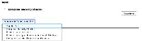
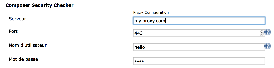

[.confluence-embedded-file-wrapper]##

[[ComposerSecurityCheckerPlugin-forsetupproxy:]]
== for setup proxy :

-> http://127.0.0.1:8080/manage[Administrer Jenkins]

-> http://127.0.0.1:8080/configure[Configurer le système] 

[.confluence-embedded-file-wrapper]##

[[ComposerSecurityCheckerPlugin-consoleout:]]
== *console out :*

============================================================

Composer Security Check :

composer file: /var/lib/jenkins/jobs/test
Project/workspace/composer.lock +
Security Report +
===============

No known* vulnerabilities detected.

* Disclaimer: This checker can only detect vulnerabilities that are
referenced +
in the SensioLabs security advisories database.

============================================================
