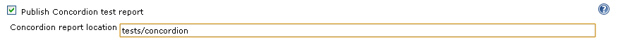
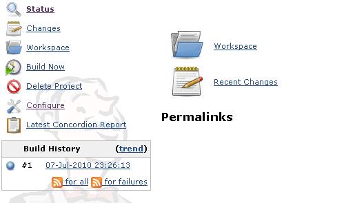
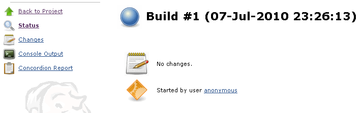

[.conf-macro .output-inline]#This plugin publishes
http://www.concordion.org/[Concordion] test reports for each build#, and
is based somewhat on the
https://wiki.jenkins-ci.org/display/JENKINS/WebTest+Presenter+Plugin[WebTest
Presenter Plugin].

[[ConcordionPresenterPlugin-Usage]]
== Usage

Configuration:

[.confluence-embedded-file-wrapper]##

Project page:

[.confluence-embedded-file-wrapper]##

Build page:

[.confluence-embedded-file-wrapper]##

[[ConcordionPresenterPlugin-TODO]]
== TODO

* Option to create index page for test reports
* Junit-esque integration (pass/fail graph, failed tests link to
specifications)

[[ConcordionPresenterPlugin-VersionHistory]]
== Version History

[[ConcordionPresenterPlugin-Version0.7(2011-08-13)]]
=== Version 0.7 (2011-08-13)

* Reworked archiving code and added some diagnostics
* Updated for Jenkins

[[ConcordionPresenterPlugin-Version0.6(2010-07-06)]]
=== Version 0.6 (2010-07-06)

* Initial release (after a few mix-ups with publishing releases and
group ids)
