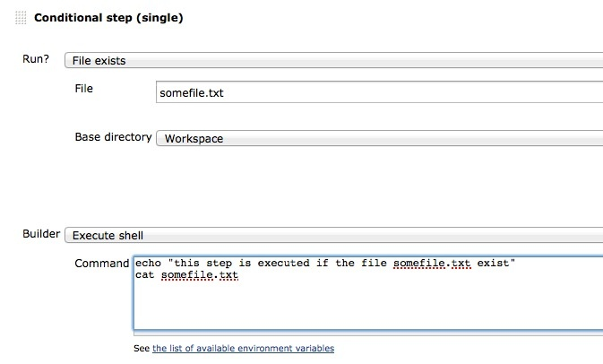
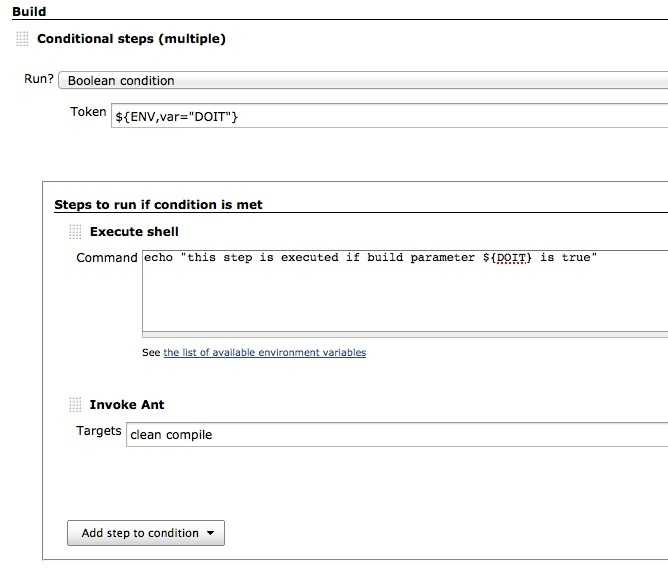

A buildstep wrapping any number of other buildsteps, controlling their
execution based on a defined condition.

[[ConditionalBuildStepPlugin-Info]]
== Info

This plugin requires the
https://wiki.jenkins-ci.org/display/JENKINS/Token+Macro+Plugin[TokenMacro
Plugin] and
the https://wiki.jenkins-ci.org/display/JENKINS/Run+Condition+Plugin[Run
Condition Plugin] to be installed!

* Ever wanted to have more control whether a step should be executed or
not?
* Want to reduce the number of jobs doing nearly the same thing?

Add a conditional buildstep which acts as a container. It will allow you
to define a condition controling the execution of the step(s).

[[ConditionalBuildStepPlugin-Conditions]]
== Conditions

There are multiple conditions one can choose of, these are all defined
by the
https://wiki.jenkins-ci.org/display/JENKINS/Run+Condition+Plugin[Run
Condition Plugin]

Missing builder

[.aui-icon .aui-icon-small .aui-iconfont-warning .confluence-information-macro-icon]#
#

If you're not able to add the builder of your choice within a
conditional build step (because it's not available within the dropdown),
then this is likely because the builder does not provide a
_@DataBoundConstructor_ constructor and/or the Descriptor does not
extend _hudson.tasks.BuildStepDescriptor_. For non programmers: the
plugin you would like to use does not yet follow the newest Jenkins
coding guidelines. Without this, the conditional buildstep plugin is not
able to work with it.

[[ConditionalBuildStepPlugin-Conditionalstep(single)]]
== Conditional step (single)

This build step allows you to select any build step and define a
condition to control whether the step should be executed. +
For reasons why you might want to use this step, see
https://wiki.jenkins-ci.org/pages/viewpage.action?pageId=59507542[Why
use Conditional step (single)?]

[.confluence-embedded-file-wrapper]##

[[ConditionalBuildStepPlugin-Conditionalsteps(multiple)]]
== Conditional steps (multiple)

A 'Conditional steps (multiple)' container is able to contain any number
of any other buildsteps (e.g. Shell, Ant, Maven,...) and you can have
any number of 'Conditional Steps' containers, each configured with a
different condition.

[.confluence-embedded-file-wrapper]##

[[ConditionalBuildStepPlugin-Examples]]
== Examples

please check out the examples at the
https://wiki.jenkins-ci.org/display/JENKINS/Run+Condition+Plugin[Run
Condition Plugin]

[[ConditionalBuildStepPlugin-Knownissues]]
=== Known issues

[[refresh-module-1328136467]]
[[refresh-1328136467]]=== https://issues.jenkins-ci.org/secure/IssueNavigator.jspa?reset=true&jqlQuery=project%20=%20JENKINS%20AND%20status%20in%20%28Open,%20%22In%20Progress%22,%20Reopened%29%20AND%20component%20=%20%27conditional-buildstep-plugin%27&tempMax=1000&src=confmacro[Open Issues]  ($\{entries.size()} issues)

[[jira-issues-1328136467]]
T

Key

Summary

[.refresh-action-group]# #

[[refresh-issues-loading-1328136467]]
[.aui-icon .aui-icon-wait]#Loading...#

[#refresh-issues-button-1328136467]##
[#refresh-issues-link-1328136467]#Refresh#
[#error-message-1328136467 .error-message .hidden]# #

[[ConditionalBuildStepPlugin-VersionHistory]]
== Version History

[[ConditionalBuildStepPlugin-1.3.6(9.June2017)]]
=== 1.3.6 (9. June 2017)

* integrate https://issues.jenkins-ci.org/browse/JENKINS-43887[JENKINS-43887]
upgrade parent pom to 2.x (thanks varyvol
https://github.com/jenkinsci/conditional-buildstep-plugin/pull/14[#14])
* ConditionalBuilder now implements DependencyDeclarer (thanks
TWestling https://github.com/jenkinsci/conditional-buildstep-plugin/pull/12[#12])

[[ConditionalBuildStepPlugin-1.3.5(16.June2016)]]
=== 1.3.5 (16. June 2016)

* fix
https://issues.jenkins-ci.org/browse/JENKINS-35526[JENKINS-35526], update
to DependencyDeclarer
(https://github.com/jenkinsci/conditional-buildstep-plugin/pull/10[PR#10]
thanks fbelzunc)
* fix
https://issues.jenkins-ci.org/browse/JENKINS-34971[JENKINS-34971] describe
advanced options about failing the evaluation of a condition

[[ConditionalBuildStepPlugin-1.3.3(13.Nov.2013)]]
=== 1.3.3 (13. Nov. 2013)

* fix https://issues.jenkins-ci.org/browse/JENKINS-20543[JENKINS-20543]
fix "NoSuchMethodError:
org.jenkinsci.plugins.conditionalbuildstep.ConditionalBuildStepHelper.getContainedBuilders()"

[[ConditionalBuildStepPlugin-1.3.2(10.Nov.2013)]]
=== 1.3.2 (10. Nov.2013)

* add helper (ConditionalBuildStepHelper) to support working with
wrapped build steps to support
https://issues.jenkins-ci.org/browse/JENKINS-18967[JENKINS-18967]
* enhance ConditionalBuildStepHelper to also return pre- and post
builders from a maven project

[[ConditionalBuildStepPlugin-1.3(16.July2013)]]
=== 1.3 (16. July 2013)

* fix https://issues.jenkins-ci.org/browse/JENKINS-18135[JENKINS-18135]
fix compatibility issues
with https://wiki.jenkins-ci.org/display/JENKINS/Any+Build+Step+Plugin[Any
Build Step Plugin]
* lift dependency to core LTS 1.480.3

[[ConditionalBuildStepPlugin-1.2.2(2.June2013)]]
=== 1.2.2 (2. June 2013)

* fix https://issues.jenkins-ci.org/browse/JENKINS-17836[JENKINS-17836]
exception if there is no builder defined within the conditional build
step

[[ConditionalBuildStepPlugin-1.2.1(1.Nov2012)]]
=== 1.2.1 (1. Nov 2012)

* Fix https://issues.jenkins-ci.org/browse/JENKINS-13871[JENKINS-13871]
Using "Conditional build step" and "Parameterized build step" in same
step is preventing parallel executions of same job

[[ConditionalBuildStepPlugin-1.2(11.Okt2012)]]
=== 1.2 (11. Okt 2012)

* Fix https://issues.jenkins-ci.org/browse/JENKINS-14118[JENKINS-14118]
show builds triggered through "Conditional buildstep" plugin reported as
downstream builds for the current build.

[[ConditionalBuildStepPlugin-1.1(6.May2012)]]
=== 1.1 (6. May 2012)

* Fix https://issues.jenkins-ci.org/browse/JENKINS-13618[JENKINS-13618]
Unable to use multiple Conditional Steps in the Prebuild section of
Multi configuration job

[[ConditionalBuildStepPlugin-1.0(31.March2012)]]
=== 1.0 (31. March 2012)

* Fix https://issues.jenkins-ci.org/browse/JENKINS-13112[JENKINS-13112]
- Adding any post-build step as a build step causes exception (caused in
combination with the
https://wiki.jenkins-ci.org/display/JENKINS/Any+Build+Step+Plugin[Any
Build Step Plugin])

[[ConditionalBuildStepPlugin-0.0.3(31.Dec.2011)]]
=== 0.0.3 (31. Dec. 2011)

* Fix https://issues.jenkins-ci.org/browse/JENKINS-12036[JENKINS-12036]
- conditional buildsteps does not support matrix build

[[ConditionalBuildStepPlugin-0.0.2(14.Nov.2011)]]
=== 0.0.2 (14. Nov. 2011)

* integrate https://wiki.jenkins-ci.org/display/JENKINS/Run+Condition+Plugin[Run
Condition Plugin]  to ease condition extensions, which also fixes
https://issues.jenkins-ci.org/browse/JENKINS-11671[JENKINS-11671]

[[ConditionalBuildStepPlugin-0.0.1]]
=== 0.0.1

* initial

[[ConditionalBuildStepPlugin-HelpandSupport]]
== Help and Support

For Help and support please use the
http://jenkins-ci.org/content/mailing-lists[Jenkins Users] mailing list
or the Issue tracker (JIRA).
