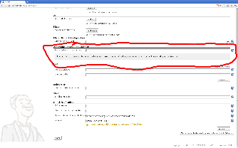

[[ConfigAutoRefreshPlugin-ConfigAutoRefreshPlugin]]
== Config AutoRefresh Plugin

 +

Provide a way to configure the auto-refresh rate from the Jenkins UI.

 +

[.confluence-embedded-file-wrapper]##

 +

'''''

 +

[[ConfigAutoRefreshPlugin-Changelog]]
=== Changelog

[[ConfigAutoRefreshPlugin-1.0(released2011-06-23)]]
==== 1.0 (released 2011-06-23)

* fully I18N
* initial implementation
