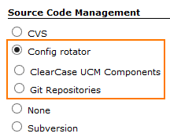
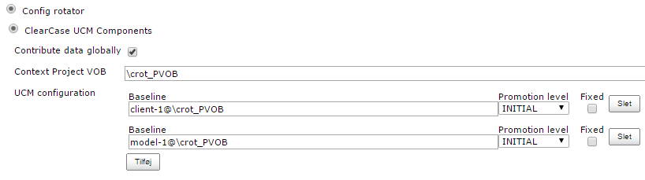
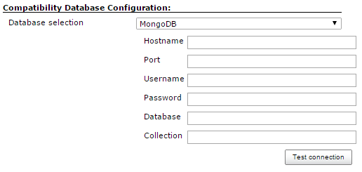
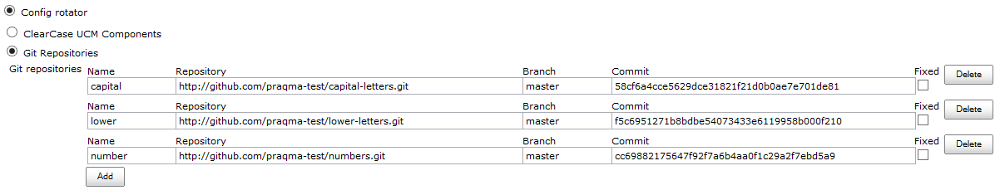
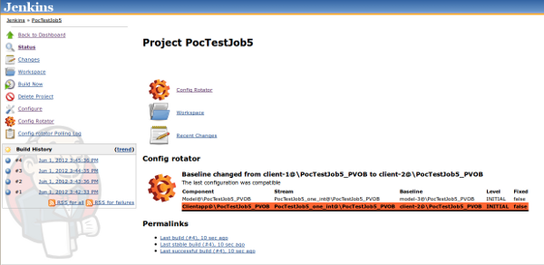
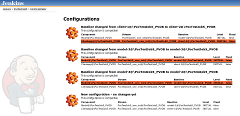
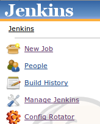
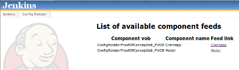
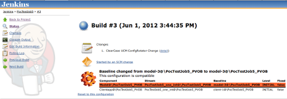
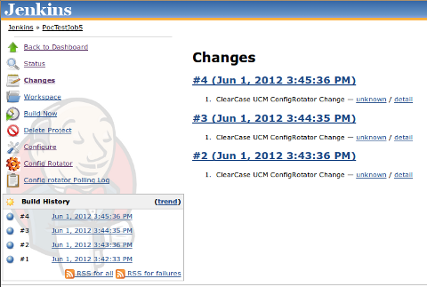

[[ConfigRotatorPlugin-Developedby]]
===== Developed by

[.confluence-embedded-file-wrapper]#image:docs/images/praqma_logo_70x70.jpg[image]#

[[ConfigRotatorPlugin-Sponsoredby]]
===== Sponsored by

[.confluence-embedded-file-wrapper .confluence-embedded-manual-size]##

[[ConfigRotatorPlugin-ConfigRotator,nowwithGitsupport]]
== Config Rotator, now with Git support

[[ConfigRotatorPlugin-Introduction]]
== Introduction

In ClearCase UCM a composite baseline describes dependencies between
different baselines of components in a parent/child relation.

This 'dependency graph' in a composite baseline describes a
configuration, where one specific baselines defines a relation to other
specific baselines – potentially nested in several layers.

But it can also be regarded as a more generic structure that simply
describes a hierarchy of components.

When viewed as a hierarchy it's interesting to know, if another (newer)
component in the structure would still be compliant with the
configuration as a whole. Somebody ought to test +
that each time a new baseline of a component in the hierarchy is
released.

The Config Rotator monitors the SCM for newer versions of components in
the structure, and executes this test when necessary. The configuration
is only created temporary and only the +
result of the try-out is stored. The actual tested configuration is not
persisted. Component developers can subscribe to test results involving
their components through ATOM feeds on the Jenkins job running the
Config Rotator.

[[ConfigRotatorPlugin-SupportedSCMs]]
=== Supported SCMs

* ClearCase UCM
* Git, from version 1.1.0

[[ConfigRotatorPlugin-Featurehighlights]]
== Feature highlights

* Try-out new configuration of components, including reset to old
configuration to try again
* Be able to subscribe to Atom feeds, by component, with information
about new compatible or incompatible configuration with the component

[[ConfigRotatorPlugin-Requirementsandrecommendedsetup]]
== Requirements and recommended setup

[[ConfigRotatorPlugin-ClearCaseUCM]]
=== ClearCase UCM

. You need a working ClearCase environment for the user running the
Jenkins build on the host (Jenkins master or slave) where the build is
executed
. Plugin is in current version only tested on Windows
. Freestyle builds must be used
. Jenkins slaves are tested running as a service, or Java Webstart (it's
important user running service or Java has a working ClearCase
environment)

Future plans might be Linux support or other ways to setup job and
master/slave. If you are using the plugin in other setups than the
above, kindly let us know if it works or not.

* Issue or inquiry use Jenkins Jira and see
https://wiki.jenkins-ci.org/display/JENKINS/config+rotator+plugin#ConfigRotatorPlugin-KnownIssues[Known
Issues] below
* Other questions: http://www.praqma.net/support

[[ConfigRotatorPlugin-Git]]
=== Git

Git requires no special setup.

[[ConfigRotatorPlugin-GettingStartedGuide]]
== Getting Started Guide

In the Source Code Management section select the Config rotator option

[.confluence-embedded-file-wrapper]##

[[ConfigRotatorPlugin-ClearCaseUCMConfiguration]]
=== ClearCase UCM Configuration

The *Context Project VOB* is where the UCM project of the temporary
stream is located. In this Project VOB a special UCM Project must be
created and named jenkins
[.confluence-embedded-file-wrapper]## +
*Contribute data globally* will write the resulting action of a config
rotator build to a database specified in global configuration under the
global configuration page:

[.confluence-embedded-file-wrapper]##

The *UCM configuration* is a series of baselines describing the
configurations.

* *Baseline* A baseline describing a component of the configuration
* *Promotion level* The required promotion level for the baseline
* *Fixed* Fixation of configuration component. Can this component be
rotated or not.

[[ConfigRotatorPlugin-Git.1]]
=== Git

* *Name* Source location of the workspace. If empty, the name of the
repository is used.
* *Repository* The URL of the Git repository.
* *Branch* The branch to rotate. Master is used if empty.
* *Commit* Offset commit to rotate from, either a SHA1 or tag.
* *Fixed* Fixation of configuration component. Can this component be
rotated or not.

[.confluence-embedded-file-wrapper]##

[[ConfigRotatorPlugin-Featuredescription]]
== Feature description

[[ConfigRotatorPlugin-Tryingaseriesofconfigurations]]
=== Trying a series of configurations

* Set Your job up to poll the SCM
* When Config Rotator finds new baselines, it starts building

Picture show a series of successfull build. The project/job page will
show latest result for the configuration. If You click on the a build
the tested configuration from the build is shown.

[.confluence-embedded-file-wrapper]##

Click the Config Rotator link in the left menu on the project/job to
view all tried configurations

[.confluence-embedded-file-wrapper]##

[[ConfigRotatorPlugin-Usingfeeds]]
=== Using feeds

[cols=",",]
|===
|[.confluence-embedded-file-wrapper]##
|[.confluence-embedded-file-wrapper]##
|===

* Main page of Jenkins shows a link to the Config Rotator feed page
* For every component in a build earlier executed, a feed for the
component contains information about the outcome of the test showing
compatible or incompatible. |
* Use your favorite RSS/Atom feed reader and subscribe the links.

[[ConfigRotatorPlugin-Resettooldconfiguration]]
=== Reset to old configuration

If You wan't to try a configuration once more, and continue from that
time on, go to the job, click a build and on the build page click *Reset
to this configuration*

[.confluence-embedded-file-wrapper]##

* *Note that resetting to a configuration applies only on the next
build, thus the project/job page is first updated after next build.*

[[ConfigRotatorPlugin-Changeslinkworkingoncomponentbaselines]]
=== Changes link working on component baselines

We have implement the *Changes* feature to show changes between the
baselines of the changes component in the configuration.

[.confluence-embedded-file-wrapper]##

[[ConfigRotatorPlugin-KnownIssues(currentversion)]]
== Known Issues (current version)

[.confluence-embedded-file-wrapper .confluence-embedded-manual-size]####**http://www.praqma.com/services/jcisupport[If
it's broken ...We Can Fix It!]**

* We've had people reporting issues when trying to copy existing jobs
using the config rotator SCM component, where the copied data is
different from the target job. 
* There are issues with changesets prior to 1.0.1. The changeset would
not properly recognize the user of the change. This should is fixed in
the most recent version. We've had to change the format of the
changes.xml files created by the job, so only changesets generated with
1.0.2 will work as designed, and 1.0.1 changeset will still show the
user as 'unknown'.
* "Build has failed" mails are sent even though the build is marked as
"nothing to do". Make sure the email plugin is run after the config
rotator post build step. Yes, there is such a thing. Normally it is
added automatically, inserted at random. It is required and cannot be
disabled.

type

key

summary

[.icon-in-pdf]# # Data cannot be retrieved due to an unexpected error.

http://issues.jenkins-ci.org/secure/IssueNavigator.jspa?reset=true&jqlQuery=project%20=%20JENKINS%20AND%20status%20in%20%28Open,%20%22In%20Progress%22,%20Reopened%29%20AND%20component%20=%20%27config-rotator-plugin%27&src=confmacro[View
these issues in Jira]

 +

[[ConfigRotatorPlugin-Changes]]
== Changes

[[ConfigRotatorPlugin-Version2.0.0(August25,2016)]]
=== Version 2.0.0(August 25, 2016)

* Fixed an issue with the Git implementation not releasing file handles
on windows
(https://github.com/Praqma/config-rotator-plugin/issues/10[#10])
* Fixed an issue that prevented job being saved on Jenkins 2.13+
(https://github.com/Praqma/config-rotator-plugin/issues/9[#9])

[[ConfigRotatorPlugin-Version1.3.1(October12,2015)]]
=== Version 1.3.1(October 12, 2015)

* Added support for JobDSL
(https://issues.jenkins-ci.org/browse/JENKINS-30904[JENKINS-30904])

[[ConfigRotatorPlugin-Version1.3.0(August28,2015)]]
=== Version 1.3.0(August 28, 2015)

* Add 'Use newest' option for Config Rotator when using ClearCase as SCM
(https://issues.jenkins-ci.org/browse/JENKINS-28983[JENKINS-28983])

[[ConfigRotatorPlugin-Version1.2.1(August18,2015)]]
=== Version 1.2.1(August 18, 2015)

* Fixed an issue with Filters not working properly in ClearCase
(https://issues.jenkins-ci.org/browse/JENKINS-29975[JENKINS-29975])

[[ConfigRotatorPlugin-Version1.2.0(July6,2015)]]
=== Version 1.2.0(July 6, 2015)

* Introduced the ability to add data for subscription
(https://issues.jenkins-ci.org/browse/JENKINS-27215[JENKINS-27215])
* Added the ability to turn this feature on/off
(https://issues.jenkins-ci.org/browse/JENKINS-28065[JENKINS-28065])

[[ConfigRotatorPlugin-Version1.1.8(Januar29,2015)]]
=== Version 1.1.8(Januar 29, 2015)

* Fixed an issue with empty dep. components
(https://issues.jenkins-ci.org/browse/JENKINS-26623[JENKINS-26623])

[[ConfigRotatorPlugin-Version1.1.8(November17,2014)]]
=== Version 1.1.8(November 17, 2014)

* Properly trigger reset, when job altered and saved
(https://issues.jenkins-ci.org/browse/JENKINS-24822[JENKINS-24822])

[[ConfigRotatorPlugin-Version1.1.7(August16,2014)]]
=== Version 1.1.7(August 16, 2014)

* Improved performance
(https://issues.jenkins-ci.org/browse/JENKINS-23653[JENKINS-23653])

[[ConfigRotatorPlugin-Version1.1.6(June23,2014)]]
=== Version 1.1.6(June 23, 2014)

* Fixed an issue with clearcase, unable to create workspace when view is
deleted
(https://issues.jenkins-ci.org/browse/JENKINS-22832[JENKINS-22832])

[[ConfigRotatorPlugin-Version1.1.5(May2,2014)]]
=== Version 1.1.5(May 2, 2014)

* Fixed an issue where an invalid configuration could cause an
infifinite build loop.
(https://issues.jenkins-ci.org/browse/JENKINS-22533[JENKINS-22533] and https://issues.jenkins-ci.org/browse/JENKINS-22842[JENKINS-22842])

[[ConfigRotatorPlugin-Version1.1.4(March11,2014)]]
=== Version 1.1.4(March  11, 2014)

* Improved the layout in IE9. The layout is now longer garbled when
usiing IE9.
(https://issues.jenkins-ci.org/browse/JENKINS-20981[JENKINS-20981])
* Fixed an issue with rebasing, the plugin will now attempt to cancel a
rebase if it underway
(https://issues.jenkins-ci.org/browse/JENKINS-22058[JENKINS-22058])

[[ConfigRotatorPlugin-Version1.1.3(December20,2013)]]
=== Version 1.1.3(December 20, 2013)

* ClearCase UCM: Clarified error message
(https://issues.jenkins-ci.org/browse/JENKINS-21068[JENKINS-21068])
* ClearCase UCM: Improved checkout performance
(https://issues.jenkins-ci.org/browse/JENKINS-21069[JENKINS-21069])
* Fixed an issue where polling could result in 'Nothing to do' grey
builds
(https://issues.jenkins-ci.org/browse/JENKINS-21066[JENKINS-21066])
* ClearCase UCM: Handling hijacked files
(https://issues.jenkins-ci.org/browse/JENKINS-21065[JENKINS-21065])

[[ConfigRotatorPlugin-Version1.1.2(August26,2013)]]
=== Version 1.1.2(August 26, 2013)

* View tag now uses remote computername as postfix
(https://issues.jenkins-ci.org/browse/JENKINS-18603[JENKINS-18603)]

[[ConfigRotatorPlugin-Version1.1.1(June4,2013)]]
=== Version 1.1.1(June 4, 2013)

* Config Rotator triggers, but nothing new is found
(https://issues.jenkins-ci.org/browse/JENKINS-18194[JENKINS-18194])
* Config spec for ClearCase UCM is not created correctly
(https://issues.jenkins-ci.org/browse/JENKINS-17803[JENKINS-17803])

[[ConfigRotatorPlugin-Version1.1.0(April14,2013)]]
=== Version 1.1.0(April 14, 2013)

* Git for Config Rotator
(https://issues.jenkins-ci.org/browse/JENKINS-17604[JENKINS-17604])
* Unload component from Config Rotator job does not work
(https://issues.jenkins-ci.org/browse/JENKINS-17230[JENKINS-17230])
* Config Rotator does not trig on new baseline
(https://issues.jenkins-ci.org/browse/JENKINS-17229[JENKINS-17229])

[[ConfigRotatorPlugin-Version1.0.4(April3,2013)]]
=== Version 1.0.4(April 3, 2013)

* Config Rotator does not trig on new baseline
(https://issues.jenkins-ci.org/browse/JENKINS-17229[JENKINS-17229])
* Use nothing to build (grey builds) if there is no new baselines
(https://issues.jenkins-ci.org/browse/JENKINS-14746[JENKINS-14746])

[[ConfigRotatorPlugin-Version1.0.3(April2,2013),faultyrelease]]
=== Version 1.0.3(April 2, 2013), faulty release

[[ConfigRotatorPlugin-Version1.0.2]]
=== Version 1.0.2

* Changesets are now visualized like they are in the ClearCase UCM
Plugin
* Fixed user identity in changeset
- https://issues.jenkins-ci.org/browse/JENKINS-15481[JENKINS-15481]

[[ConfigRotatorPlugin-Version1.0.1]]
=== Version 1.0.1

* Fixed missing icon in rotated configuration
- https://issues.jenkins-ci.org/browse/JENKINS-13989[JENKINS-13989]
* Fixed incorrect feed urls
- https://issues.jenkins-ci.org/browse/JENKINS-13988[JENKINS-13988]

[[ConfigRotatorPlugin-Releasenote]]
==== Release note

We have implemented two levels of check of configuration. The first
check is if configuration is loadable in ClearCase. The second level of
check is if the configuration added make sense in a context of
configuration rotation. Eg. config-rotator does not allow the same
component more the once.

Polling check the first level, and abort polling if check is not
passed. +
Builds do both checks and fail if not passed.

[[ConfigRotatorPlugin-Version1.0.0,initialversion]]
=== Version 1.0.0, initial version
