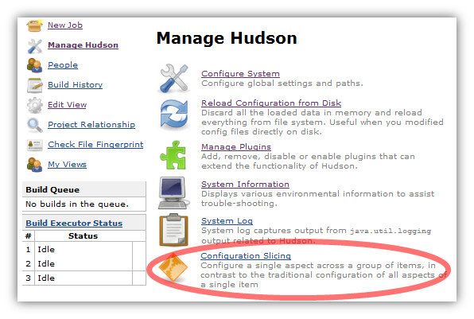
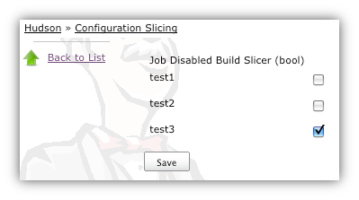
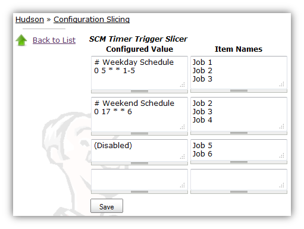
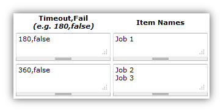
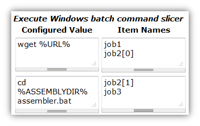
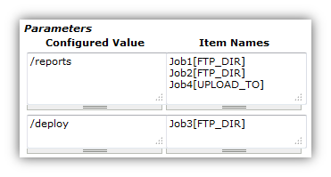
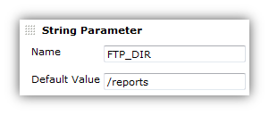
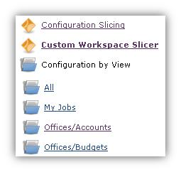

[.conf-macro .output-inline]##

[cols="",options="header",]
|===
|Plugin Information
|View Configuration Slicing
https://plugins.jenkins.io/configurationslicing[on the plugin site] for
more information.
|===

[.aui-icon .aui-icon-small .aui-iconfont-warning .confluence-information-macro-icon]##

*This plugin is up for adoption.* Want to help improve this plugin?
https://wiki.jenkins-ci.org/display/JENKINS/Adopt+a+Plugin[Click here to
learn more]!

Perform mass configuration of select project properties, including
email, timer, discard old builds, and Maven configuration.It has a
framework to make it very easy to add a configuration page for a new
property.  At present, two types of data can be mass-configured:
booleans and strings.  

The plugin shows up in Jenkins' UI on the Manage Jenkins page - seen
here near the bottom of the page:   +
[.confluence-embedded-file-wrapper]##

The main page of the configuration slicing plugin shows all the
properties that can be sliced - select one and you are presented with a
screen showing how that value is set across the entire Jenkins instance.
Many properties on Jenkins projects are useful to set this way, but the
configuration slicing plugin can handle properties on any collection,
such as slaves, or builds of a project.

*The following functions are supported*

* https://wiki.jenkins-ci.org/display/JENKINS/Ant+Plugin[Ant version per
project]
* Block Build when Downstream Building Slicer (bool)
* Block Build when Upstream Building Slicer (bool)
* https://wiki.jenkins-ci.org/display/JENKINS/Build-timeout+Plugin[Build
Timeout] (does not support all features)
* Custom Workspace Slicer (Advanced Project Options > Use custom
workspace)
* Discard Old Builds Slicer - Days to keep artifacts
* Discard Old Builds Slicer - Days to keep builds
* Discard Old Builds Slicer - Max # of builds to keep
* Discard Old Builds Slicer - Max # of builds to keep with artifacts
* E-mail Notification
* https://wiki.jenkins-ci.org/display/JENKINS/Email-ext+plugin[Editable
Email Notification]
(https://issues.jenkins-ci.org/browse/JENKINS-11774[recipient list
only])
* https://wiki.jenkins-ci.org/display/JENKINS/Jython+Plugin[Execute
Jython script]
* https://wiki.jenkins-ci.org/display/JENKINS/Python+Plugin[Execute
Python script]
* Execute shell slicer
* Execute Windows batch command slicer
* https://wiki.jenkins-ci.org/display/JENKINS/Gradle+Plugin[Gradle
version per project]
* https://wiki.jenkins-ci.org/display/JENKINS/Groovy+plugin[Groovy
version per project]
* JDK per project
* Job Disabled Build Slicer (bool)
* Job Disabled Build Slicer (String)
* https://wiki.jenkins-ci.org/display/JENKINS/Priority+Sorter+Plugin[Job
Priority Slicer]
* https://wiki.jenkins-ci.org/display/JENKINS/Logfilesizechecker+Plugin[Logfilesizechecker
Plugin]
* Maven "top-level" targets
* Maven Goals and Options (Maven project)
* Maven Version (Maven Projects)
* MAVEN_OPTS per Maven project
* Parameters
* Quiet period
* SCM Timer Trigger Slicer
* Tied Label Slicer
* Timer Trigger Slicer
* https://wiki.jenkins-ci.org/display/JENKINS/Timestamper[Timestamper
Slicer]
* https://wiki.jenkins-ci.org/display/JENKINS/Configuration+Slicing+Plugin[Claim
Slicer]

[[ConfigurationSlicingPlugin-Booleanslicing]]
== Boolean slicing

In the case of booleans, the plugin presents a set of checkboxes and
names.  The user can then adjust that property and save the changes.

[.confluence-embedded-file-wrapper]##

[[ConfigurationSlicingPlugin-Stringslicing]]
== String slicing

Most of the slicing uses a GUI much like the following example.  You can
move the Item Names (i.e. Jobs) around within the boxes on the right to
change which jobs have different settings.  You can also alter the
values on the left to change how jobs are configured.  There will always
be a blank set of boxes added to the bottom to allow you to create a new
setting when you need it.  For most of these screens, a value of
"(Disabled)" will indicate that those jobs do not use this configuration
at all.  To disable jobs (e.g. for SCM Polling), move those job names
into that "(Disabled)" box.

[.confluence-embedded-file-wrapper]##

[[ConfigurationSlicingPlugin-Stringslicingmultiplevalues]]
== String slicing multiple values

Some slicers allow you to configure multiple values at a time. In those
cases, the values are separated by a comma, and follow the given
example.

[.confluence-embedded-file-wrapper]##

[[ConfigurationSlicingPlugin-StringslicingmultipleBuilders]]
== String slicing multiple Builders

For the Windows batch builder, Shell builders, and "Top-level Maven
targets", a job can have multiple builders of each type. To configure
jobs like this, you will be presented with an index next to the jobs
names like "MyJob[0]" and "MyJob[1]". The index indicates which instance
of the builder you are configuring.

[.confluence-embedded-file-wrapper]##

This is available under these links

* Execute shell slicer
* Execute Windows batch command slicer
* Maven "top-level" targets

[[ConfigurationSlicingPlugin-Configuringparametersacrossmultiplejobs]]
== Configuring parameters across multiple jobs

Job Parameters (aka "This build is parameterized") can be configured
across multiple jobs at one time through the "Parameters" link. To
indicate which parameter you are configuring, note the
"JobName[ParameterName]" syntax.

[.confluence-embedded-file-wrapper]##
[.confluence-embedded-file-wrapper]##

[[ConfigurationSlicingPlugin-SlicingbyView]]
== Slicing by View

If you have many jobs, it can be difficult to perform the configuration
slicing. To make it more granular, you can configure just the jobs
within one view. Assuming you have organized your Jenkins installation
to have useful views, this will allow you to configure jobs at the right
granularity. To use this feature, first select the type of configuration
(in this example "Custom Workspace") and then you will be given a list
of views to choose from. You don't have to choose a view, as the default
is to show all jobs. If you select one of the views on the left, your
list of jobs is filtered down to just the jobs in that view.

[.confluence-embedded-file-wrapper]##

[[ConfigurationSlicingPlugin-EmailNotificationsandEditableEmailNotifications(from1.41on)]]
== Email Notifications and https://wiki.jenkins-ci.org/display/JENKINS/Email-ext+plugin[Editable Email Notifications] (from 1.41 on)

When editing recipient lists, Email notifications are only completely
disabled when set to (Disabled).

Setting a empty recipient list leaves existing email notifications to
committers (Checkbox "Notify individuals who broke the build") in place.

[[ConfigurationSlicingPlugin-Changelog]]
== Changelog

[[ConfigurationSlicingPlugin-Version1.41-May31,2015]]
=== Version 1.41 - May 31, 2015

* https://issues.jenkins-ci.org/browse/JENKINS-20319[JENKINS-20319] -
E-Mail-Configurations are only completely disabled when set to
(Disabled). Setting a empty recipient leaves e-mail notifications to
committers in place.
* Requires jenkins 1.509.3 and email-ext 2.37
* https://issues.jenkins-ci.org/browse/JENKINS-21225[JENKINS-21225] -
Updated Editable email notification to work with email-ext 2.37
* https://issues.jenkins-ci.org/browse/JENKINS-21445[JENKINS-21445] -
bug fix in job disabled build slicer
* https://issues.jenkins-ci.org/browse/JENKINS-25964[JENKINS-25964] -
NPE in some cases when trying to slice parameters

[[ConfigurationSlicingPlugin-Version1.40-November15,2014]]
=== Version 1.40 - November 15, 2014

Fix bugs related to selection of maven modules or matrix configurations
instead of top level project items:

* https://issues.jenkins-ci.org/browse/JENKINS-18455[JENKINS-18455]
* https://issues.jenkins-ci.org/browse/JENKINS-20082[JENKINS-20082]
* https://issues.jenkins-ci.org/browse/JENKINS-21556[JENKINS-21556]
* https://issues.jenkins-ci.org/browse/JENKINS-23776[JENKINS-23776]

[[ConfigurationSlicingPlugin-Version1.39-October4,2014]]
=== Version 1.39 - October 4, 2014

* https://issues.jenkins-ci.org/browse/JENKINS-16855[JENKINS-16855] -
Add support for Claim Slicing
* https://issues.jenkins-ci.org/browse/JENKINS-16869[JENKINS-16869] - Do
not show the TimeStamper slicer if the TimeStamper plugin is not
installed
* https://issues.jenkins-ci.org/browse/JENKINS-23169[JENKINS-23169] -
NullPointerException with newer Jenkins versions

[[ConfigurationSlicingPlugin-Version1.38.3-October3,2013]]
=== Version 1.38.3 - October 3, 2013

* https://issues.jenkins-ci.org/browse/JENKINS-16305[JENKINS-16305] -
Add support for Quiet period configuration slicing
* https://issues.jenkins-ci.org/browse/JENKINS-16828[JENKINS-16828] -
NullPointerException in BooleanSlice.get for "Block Build" when slicing
by view
* https://issues.jenkins-ci.org/browse/JENKINS-18060[JENKINS-18060] -
Add support for logfilesizechecker
* https://issues.jenkins-ci.org/browse/JENKINS-19858[JENKINS-19858] -
Visual spacing has degraded dramatically with newer versions of Jenkins
(noticed in ver. 1.533)
* https://issues.jenkins-ci.org/browse/JENKINS-14521[JENKINS-14521] -
Configuration Slicing should temporarily disable the Auto Refresh plugin
* https://issues.jenkins-ci.org/browse/JENKINS-19855[JENKINS-19855] -
Parameters slicer trims default values - including space at the
beginning of a Choice Parameter
* Removed support for Workspace Cleanup Plugin (became too complex to
perform configuration slicing)

[[ConfigurationSlicingPlugin-Version1.37.1-Sept30,2013]]
=== Version 1.37.1 - Sept 30, 2013

* fix regression introduced by folder support
(https://issues.jenkins-ci.org/browse/JENKINS-18455[JENKINS-18455])

[[ConfigurationSlicingPlugin-Version1.37-June4,2013]]
=== Version 1.37 - June 4, 2013 

* add support for folders
* moved to github

[[ConfigurationSlicingPlugin-Version1.36-October28,2012]]
=== Version 1.36 - October 28, 2012

* https://issues.jenkins-ci.org/browse/JENKINS-14456[JENKINS-14456] -
Add support for Workspace Cleanup Plugin

[[ConfigurationSlicingPlugin-Version1.35-October27,2012]]
=== Version 1.35 - October 27, 2012

* Fixed issues with the newer version of the build timeout plugin
* https://issues.jenkins-ci.org/browse/JENKINS-15528[JENKINS-15528] -
java.lang.ClassNotFoundException: hudson.plugins.python.Python
* https://issues.jenkins-ci.org/browse/JENKINS-15447[JENKINS-15447] -
Warnings with Configuration Slicing plugin

[[ConfigurationSlicingPlugin-Version1.33-Sept19,2012]]
=== Version 1.33 - Sept 19, 2012

* https://issues.jenkins-ci.org/browse/JENKINS-15152[JENKINS-15152] -
Add support for configure 'Block build when upstream project is
building' and 'Block build when downstream project is building'
* https://issues.jenkins-ci.org/browse/JENKINS-14784[JENKINS-14784] -
Add support for the "execute python script" slicer

[[ConfigurationSlicingPlugin-Version1.32-July14,2012]]
=== Version 1.32 - July 14, 2012

* https://issues.jenkins-ci.org/browse/JENKINS-14417[JENKINS-14417] -
Add Timestamper slicer
* https://issues.jenkins-ci.org/browse/JENKINS-11463[JENKINS-11463] -
Add configuration slicer for build priority sorter
* https://issues.jenkins-ci.org/browse/JENKINS-13834[JENKINS-13834] -
E-mail Notification Slicer issues
* https://issues.jenkins-ci.org/browse/JENKINS-14428[JENKINS-14428] -
Provide group operations for "Disable build slicer"
* https://issues.jenkins-ci.org/browse/JENKINS-12294[JENKINS-12294] -
"Save" button in slicers should float, just like in the new job config
pages

[[ConfigurationSlicingPlugin-Version1.31-May22,2012]]
=== Version 1.31 - May 22, 2012

* https://issues.jenkins-ci.org/browse/JENKINS-13866[JENKINS-13866] -
Configuration slicing for parameters
* https://issues.jenkins-ci.org/browse/JENKINS-13867[JENKINS-13867] -
Configuration slicing for Maven versions should apply to Free style
projects

[[ConfigurationSlicingPlugin-Version1.30-May20,2012]]
=== Version 1.30 - May 20, 2012

* https://issues.jenkins-ci.org/browse/JENKINS-12515[JENKINS-12515] -
Add configuration slicing for use of Ant, Gradle and Groovy
installations
* https://issues.jenkins-ci.org/browse/JENKINS-13839[JENKINS-13839] -
Configure Maven goals for multiple jobs and multiple builders
* https://issues.jenkins-ci.org/browse/JENKINS-12922[JENKINS-12922] -
Support changing maven version to multiple jobs at once using
configuration slicing plugin

[[ConfigurationSlicingPlugin-Version1.29-May18,2012]]
=== Version 1.29 - May 18, 2012

* https://issues.jenkins-ci.org/browse/JENKINS-13830[JENKINS-13830] -
Add windows batch command
* https://issues.jenkins-ci.org/browse/JENKINS-11941[JENKINS-11941] -
Configuration Slicing Plugin's "Execute shell slicer" lists first
execute shell step only

[[ConfigurationSlicingPlugin-Version1.28.1-December24,2011]]
=== Version 1.28.1 - December 24, 2011

* https://issues.jenkins-ci.org/browse/JENKINS-12215[JENKINS-12215] -
Configuration slicer changes step order

[[ConfigurationSlicingPlugin-Version1.27-November28,2011]]
=== Version 1.27 - November 28, 2011

* https://issues.jenkins-ci.org/browse/JENKINS-11868[JENKINS-11868] -
Add configuration slicer for Jenkins build timeout plugin

[[ConfigurationSlicingPlugin-Version1.26-November24,2011]]
=== Version 1.26 - November 24, 2011

* https://issues.jenkins-ci.org/browse/JENKINS-11781[JENKINS-11781] -
Configuration Slicing Plugin's "Execute shell slicer" view doesn't
support Matrix jobs

[[ConfigurationSlicingPlugin-Version1.25-November9,2011]]
=== Version 1.25 - November 9, 2011

* https://issues.jenkins-ci.org/browse/JENKINS-11649[JENKINS-11649] -
Add configuration slicers for Discard Old Builds with artifacts

[[ConfigurationSlicingPlugin-Version1.24-October26,2011]]
=== Version 1.24 - October 26, 2011

* https://issues.jenkins-ci.org/browse/JENKINS-11500[JENKINS-11500] -
Add execute shell option to the plugin

[[ConfigurationSlicingPlugin-Version1.23-October13,2011]]
=== Version 1.23 - October 13, 2011

* Added configuration by views - see this wiki page for details

[[ConfigurationSlicingPlugin-Version1.22-October6,2011]]
=== Version 1.22 - October 6, 2011

* Fixed
https://issues.jenkins-ci.org/browse/JENKINS-11242[JENKINS-11242] - Add
configuration slicing for Email-ext plugin

[[ConfigurationSlicingPlugin-Version1.21-September22,2011]]
=== Version 1.21 - September 22, 2011

* Fixed
https://issues.jenkins-ci.org/browse/JENKINS-11094[JENKINS-11094] - Add
Email configuration slicer

[[ConfigurationSlicingPlugin-Version1.20-August24,2011]]
=== Version 1.20 - August 24, 2011

* Fixed https://issues.jenkins-ci.org/browse/JENKINS-8194[JENKINS-8194]
- Discard Old Builds Slicer resets configuration of artifact keeping
* Fixed
https://issues.jenkins-ci.org/browse/JENKINS-10797[JENKINS-10797] - Sort
"(Disabled)" properly
* improved navigation options

[[ConfigurationSlicingPlugin-Version1.19-July22,2011]]
=== Version 1.19 - July 22, 2011

* Fixed
https://issues.jenkins-ci.org/browse/JENKINS-10431[JENKINS-10431] - do
not create changes when there are no actual changes
* sort the index of slicers
* add newline to job names list to make it easier to cut and paste

[[ConfigurationSlicingPlugin-Version1.18-July2011]]
=== Version 1.18 - July 2011

* Improved handling of chron specs with comments or multiple lines
* Fixed null pointer problem with timer slicers (previously would
require reboot to pick up new slicer changes)

[[ConfigurationSlicingPlugin-Version1.17-July2011]]
=== Version 1.17 - July 2011

* Complete redesign of the string slicer GUI (affects most slicers)
* Added custom workspace slicer

[[ConfigurationSlicingPlugin-Version1.15-January22,2010]]
=== Version 1.15 - January 22, 2010

* Add Maven project slicing - MAVEN_OPTS and 'Goals and Settings'
(http://n4.nabble.com/Use-e-option-in-all-maven-jobs-tp1101676p1101676.html[report])

[[ConfigurationSlicingPlugin-Version1.14-January16,2010]]
=== Version 1.14 - January 16, 2010

* Fix LogRotationSlicer to handle empty strings better
(https://issues.jenkins-ci.org/browse/JENKINS-5240[5240])

[[ConfigurationSlicingPlugin-Version1.13-January15,2010]]
=== Version 1.13 - January 15, 2010

* Add Jdk slicer
(http://n4.nabble.com/Globally-change-default-JDK-td387648.html[report])
* Finally sort out release issues: The pom.xml for maven-hpi-plugin
needed to point to a newer javanettasks

[[ConfigurationSlicingPlugin-Version1.12-attemptedJanuary15,2010-neverreleased]]
=== Version 1.12 - attempted January 15, 2010 - never released

[[ConfigurationSlicingPlugin-Version1.11-attemptedJanuary15,2010-neverreleased]]
=== Version 1.11 - attempted January 15, 2010 - never released

[[ConfigurationSlicingPlugin-Version1.10-attemptedNovember2,2009andJanuary15,2010-neverreleased]]
=== Version 1.10 - attempted November 2, 2009 and January 15, 2010 - never released

[[ConfigurationSlicingPlugin-Version1.9-July29,2009]]
=== Version 1.9 - July 29, 2009

* No changes. Release was done to figure out case sensitivity issue in
javanettasks 1.23

[[ConfigurationSlicingPlugin-Version1.8-attemptedJuly22,2009-neverreleased]]
=== Version 1.8 - attempted July 22, 2009 - never released

[[ConfigurationSlicingPlugin-Version1.7-attemptedJuly22,2009-neverreleased]]
=== Version 1.7 - attempted July 22, 2009 - never released

[[ConfigurationSlicingPlugin-Version1.6-attemptedJuly21,2009andJuly22,2009-neverreleased]]
=== Version 1.6 - attempted July 21, 2009 and July 22, 2009 - never released

[[ConfigurationSlicingPlugin-Version1.5-July21,2009]]
=== Version 1.5 - July 21, 2009

* Add log rotation slicers, for each of days and builds
(http://n4.nabble.com/Consumed-1-2-GB-of-memory-tp384274p384285.html[report])

* Add SCM polling schedule slicer

* Add slave label slicer

[[ConfigurationSlicingPlugin-Version1.4-attemptedApril9,2009-neverreleased]]
=== Version 1.4 - attempted April 9, 2009 - never released

[[ConfigurationSlicingPlugin-Version1.3-attemptedApril9,2009-neverreleased]]
=== Version 1.3 - attempted April 9, 2009 - never released

[[ConfigurationSlicingPlugin-Version1.2-March16,2009]]
=== Version 1.2 - March 16, 2009

* Initial release - supports slicing for timer trigger

[[ConfigurationSlicingPlugin-Version1.1-attemptedMarch16,2009-neverreleased]]
=== Version 1.1 - attempted March 16, 2009 - never released

[[ConfigurationSlicingPlugin-Version1.0-attemptedMarch16,2009-neverreleased]]
=== Version 1.0 - attempted March 16, 2009 - never released
