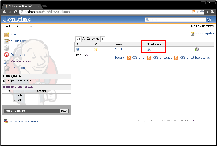

[[ConfigureJobColumnPlugin-ConfigureJobColumnPlugin]]
== Configure Job Column Plugin

 +

Provide a fast-path configure job link available for views.

 +

[cols="",options="header",]
|===
|Configure Column
|[.confluence-embedded-file-wrapper]##
|===

 +

'''''

 +

[[ConfigureJobColumnPlugin-Changelog]]
=== Changelog

[[ConfigureJobColumnPlugin-1.0(released2012-05-30)]]
==== 1.0 (released 2012-05-30)

* fully I18N
* initial implementation
