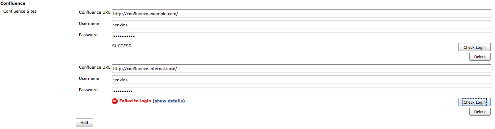
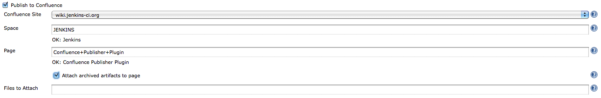
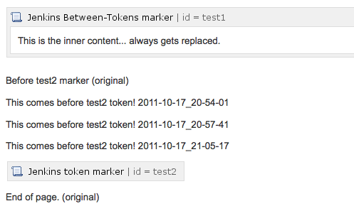

[.conf-macro .output-inline]##

[cols="",options="header",]
|===
|Plugin Information
|View Confluence Publisher
https://plugins.jenkins.io/confluence-publisher[on the plugin site] for
more information.
|===

[.aui-icon .aui-icon-small .aui-iconfont-info .confluence-information-macro-icon]##

Older versions of this plugin may not be safe to use. Please review the
following warnings before using an older version:

* https://jenkins.io/security/advisory/2018-07-30/#SECURITY-982[CSRF
vulnerability and missing permission checks]

[.confluence-embedded-file-wrapper]##image:https://buildhive.cloudbees.com/job/jenkinsci/job/confluence-publisher-plugin/badge/icon[image]##[.conf-macro .output-inline]##This
plugin allows you to publish build artifacts as attachments to an
http://www.atlassian.com/[Atlassian]
http://www.atlassian.com/software/confluence/[Confluence] wiki page.##

[[ConfluencePublisherPlugin-Configuration]]
== Configuration

[[ConfluencePublisherPlugin-GlobalConfiguration]]
=== Global Configuration

First, configure one or more Confluence sites in the global system
configuration. If authentication credentials are not supplied, the
plugin will act as an anonymous user – as such your Confluence
configuration must support anonymous attachments for that to work.

[.confluence-embedded-file-wrapper .confluence-embedded-manual-size]##

[[ConfluencePublisherPlugin-JobConfiguration]]
=== Job Configuration

With at least one site configured, enable the "Publish to Confluence"
post-build action, and select from one of the pre-configured Confluence
sites. Enter the Space and Page name where the attachment should end up
(e.g., for this URL, Space name = "JENKINS", Page name =
"Confluence+Publisher+Plugin").

If you have enabled "Archive the artifacts", and wish to automatically
upload everything that was archived, check the box labeled "Attach
archived artifacts to page". _Otherwise_, enter an Ant-style fileset
pattern to specify which files should be uploaded.

[.confluence-embedded-file-wrapper .confluence-embedded-manual-size]##

[[ConfluencePublisherPlugin-Editingpagemarkup]]
=== Editing page markup

[.aui-icon .aui-icon-small .aui-iconfont-warning .confluence-information-macro-icon]#
#

Please note that as of Confluence v4.0, the page storage format is no
longer supporting "wiki format". That makes it slightly more difficult
to use simple hidden macros for the replacements. It is still possible,
but at the moment it is a bit convoluted and fragile.

In the "Wiki Markup Replacements" section, select the Editor type from
the "Add Replacement" dropdown menu. Available Editors include:

* *Entire Page* +
Entire page content is replaced. _No markers required._
* *Prepend* +
Content is added to the very beginning of the page. _No markers
required._
* *Append* +
Content is added to the very end of the page. _No markers required._
* *Before Token* +
Content is inserted before a configurable marker token. _Requires one
marker._
* *After Token* +
Content is inserted after a configurable marker token. _Requires one
marker._
* *Between Tokens* +
Content is inserted between two configurable start/end marker tokens.
Existing content between the tokens is replaced. _Requires a start and
end marker._

Once an editor has been selected, choose the type of markup Generator to
use. Available Generators:

* *Plain Text* +
Content is entered into a textarea field. The content should be valid
wiki markup. Build variables will be expanded.
* *File Contents* +
Enter a filename to pull markup contents from. The file should exist
relative to the workspace directory, and should contain plain-text
markup. Build variables will be expanded.

You may add multiple markup replacement configurations. However, note
that the token-related editors only expect to perform edits once,
therefore each replacement configuration should use unique token
markers.

If possible, it is recommended to configure two custom User Macros in
the Confluence configuration (or have your Confluence administrator
configure them):

[[ConfluencePublisherPlugin-SampleConfluence3.xUserMacros]]
==== Sample Confluence 3.x User Macros

* Single-marker macro (used for "Before Token" and "After Token"
editors):
** Name: jenkins-marker
** `+[ ]+` Macro has a body (_*uncheck* the box_)
** "Macro generates HTML markup"
** Template: _blank_
* Start/End macro (used for the "Between Tokens" editor):
** Name: jenkins-between
** `+[X]+` Macro has a body
** "Use unprocessed macro body"
** "Macro generates wiki markup"
** Template: _blank_

These two macros can then be used in the wiki markup, and will not
interfere with normal rendering of the wiki content. Additionally,
Confluence's "parameter" syntax for user macros allows adding arbitrary
parameters to these macros, thus making it very simple to keep the
tokens unique. Some examples:

* \{`+jenkins-marker:before|section=foo+`}
* \{`+jenkins-marker:after|section=changelog+`}
* \{`+jenkins-between:start|section=log}This will be replaced.{jenkins-between:end|section=log+`}

If you choose not to use a confluence macro as the token, it will still
work (e.g., you can something else, like "`+%%INSERT_AFTER%%+`").
However, that text may appear in the rendered markup. For that reason,
using the Confluence macro is the recommended approach.

[[ConfluencePublisherPlugin-SampleConfluence4.xUserMacros]]
==== Sample Confluence 4.x User Macros

* Single-marker macro (used for "Before Token" and "After Token"
editors):
** Name: jenkins-marker
** image:docs/images/error.svg[(error)]
No Macro Body
** Template:
+
....
## Macro title: Jenkins Token Marker
## Macro has a body: N
## Body processing: No macro body
## Output: None
##
## Developed by: Joe Hansche
## Date created: 10/17/2011
## Installed by: Joe Hansche

## Allows an "id" parameter in order to make multiple unique markers
## @param id
....
* Start/End macro (used for the "Between Tokens" editor):
** Name: jenkins-between
** image:docs/images/error.svg[(error)]
Rendered
** Template:
+
....
## Macro title: Jenkins Between-Tokens section
## Macro has a body: Y
## Body processing: Rendered
## Output: Piped input
##
## Developed by: Joe Hansche
## Date created: 10/17/2011
## Installed by: Joe Hansche

## Allows an "id" parameter in order to make multiple unique markers
## @param id
$body
....

It's then important to realize that you don't have the same control over
the markers as you did in Confluence 3.x, and the marker you used
previously will not work in the editor configuration. To know what text
to use for the "marker" locations, you'll need to insert the macros in
their proper locations, and then view the underlying storage format.
These are the analogous examples that correspond to the same examples
given above for the Confluence 3.x versions:

* \{`+jenkins-marker:id=before-foo+`}
** {blank}
+
....

<ac:macro ac:name="jenkins-marker"><ac:parameter ac:name="id">before-foo</ac:parameter></ac:macro>

....
* \{`+jenkins-marker:id=after-changelog+`}
** {blank}
+
....

<ac:macro ac:name="jenkins-marker"><ac:parameter ac:name="id">after-changelog</ac:parameter></ac:macro>

....
* \{`+jenkins-between:id=log+`} (this won't actually render the same
way, and will instead show a block section that has some body being
rendered)
** {blank}
+
....
<ac:macro ac:name="jenkins-between"><ac:parameter ac:name="id">log</ac:parameter><ac:parameter ac:name="atlassian-macro-output-type">BLOCK</ac:parameter><ac:rich-text-body>
....

Here's an example of what it might look like while in *Edit mode*:

[.confluence-embedded-file-wrapper]##

[[ConfluencePublisherPlugin-Changelog]]
== Changelog

[[ConfluencePublisherPlugin-Version2.0.2(July30,2018)]]
=== Version 2.0.2 (July 30, 2018)

* https://jenkins.io/security/advisory/2018-07-30/#SECURITY-982[Fix
security issue]

[[ConfluencePublisherPlugin-Version1.8(Jan14,2013)]]
=== Version 1.8 (Jan 14, 2013)

* https://issues.jenkins-ci.org/browse/JENKINS-15472[JENKINS-15472]
Create the page in Confluence at build-time if the page didn't already
exist.

[[ConfluencePublisherPlugin-Version1.7.1(Jun25,2012)]]
=== Version 1.7.1 (Jun 25, 2012)

* https://issues.jenkins-ci.org/browse/JENKINS-14205[JENKINS-14205] Fix
logic error checking for "start" token for the "Between Markers" editor.
* _Note_: The 1.7 tag failed to release properly from the Maven Release
plugin, which is why this version is actually released as "1.7.1".

[[ConfluencePublisherPlugin-Version1.6(May29,2012)]]
=== Version 1.6 (May 29, 2012)

* https://issues.jenkins-ci.org/browse/JENKINS-13896[JENKINS-13896] Fix
StringIndexOutOfBoundsException when the "between" ending marker exists
in multiple locations.

[[ConfluencePublisherPlugin-Version1.5(Apr27,2012)]]
=== Version 1.5 (Apr 27, 2012)

* https://issues.jenkins-ci.org/browse/JENKINS-13569[JENKINS-13569] Fix
NPE when "Attach archived artifacts" is enabled, but the job's "Archive
the artifacts" option is *not* enabled.

[[ConfluencePublisherPlugin-Version1.4(Jan11,2012)]]
=== Version 1.4 (Jan 11, 2012)

* https://issues.jenkins-ci.org/browse/JENKINS-12253[JENKINS-12253]
Introduces "even if unstable" option in the job config.
* https://issues.jenkins-ci.org/browse/JENKINS-12253[JENKINS-12253] Also
introduces a `+${BUILD_RESULT+`} build-time environment variable.
* https://issues.jenkins-ci.org/browse/JENKINS-12254[JENKINS-12254]
Allow Space and Page names to be specified by build-time environment
variables (e.g., dynamic from a parameterized build).

[[ConfluencePublisherPlugin-Version1.3(Oct17,2011)]]
=== Version 1.3 (Oct 17, 2011)

* https://issues.jenkins-ci.org/browse/JENKINS-11276[JENKINS-11276]
Fixes content editing in Confluence 4.0.
* Adds a new "Replace entire page" editor, which was previously only
possible with the "Replace between tokens" editor, and placing the
start/end tokens at the top/bottom of the page content.

[[ConfluencePublisherPlugin-Version1.2(Oct16,2011)]]
=== Version 1.2 (Oct 16, 2011)

* https://issues.jenkins-ci.org/browse/JENKINS-11276[JENKINS-11276]
Fixes file attachments when working against a Confluence 4.0 server.
Also fails gracefully if content editors are configured for a 4.0
server. Both features still work properly on Confluence 3.x, but content
editing is disabled for version 4.0+.

[[ConfluencePublisherPlugin-Version1.1.1(Sep22,2011)]]
=== Version 1.1.1 (Sep 22, 2011)

* Fix a Content-Type issue that prevented attachments to Confluence, by
defaulting to application/octet-stream if unable to figure out the
content type automatically.

[[ConfluencePublisherPlugin-Version1.1(Jul2,2011)]]
=== Version 1.1 (Jul 2, 2011)

* Implements Confluence page
https://wiki.jenkins-ci.org/display/JENKINS/Confluence+Publisher+Plugin#ConfluencePublisherPlugin-Editingpagemarkup[wiki
markup editing].

[[ConfluencePublisherPlugin-Version1.0.3(Jun19,2011)]]
=== Version 1.0.3 (Jun 19, 2011)

* Fix bug introduced in 1.0.2 for Confluence installations hosted at the
root (e.g., http://confluence.example.com/). 1.0.2 works for non-root
installations (e.g., http://www.example.com/confluence/). This release
should fix both cases.

[[ConfluencePublisherPlugin-Version1.0.2(Jun18,2011)]]
=== Version 1.0.2 (Jun 18, 2011)

* *Bad Release!* See version 1.0.3
* https://github.com/jenkinsci/confluence-publisher-plugin/pull/1[GH-1]
- Fixing incorrect confluence RPC URL creation in Utils.

[[ConfluencePublisherPlugin-Version1.0.1(Mar24,2011)]]
=== Version 1.0.1 (Mar 24, 2011)

* Rerelease 1.0.0 to properly set required Jenkins version

[[ConfluencePublisherPlugin-Version1.0.0(Feb28,2011)]]
=== Version 1.0.0 (Feb 28, 2011)

* Initial release
