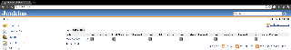

[[ConsoleColumnPlugin-ConsoleColumnPlugin]]
== Console Column Plugin

Minimum Version

[.aui-icon .aui-icon-small .aui-iconfont-info .confluence-information-macro-icon]#
#

Because of a JDK issue, requiredCore was made to be 1.420. However, we
have reports that this plugin will happily work on 1.409 LTS releases.

[.conf-macro .output-inline]# #

[.aui-icon .aui-icon-small .aui-iconfont-warning .confluence-information-macro-icon]##

*This plugin is up for adoption.* Want to help improve this plugin?
https://wiki.jenkins-ci.org/display/JENKINS/Adopt+a+Plugin[Click here to
learn more]!

 +

Provide a fast-path console link available for views.

 +

[cols="",options="header",]
|===
|Views
|[.confluence-embedded-file-wrapper]##
|===

 +

'''''

 +

[[ConsoleColumnPlugin-Changelog]]
=== Changelog

[[ConsoleColumnPlugin-1.5(released2011-10-15)]]
==== 1.5 (released 2011-10-15)

* Fix issue @11358, do not show console links for jobs with builds of
that type unavailable (e.g. no lastFailed console link if no failed
builds)

[[ConsoleColumnPlugin-1.4(released2011-10-12)]]
==== 1.4 (released 2011-10-12)

* Added German I18N, thank you Christoph Kutzinski

[[ConsoleColumnPlugin-1.3(released2011-10-06)]]
==== 1.3 (released 2011-10-06)

* fix issue @11180 and make console columns not shown by default

[[ConsoleColumnPlugin-1.1(released2011-02-11)]]
==== 1.1 (released 2011-02-11)

* fix 404 for images on non-default view view
* fix hard coded 16x16 image size

[[ConsoleColumnPlugin-1.0(released2011-02-03)]]
==== 1.0 (released 2011-02-03)

* fully I18N
* initial implementation
