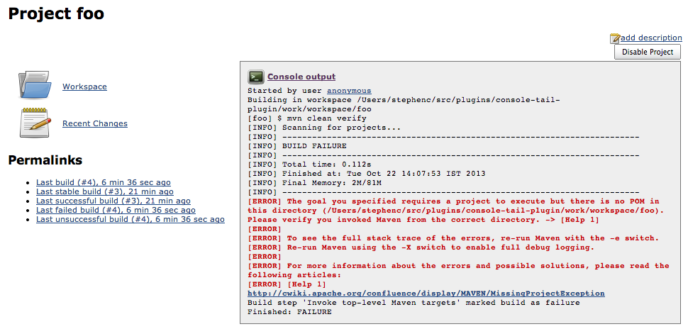

[.conf-macro .output-inline]# #

[.aui-icon .aui-icon-small .aui-iconfont-warning .confluence-information-macro-icon]##

*This plugin is up for adoption.* Want to help improve this plugin?
https://wiki.jenkins-ci.org/display/JENKINS/Adopt+a+Plugin[Click here to
learn more]!

[[ConsoleTailPlugin-ConsoleTailPlugin]]
== Console Tail Plugin

This plugin adds a floating box to all projects when the last build
failed. The floating box is only shown if the last build failed.

[.confluence-embedded-file-wrapper .image-center-wrapper]##

[[ConsoleTailPlugin-VersionHistory]]
=== Version History

[[ConsoleTailPlugin-Version1.1(Oct22,2013)]]
==== Version 1.1 (Oct 22, 2013)

* Fix some layout issues

[[ConsoleTailPlugin-Version1.0(Oct22,2013)]]
==== Version 1.0 (Oct 22, 2013)

* Initial release
