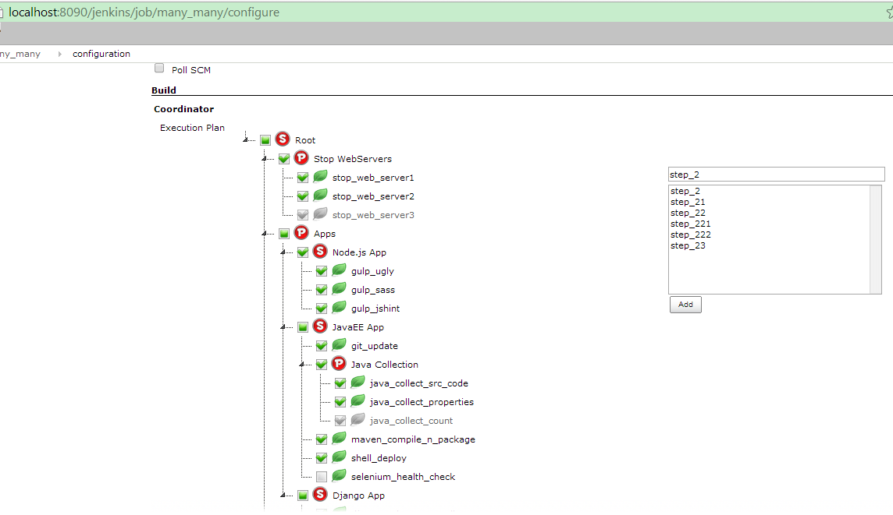
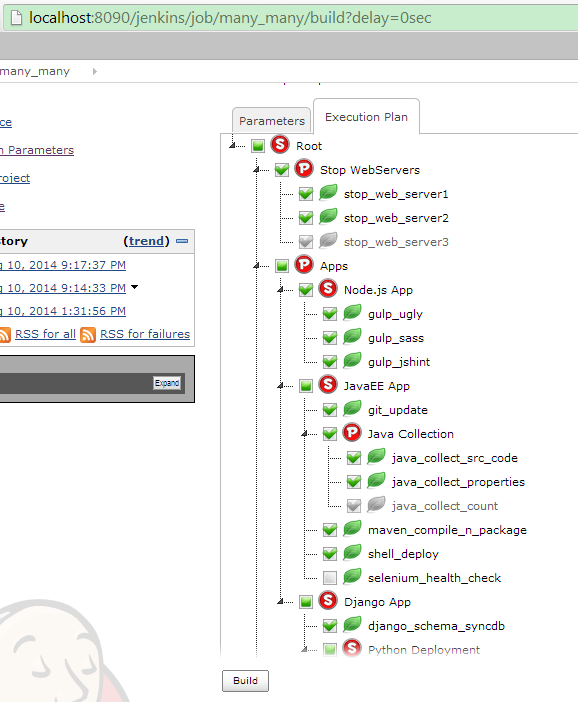
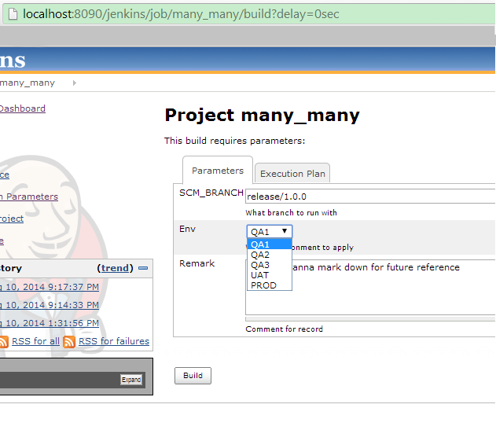
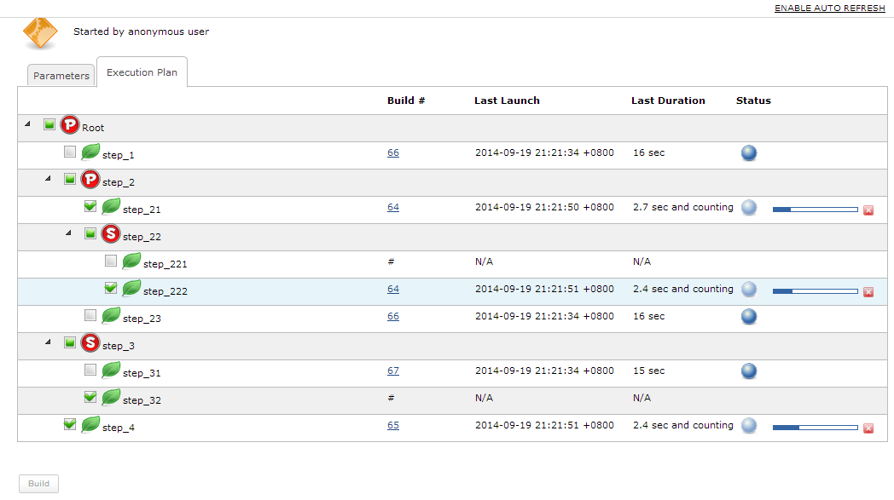

[.conf-macro .output-inline]# #

This plugin acts like a coordinator that makes other jobs to build in a
particular sequence as pre-defined.

There are *serial* and *parallel* building patterns, which should have
already covered most scenarios.

[[Coordinator-Why?]]
== Why?

I've seen different organizations spending their own effort to customize
their CI tools, especially for job running dependency definitions. 

Say first run *Job A*, then *Job B* & *Job C* in parallel, then *Job D*,
then others, etc.

This plugin is meant to make this by drag & drop, and clicks. It would
be easy to trace the building histories including the person who
triggers the job,

build number, launch time, duration & status in each atomic job.

In a word, it's more like a dash board to keep all relevant information
in a page view.

[[Coordinator-Demo]]
== Demo

[[Coordinator-LiveDemo]]
=== Live Demo

For a running Jenkins instance with Coordinator plugin installed, go to
jenkins.unendedquest.com

[[Coordinator-ConfigurePage]]
=== Configure Page

[cols="",]
|===
|[.confluence-embedded-file-wrapper .image-left-wrapper]##
|===

[[Coordinator-TriggerPage]]
=== Trigger Page

[width="100%",cols="50%,50%",]
|===
a|
[[Coordinator-ExecutionPlan]]
===== Execution Plan

a|
[[Coordinator-ParametersPassingToAtomicJobs]]
===== Parameters Passing To Atomic Jobs

|[.confluence-embedded-file-wrapper .image-left-wrapper]##
|[.confluence-embedded-file-wrapper .image-left-wrapper]##
|===

[[Coordinator-BuildingPage]]
=== Building Page

[cols="",]
|===
|[.confluence-embedded-file-wrapper .image-left-wrapper]##
|===

[[Coordinator-ChangeLog]]
== Change Log

[[Coordinator-Version1.0.0(Nov1,2014)]]
=== Version 1.0.0 (Nov 1, 2014)

* basics
