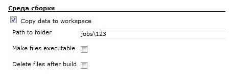

 +

Copies data to workspace directory for each project build.

Hudson 1.366 or later.

[.aui-icon .aui-icon-small .aui-iconfont-error .confluence-information-macro-icon]#
#

This plugin was created for Hudson 1.366. It might not work with earlier
versions of Hudson.

[[CopyDataToWorkspacePlugin-Userguide]]
== User guide

This plugin copies data from directory stored on master node. The path
to this directory should be relative to Hudson root path (HUDSON_HOME).
All data will be copied to the project workspace directory

on master or slave node.

{empty}1. Select "Copy data to workspace" in the Build Environment (list
of BuildWrappers).

{empty}2. Enter the path to a data storage directory. All data in this
directory will be copied to workspace (only data, not a directory
itself). Path should be relative to Hudson root path (HUDSON_HOME). +
For example, Hudson root path = "C:\tmp". Path to folder =
"storage\task". Plugin will copy data from directory
"C:\tmp\storage\task".

{empty}3. Option "Make files executable". It means that after copying
data to workspace plugin apply to each file chmod(0755). So all files
become executable. On Windows, no-op.

{empty}4. Option "Delete files after build". If checked, plugin will
delete all copied files from workspace after build.


[.confluence-embedded-file-wrapper]##

[[CopyDataToWorkspacePlugin-Changelog]]
=== Changelog

[[CopyDataToWorkspacePlugin-Version1.0(February24,2011)]]
==== Version 1.0 (February 24, 2011)

* Initial release.
