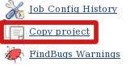

 +

This plugin adds the "Copy project" link into left side panel in the
main project page to facilitate copying of job configuration.

[.confluence-embedded-file-wrapper]##

[[Copyprojectlinkplugin-Changelog]]
== Changelog

[[Copyprojectlinkplugin-Release1.4(2015-05-13)]]
=== Release 1.4 (2015-05-13)

* Fix https://issues.jenkins-ci.org/browse/JENKINS-13517[JENKINS-13517]:
CopyProjectLink plugin: does not work with jobs using 'display name'
feature

[[Copyprojectlinkplugin-Release1.3(2015-05-12)]]
=== Release 1.3 (2015-05-12)

* Fix https://issues.jenkins-ci.org/browse/JENKINS-22363[JENKINS-22363]:
Do not report ClassNotFoundException when used without Folders plugin.

[[Copyprojectlinkplugin-Release1.2(2013-11-08)]]
=== Release 1.2 (2013-11-08)

* Copy of folders (from
https://wiki.jenkins-ci.org/display/JENKINS/CloudBees+Folders+Plugin[Cloudbees
Folders plugin]) is now supported
* Fix https://issues.jenkins-ci.org/browse/JENKINS-18910[JENKINS-18910]
CopyProjectLink plugin: does not work with non-root url

[[Copyprojectlinkplugin-Release1.1(2013-04-09)]]
=== Release 1.1 (2013-04-09)

* Fix to work correctly within folders + several other improvements
(https://github.com/jenkinsci/copy-project-link-plugin/pull/1[pull #1])

[[Copyprojectlinkplugin-Release1.0(2011-02-10)]]
=== Release 1.0 (2011-02-10)

* Initial release

 +
