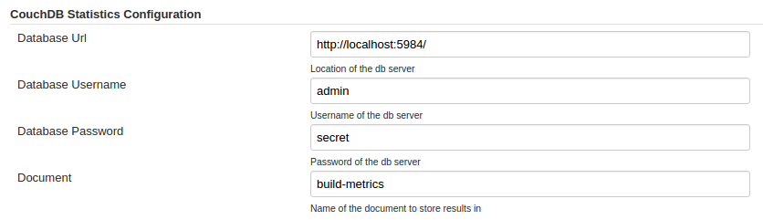

CouchDB Statistics plugin allows the publishing of all build statistics
to CouchDB/Cloudant.

[[CouchDBStatisticsPlugin-InstallationInstructions]]
== Installation Instructions

The plugin configuration is done under `+Manage Jenkins+` >
`+Configure System+`.

[.confluence-embedded-file-wrapper]##

[[CouchDBStatisticsPlugin-ChangeLog]]
== Change Log

[[CouchDBStatisticsPlugin-Version0.2.1(4thDecember2015)]]
=== Version 0.2.1 (4th December 2015)

* Converted password field to a 'password' box.

[[CouchDBStatisticsPlugin-Version0.2(3rdDecember2015)]]
=== Version 0.2 (3rd December 2015)

* Initial Release
** Supports basic parameters, e.g. jobName, duration, buildNumber,
timestamp, status
