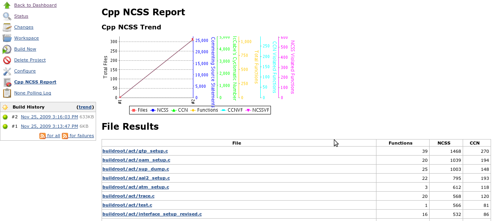
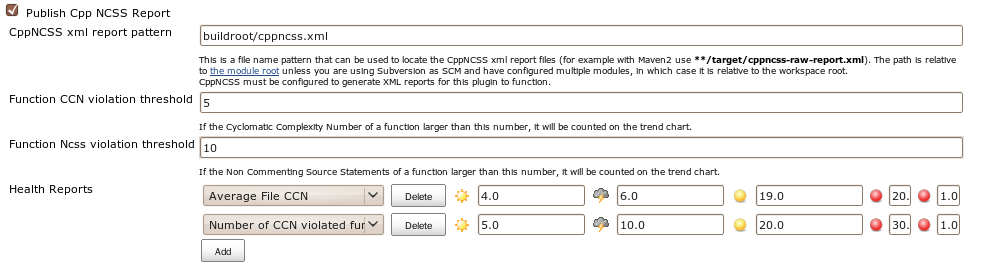

[.conf-macro .output-inline]##

[cols="",options="header",]
|===
|Plugin Information
|View CppNCSS https://plugins.jenkins.io/cppncss[on the plugin site] for
more information.
|===

[.aui-icon .aui-icon-small .aui-iconfont-info .confluence-information-macro-icon]##

Older versions of this plugin may not be safe to use. Please review the
following warnings before using an older version:

* https://jenkins.io/security/advisory/2018-02-26/#SECURITY-712[Reflected
cross-site-scripting vulnerability]

[.aui-icon .aui-icon-small .aui-iconfont-warning .confluence-information-macro-icon]##

*This plugin is up for adoption.* Want to help improve this plugin?
https://wiki.jenkins.io/display/JENKINS/Adopt+a+Plugin[Click here to
learn more]!

[.conf-macro .output-inline]#This plugin allows you to use
http://cppncss.sourceforge.net/[CppNCSS] build reporting tool.#

[[CPPNCSSPlugin-Thereportresult:]]
== The report result:

[.confluence-embedded-file-wrapper]##

[[CPPNCSSPlugin-ConfiguringtheCppNCSSPlugin]]
== Configuring the CppNCSS Plugin

You can configure use cppncss plugin to report in your project's
configuration page:
[.confluence-embedded-file-wrapper]##

[[CPPNCSSPlugin-ChangeLog]]
== Change Log

[[CPPNCSSPlugin-Version1.2(Feb03,2018)]]
=== Version 1.2 (Feb 03, 2018)

* image:docs/images/error.svg[(error)] https://issues.jenkins-ci.org/browse/JENKINS-49237[JENKINS-49237]
- Update the plugin to make it compatible with Jenkins 2.102+
** More
info: https://wiki.jenkins.io/display/JENKINS/Plugins+affected+by+fix+for+JEP-200[Plugins
affected by fix for JEP-200]
* https://issues.jenkins-ci.org/browse/JENKINS-21511[image:docs/images/error.svg[(error)] JENKINS-21511]
- Graph was missing when thresholds were not defined due to
NullPointerException
* image:docs/images/information.svg[(info)] Mpdernize
the plugin and update minimum Jenkins core requirement to 1.651.3
* https://jenkins.io/security/advisory/2018-02-26/#SECURITY-712[Fix]
https://jenkins.io/security/advisory/2018-02-26/#SECURITY-712[security
issue]

[[CPPNCSSPlugin-Version1.1(Feb18,2011)]]
=== Version 1.1 (Feb 18, 2011)

* Fix number parse error for ncss/ccn, etc.
* Avoid build failure when previous build does not have cppncss report.

[[CPPNCSSPlugin-Version1.0(Jun3,2010)]]
=== Version 1.0 (Jun 3, 2010)
