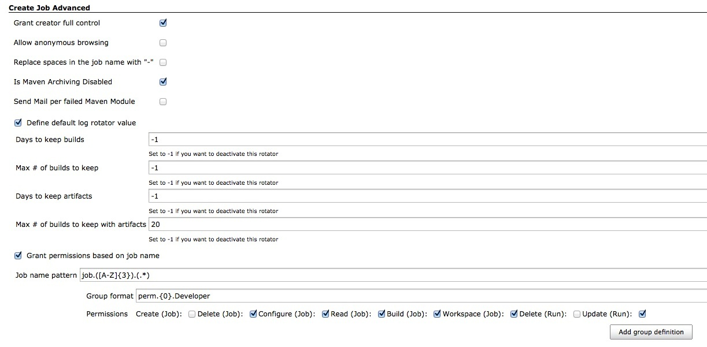

This plugin extends creating job. +
When you create a job, it automatically adds all permissions for the
creator.

[.confluence-embedded-file-wrapper]##

 +

[[CreateJobAdvancedPlugin-Sourcecode]]
== Source code

* GitHub: https://github.com/jenkinsci/createjobadvanced-plugin

[[CreateJobAdvancedPlugin-Changelog]]
== Changelog

[[CreateJobAdvancedPlugin-1.8(Dec29,2013)]]
=== 1.8 (Dec 29, 2013)

* update core dependency to 1.532
* fix compatibility issues with the maven-plugin since refactoring of
the MavenMailer

[[CreateJobAdvancedPlugin-1.7(Okt7,2012)]]
=== 1.7 (Okt 7, 2012)

* add support for two default values of maven projects
(https://github.com/jenkinsci/createjobadvanced-plugin/pull/2[pull #2]):
** Disable auto archiving - to save disc space per default
** Disable one mail per failed module - to not spam the users

[[CreateJobAdvancedPlugin-1.6(Aug5,2011)]]
=== 1.6 (Aug 5, 2011)

* Updates to text/help.

[[CreateJobAdvancedPlugin-1.5(Oct25,2010)]]
=== 1.5 (Oct 25, 2010)

* Dynamic permission definitions allow you to automatically grant +
permissions to specifig groups at job creation time. You can define a +
regular expression to get information from the jobs name. e.g. if all +
your jobs follow a naming standard, like this: 'group.GROUP.FreeForm', +
you can define a pattern like 'group.(.*).(.*)' and reuse the +
regular expression groups in the group format. +
(special thanks to domi)

[[CreateJobAdvancedPlugin-1.4]]
=== 1.4

* Add documentation
* activate/desactivate automatically set anonymous rights
* (special tks to jsiirola)

[[CreateJobAdvancedPlugin-1.3]]
=== 1.3

* Create an interface in Jenkins configuration
* activate/desactivate automatically set owner rights
* activate/desactivate replace space with "-" in the job name
* define default log rotator value

[[CreateJobAdvancedPlugin-1.2]]
=== 1.2

* Fix to work on version 1.334

[[CreateJobAdvancedPlugin-1.1]]
=== 1.1

* Fix bug if you create a job with template

[[CreateJobAdvancedPlugin-1.0]]
=== 1.0

* Initial Import
