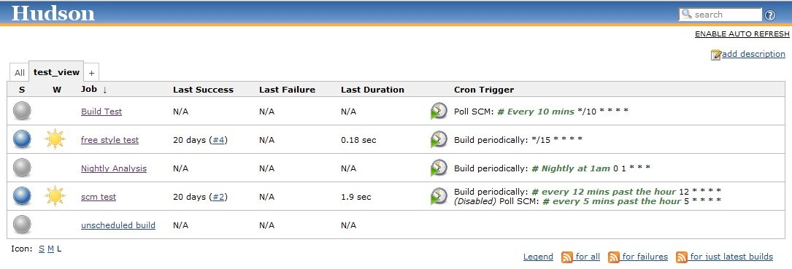

[[CronColumnPlugin-CronColumn]]
== Cron Column

[.conf-macro .output-inline]##View column showing the cron trigger
expressions that can be configured on a job +
(Subversion, Scheduled Builds, etc.)##This is a ListViewColumn plugin
that adds a column to a jobs overview page. +
The column displays the cron-like expression of each Trigger that can be
configured on a job (Subversion, Scheduled Builds etc).

Plugin Source:
https://hudson.dev.java.net/svn/hudson/trunk/hudson/plugins/cron_column

[.confluence-embedded-file-wrapper]##

[[CronColumnPlugin-HowtoUse]]
== How to Use

Once you have installed this plugin, you still have to update a view to
add this column.  The pages
https://wiki.jenkins-ci.org/display/JENKINS/Changing+the+Columns+of+a+View[Changing
the Columns of a View] and
https://wiki.jenkins-ci.org/display/JENKINS/Editing+or+Replacing+the+All+View[Editing
or Replacing the All View] will show you how.

[[CronColumnPlugin-Changelog]]
== Changelog

[[CronColumnPlugin-Version1.4(Jun162014)]]
=== Version 1.4 (Jun 16 2014)

Same as 1.1, just released to make sure it is considered newer than
1.003 (a nonstandard version string).

[[CronColumnPlugin-Version1.1(Jun122014)]]
=== Version 1.1 (Jun 12 2014)

* Do not show column by default
(https://issues.jenkins-ci.org/browse/JENKINS-23159[JENKINS-23159])

[[CronColumnPlugin-Version1.003(6Jul,2010)]]
==== Version 1.003 (6 Jul, 2010)

* Plugin now works with other project types (previously only worked with
Freestyle Projects)
