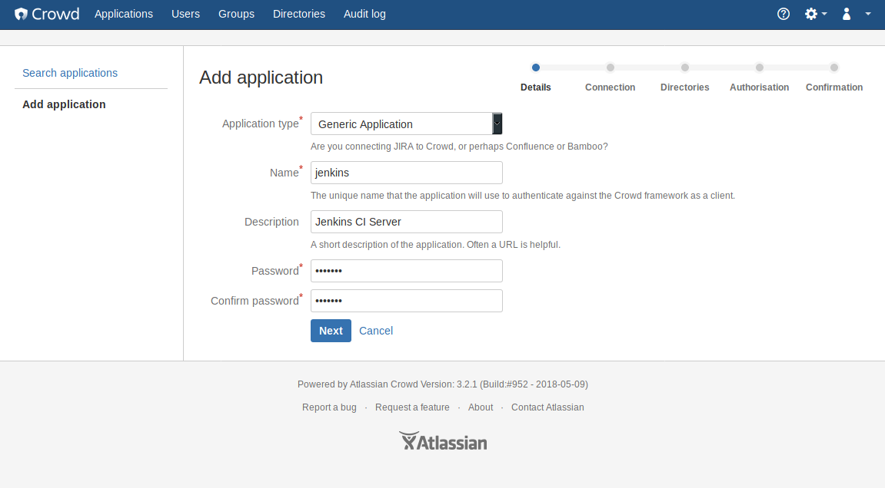
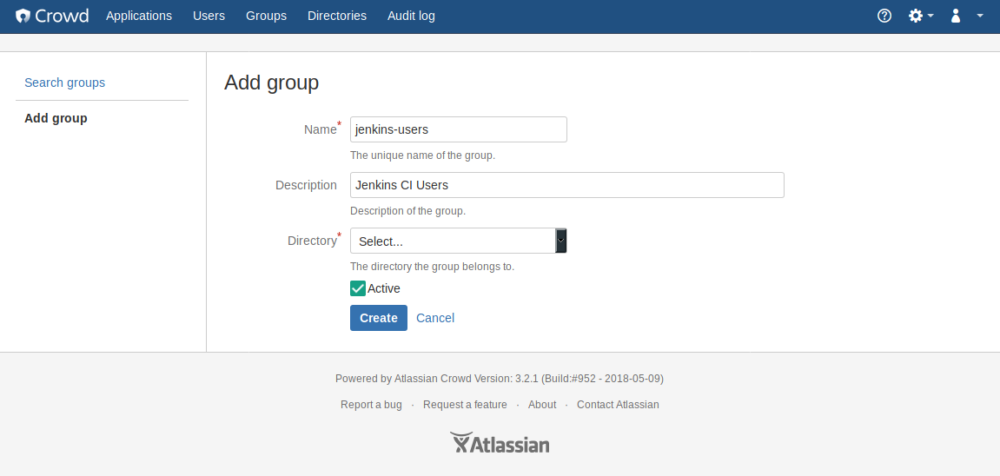
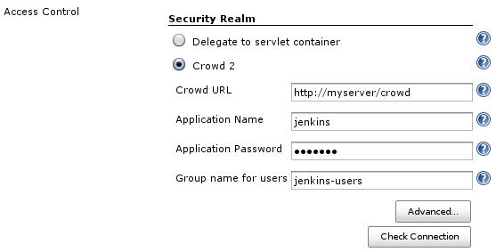

[.conf-macro .output-inline]##

[cols="",options="header",]
|===
|Plugin Information
|View Crowd 2 Integration https://plugins.jenkins.io/crowd2[on the
plugin site] for more information.
|===

[.aui-icon .aui-icon-small .aui-iconfont-info .confluence-information-macro-icon]##

Older versions of this plugin may not be safe to use. Please review the
following warnings before using an older version:

* https://jenkins.io/security/advisory/2018-09-25/#SECURITY-1068[Credentials
stored in plain text]
* https://jenkins.io/security/advisory/2018-09-25/#SECURITY-1067[SSRF
vulnerability]

[.aui-icon .aui-icon-small .aui-iconfont-warning .confluence-information-macro-icon]##

*This plugin is up for adoption.* The maintainer is looking for a
co-maintainer or successor.
https://wiki.jenkins-ci.org/display/JENKINS/Adopt+a+Plugin[Click here to
learn more]!

[[Crowd2Plugin-Crowd2Plugin]]
== Crowd 2 Plugin

[.conf-macro .output-inline]##This plugin enables use of
https://www.atlassian.com/software/crowd[Atlassian Crowd] >= 2.1.x as an
authentication source.##Crowd is a commercial identity management and
Single Sign-On (SSO) application.

[[Crowd2Plugin-Configuration]]
=== Configuration

To configure the plugin, you first need to create a new application in
Crowd. https://confluence.atlassian.com/crowd/adding-an-application-18579591.html
has more information on how to configure applications in Crowd.

[.confluence-embedded-file-wrapper .confluence-embedded-manual-size]##

Be sure to also allow connections to Crowd from the server Jenkins runs
on.

Next you need to configure a group that contains all users that are
allowed to login into Jenkins.
https://confluence.atlassian.com/crowd/managing-users-and-groups-193223.html
has more information how to manage users and groups.

[.confluence-embedded-file-wrapper .confluence-embedded-manual-size]##

Once you have the application and group configured in Crowd, you can
enable Crowd-based security in Jenkins on the "Manage Jenkins" page.
Enter the URL of your Crowd server (will typically end with .../crowd)
as well as the application name, password and group name you configured
in Crowd.

[.confluence-embedded-file-wrapper]##

Click on the "Check Connection" button to ensure that your connection
credentials are valid.

[.aui-icon .aui-icon-small .aui-iconfont-warning .confluence-information-macro-icon]#
#

Crowd supports nested groups, i.e. groups which contain other groups as
members and groups that are members of other groups (see
http://confluence.atlassian.com/display/CROWD/Nested+Groups+in+Crowd).
If you want to use this feature, click on the "Advanced..." button and
enable it. This may degrade performance, depending on your server
configuration.

[.aui-icon .aui-icon-small .aui-iconfont-info .confluence-information-macro-icon]#
#

This plugin doesn't support Crowd roles. As long as there's not enough
interest, it's unlikely that they are supported in a future version
because they are deprecated since Crowd 2.0 (see
http://confluence.atlassian.com/display/CROWD/Crowd+2.0+Upgrade+Notes[here]
for details).

[[Crowd2Plugin-Requirements]]
=== Requirements

This plugin has been tested with Jenkins 1.431 and Crowd 2.3.x, but was
built using Jenkins core 1.398 so it should work with Jenkins >= 1.398.

[.aui-icon .aui-icon-small .aui-iconfont-warning .confluence-information-macro-icon]#
#

This plugin uses Crowd REST APIs for connecting to Crowd and therefore
requires Crowd >= 2.1 +
(see http://developer.atlassian.com/display/CROWDDEV/Crowd+REST+APIs).
If you have an older Crowd server, use the older "Crowd Plugin" instead.

[[Crowd2Plugin-FAQ]]
=== FAQ

[[Crowd2Plugin-IsSingle-Sign-On(SSO)supported?]]
==== Is Single-Sign-On (SSO) supported?

Yes :-) That was the main reason I wrote this plugin.

[[Crowd2Plugin-What'sthedifferencebetweenthispluginand"CrowdPlugin"?]]
==== What's the difference between this plugin and "Crowd Plugin"?

Apart from SSO this plugin contains fixes for almost all open issues of
the "Crowd Plugin". (If you look at the issue navigator, there are
actually seven; five of them are almost or even older than one year.
Looking at the source code at GitHub
(https://github.com/jenkinsci/crowd-plugin), there doesn't seem to be
much activity trying to fix them). I have to admit that I haven't tested
https://issues.jenkins-ci.org/browse/JENKINS-9924[JENKINS-9924] so far,
i.e. what happens when the Crowd server is down. This will be done in
the near future.

A more technically answer is that this plugin code was written from
scratch using a different API to connect to the Crowd server, i.e. the
Crowd REST APIs. These are recommeded by Atlassian for long-term
compatibility.

In contrary, the "Crowd Plugin" uses Crowd's Java integration libraries
that have the disadvantage that one perhaps has to re-compile the source
code when a new Crowd release is available and one has to update these
libraries.

[[Crowd2Plugin-WhydoIhavetochooseagroupforusers?]]
==== Why do I have to choose a group for users?

To restrict the number of your Crowd users that are allowed to login. I
thought it's cool to have such a feature because for example Confluence
and JIRA, other well known products from Atlassian, also work that way.

[[Crowd2Plugin-IsthereLocalizationsupport?]]
==== Is there Localization support?

Yes.

[.aui-icon .aui-icon-small .aui-iconfont-info .confluence-information-macro-icon]#
#

Actually only German localization is included. If you can translate a
couple of messages and info texts into other languages, please send me a
note, and I'll include them in a newer version.

[[Crowd2Plugin-VersionHistory]]
=== [.inline-comment-marker]#Version History#

[[Crowd2Plugin-Version2.0.1(Sep25,2018)]]
==== [.inline-comment-marker]#Version 2.0.1 (Sep 25, 2018)#

* [.inline-comment-marker]#Fix security issues:
https://jenkins.io/security/advisory/2018-09-25/#SECURITY-1067[one],
https://jenkins.io/security/advisory/2018-09-25/#SECURITY-1068[two]#

[[Crowd2Plugin-Version2.0.0(Jul23,2018)]]
==== [.inline-comment-marker]#Version 2.0.0 (Jul 23, 2018) +
#

[.inline-comment-marker]# #

Fixed Bugs

* https://issues.jenkins-ci.org/browse/JENKINS-16703[JENKINS-16703] -
Too many periodic requests to Crowd server
* https://issues.jenkins-ci.org/browse/JENKINS-27070[JENKINS-27070] -
Plenty of "SEVERE: Host connection pool not found,
hostConfig=HostConfiguration"

Improvements

* https://issues.jenkins-ci.org/browse/JENKINS-40472[JENKINS-40472] -
Crowd2 plugin should allow blanks in parameter 'Restrict groups'
* Added possibility to enable caching to reduce remote calls to Crowd

Thanks a lot https://wiki.jenkins-ci.org/display/~aheritier[Arnaud
Héritier], https://wiki.jenkins-ci.org/display/~gmshake[Unknown User
(gmshake)] and all others who tested, gave input and had patience
[.confluence-embedded-file-wrapper .confluence-embedded-manual-size]#image:https://assets-cdn.github.com/images/icons/emoji/unicode/1f44d.png[image,width=20,height=20]#

[[Crowd2Plugin-Version1.8(Aug1,2014)]]
==== Version 1.8 (Aug 1, 2014)

* [JENKINS-23208] Fixed trace with enabled "remember me" checkbox.
* isAuthenticated() in /whoAmI page is now true.

[[Crowd2Plugin-Version1.7(Apr23,2014)]]
==== Version 1.7 (Apr 23, 2014)

* [JENKINS-21852] Added http proxy configuration.
* [JENKINS-18791] Session validation interval saved from ui.
* [JENKINS-13279] Don't use ssoTokenHelper, work with Embedded Crowd in
Jira.
* [JENKINS-16703] More options for connection configuration.
* Updated rest-api library to 2.7.1

[[Crowd2Plugin-Version1.6(Nov23,2013)]]
==== Version 1.6 (Nov 23, 2013)

Note: *check that your group list uses CSV separator and you have SSO
checkbox enabled (if you use it).*

* https://github.com/jenkinsci/crowd2-plugin/pull/3[pull #3] Fixed bug
whereby bogus user IDs were created that included display names. *When
upgrading, manual cleanup of* `+$JENKINS_HOME/users/+` *may be
required.*
* https://issues.jenkins-ci.org/browse/JENKINS-15509[JENKINS-15509]:
Don't require group.
* https://issues.jenkins-ci.org/browse/JENKINS-15753[JENKINS-15753]:
Allow spaces in group names.
* https://issues.jenkins-ci.org/browse/JENKINS-19212[JENKINS-19212]:
Make "useSSO" optional.
* Updated rest-api library to 2.6.6.

[[Crowd2Plugin-Version1.5(Aug23,2012)]]
==== Version 1.5 (Aug 23, 2012)

* https://issues.jenkins-ci.org/browse/JENKINS-11829[JENKINS-11829]:
Support more than one group
* https://issues.jenkins-ci.org/browse/JENKINS-12339[JENKINS-12339]:
misspelling in error message
* https://issues.jenkins-ci.org/browse/JENKINS-13547[JENKINS-13547]:
Jenkins runs extremely slow with remote crowd server

[[Crowd2Plugin-Version1.4(Nov25,2011)]]
==== Version 1.4 (Nov 25, 2011)

* Upgrade commons-httpclient version to 3.1.

[[Crowd2Plugin-Version1.3(Oct27,2011)]]
==== Version 1.3 (Oct 27, 2011)

Fixed the following bugs:

* https://issues.jenkins-ci.org/browse/JENKINS-11418[JENKINS-11418]:
Crowd2 doesn't always show full user name
* https://issues.jenkins-ci.org/browse/JENKINS-11507[JENKINS-11507]:
Single-sign-on isn't working correctly in the Crowd 2 plugin

[[Crowd2Plugin-Version1.2(Oct19,2011)]]
==== Version 1.2 (Oct 19, 2011)

* Fixed a problem that prevented you at least from adding pre- or post
build steps when reconfiguring a build job.
* Added some debug log messages.

[[Crowd2Plugin-Version1.1(Oct11,2011)]]
==== Version 1.1 (Oct 11, 2011)

* Fix for a problem that I discovered in combination with the
https://wiki.jenkins-ci.org/display/JENKINS/Email-ext+plugin[Email-ext
plugin]: Sending emails to the logged-in user was not possible because a
lookup operation in the Crowd server for details about a user failed.
* The Crowd user Id is now shown besides the display name of the
logged-in user.
* Added more debug log messages.
+
[.aui-icon .aui-icon-small .aui-iconfont-info .confluence-information-macro-icon]#
#

The debug log messages are usually not shown in Jenkins' console output
because they are logged with log level FINE or below. See
https://wiki.jenkins-ci.org/display/JENKINS/Logging[here] how to enable
them (the plugin uses logger classes `+de.theit.jenkins.crowd.XXX+`).

[[Crowd2Plugin-Version1.0(Sep23,2011)]]
==== Version 1.0 (Sep 23, 2011)

* Initial release
