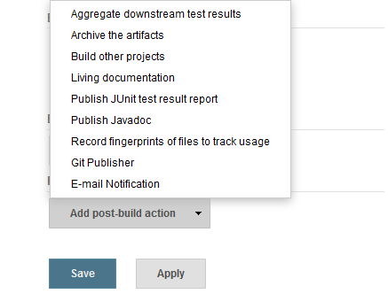
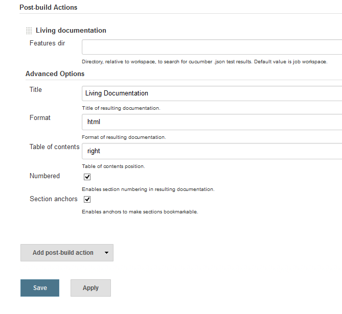
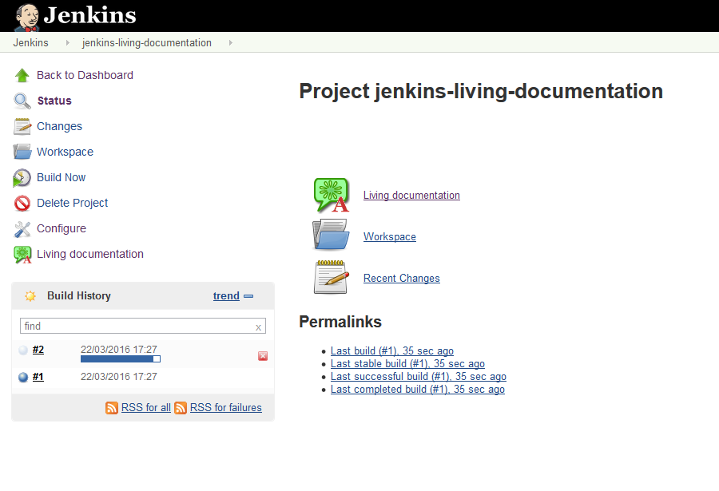
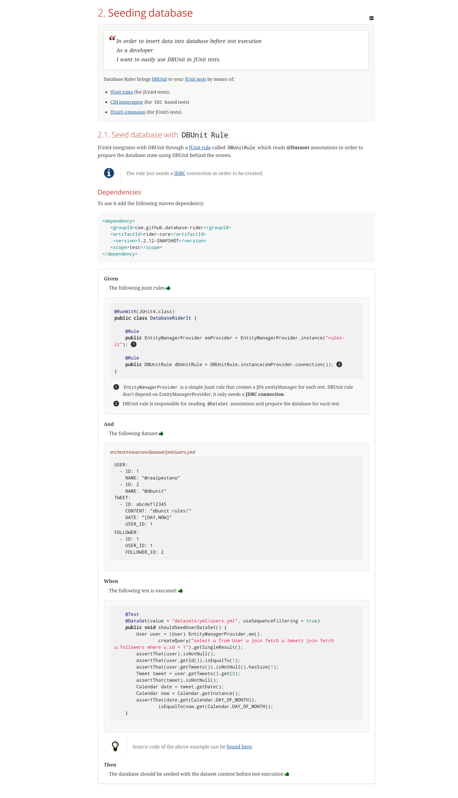
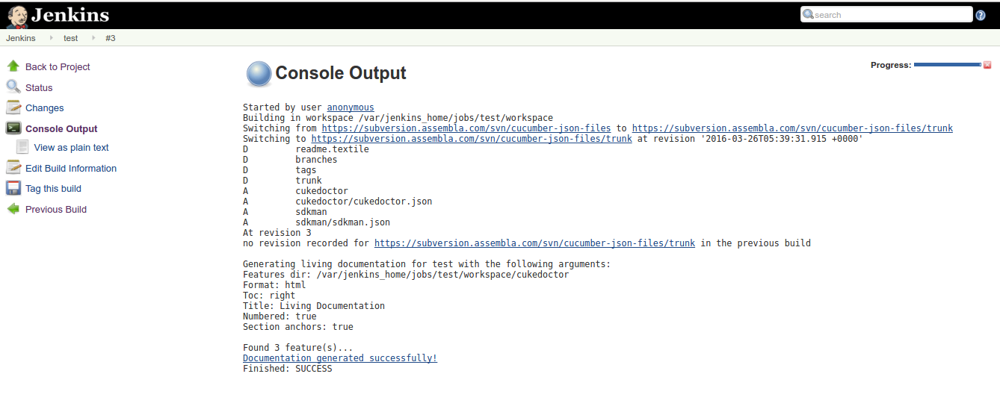

[.conf-macro .output-inline]##

[cols="",options="header",]
|===
|Plugin Information
|View Cucumber Living Documentation
https://plugins.jenkins.io/cucumber-living-documentation[on the plugin
site] for more information.
|===

[.aui-icon .aui-icon-small .aui-iconfont-info .confluence-information-macro-icon]##

Older versions of this plugin may not be safe to use. Please review the
following warnings before using an older version:

* https://jenkins.io/security/advisory/2018-03-26/#SECURITY-308[Plugin
disables Jenkins Cross-Site Scripting protection]

[.conf-macro .output-inline]#Brings Cucumber living documentation to
your continuous integration environment via
https://github.com/rmpestano/cukedoctor[Cukedoctor].#

 +

 +

[width="100%",cols="8%,92%",]
|===
a|
[.confluence-embedded-file-wrapper .confluence-embedded-manual-size]#image:https://assets-cdn.github.com/images/icons/emoji/unicode/2757.png[exclamation,width=20,height=20]#

a|
[line-through]*This plugin only works
if https://wiki.jenkins.io/display/JENKINS/Configuring+Content+Security+Policy[content
security policy is relaxed] as described
in https://wiki.jenkins.io/display/JENKINS/Configuring+Content+Security+Policy#ConfiguringContentSecurityPolicy-RelaxingTheRules[this
section]. For example start Jenkins with following argument:*

[source,console-output]
----
-Dhudson.model.DirectoryBrowserSupport.CSP="sandbox allow-scripts; style-src 'unsafe-inline' *;script-src 'unsafe-inline' *;"
----

*Since [.underline]#v2.2.1# the plugin doesn't need relaxed content
security policy.*

|===

[cols=",",]
|===
a|
[.confluence-embedded-file-wrapper .confluence-embedded-manual-size]#image:https://assets-cdn.github.com/images/icons/emoji/unicode/2757.png[exclamation,width=20,height=20]#

a|
 +

Versions *`+2.x+`* of the plugin uses Jenkins *`+2.73.1+`* as baseline
(https://github.com/jenkinsci/cucumber-living-documentation-plugin/issues/18[see
issue #17]), for older Jenkins installations use version *1.1.1* of this
plugin, otherwise the
exception _`+java.lang.NoSuchMethodError: jnr.constants.platform.OpenFlags.defined()Z +`_ will
be raised when generating living documentation.

 +

[width="100%",cols="50%,50%",]
|===
a|
[.confluence-embedded-file-wrapper .confluence-embedded-manual-size]#image:https://assets-cdn.github.com/images/icons/emoji/unicode/1f4a1.png[bulb,width=20,height=20]#

|The PDF documentation generation is way faster on version *`+2.x+`*.
|===

|===

[[CucumberLivingDocumentationPlugin-Howitworks?]]
===  +
How it works?

The plugin first looks for **Cucumber json files**, generated by your
BDD tests, on your build workspace. After it parses the files and
transforms them into html and pdf documentation making them available
into your Jenkins build. +
 +

[.aui-icon .aui-icon-small .aui-iconfont-info .confluence-information-macro-icon]#
#

To generate Cucumber json output files use the *json formatter*:

[source,syntaxhighlighter-pre]
----
@RunWith(Cucumber.class)
@CucumberOptions(plugin ={"json:target/cucumber.json"})
----

[[CucumberLivingDocumentationPlugin-Usage]]
===  +
Usage

After installing the plugin, you'll get a new _Post build action_ entry
named *Living documentation:*

[.confluence-embedded-file-wrapper]##

[[CucumberLivingDocumentationPlugin-Configuration]]
== Configuration

Here are the possible plugin configuration:

[.confluence-embedded-file-wrapper]##

[[CucumberLivingDocumentationPlugin-Accessingdocumentation]]
== Accessing documentation

When the plugin is enabled in your job it adds a link which will take
you to the current project documentation:

[.confluence-embedded-file-wrapper]##

 +

[[CucumberLivingDocumentationPlugin-Documentationhistory]]
== Documentation history

 +

The plugin stores living documentation history:

 +

https://user-images.githubusercontent.com/1592273/36995077-d5a8ddb2-2091-11e8-9e78-51ad3f1d8488.png[[.confluence-embedded-file-wrapper]#image:https://github.com/jenkinsci/cucumber-living-documentation-plugin/raw/master/docs-history.png[docs
history]#]

 +

[cols=",",]
|===
a|
[.confluence-embedded-file-wrapper .confluence-embedded-manual-size]#image:https://assets-cdn.github.com/images/icons/emoji/unicode/26a0.png[warning,width=20,height=20]#

|It reads the history from your `+job runs history+`, if you delete a
job execution, the documentation will also be deleted from the history.
|===

 +

[[CucumberLivingDocumentationPlugin-Documentationexamples]]
== Documentation examples

Here is a documentation example generated by the plugin based on a
*cucumber json output file*:

https://github.com/rmpestano/cukedoctor/blob/master/img/cukedoctor-sample.png?raw=true[[.confluence-embedded-file-wrapper]##]

The feature file for the above sample can be
https://github.com/database-rider/database-rider/blob/master/rider-core/src/test/resources/features/seeding/seeding-database.feature[found
here].

[.aui-icon .aui-icon-small .aui-iconfont-info .confluence-information-macro-icon]#
#

For more examples http://rmpestano.github.io/cukedoctor/[access here].

[[CucumberLivingDocumentationPlugin-Jenkinspipelinestep]]
===  +
Jenkins pipeline step

Following is an example of pipeline step using this plugin:

 +

....
node {
    step([$class: 'CukedoctorPublisher', featuresDir: '', format: 'HTML', hideFeaturesSection: false, hideScenarioKeyword: false, hideStepTime: false, hideSummary: false, hideTags: false, numbered: true, sectAnchors: true, title: 'Living Documentation', toc: 'RIGHT'])
  }
....

 +

Since version _1.0.10_ it is possible to use the livingDocs shortcut in
pipeline DSL:

 +

....
node {
    svn 'https://subversion.assembla.com/svn/cucumber-json-files/trunk'
    livingDocs()
}
....

 +

Parameters should be declared as `+key+`: `+'value'+` as example below:

 +

....
node {
    svn 'https://subversion.assembla.com/svn/cucumber-json-files/trunk'
    livingDocs(featuresDir:'cukedoctor')
}
....

 +

Or using the https://jenkins.io/doc/book/pipeline/syntax/[declarative
pipeline]:

 +

....
pipeline {
    agent any
    stages {
        stage('Checkout') {
            steps {
                svn 'https://subversion.assembla.com/svn/cucumber-json-files/trunk'
                livingDocs(featuresDir:'cukedoctor')
            }
        }
    }
}
....

[[CucumberLivingDocumentationPlugin-Docker]]
===  Docker

An easy way to test this plugin is using a docker container, here are
the steps (assuming you have docker installed):

. Run the image: 
+
[source,syntaxhighlighter-pre]
----
docker run -it -p 8080:8080 rmpestano/jenkins-living-documentation
----
. Access http://localhost:8080/ and create a job;
. Configure this svn
repository: https://subversion.assembla.com/svn/cucumber-json-files/trunk/[https://subversion.assembla.com/svn/cucumber-json-files/trunk]
+
[.aui-icon .aui-icon-small .aui-iconfont-info .confluence-information-macro-icon]#
#

This repository contains cucumber json sample files for the living
documentation plugin.
. Add the *Living documentation* post build action;
. Now you can run the job

[.aui-icon .aui-icon-small .aui-iconfont-approve .confluence-information-macro-icon]#
#

use featuresDir to point to specific json output, a sub folder relative
to workspace root dir, eg: *cukedoctor.*

 +

Job output should look like:

[.confluence-embedded-file-wrapper]##

[[CucumberLivingDocumentationPlugin-ChangeLog]]
== Change Log

[[CucumberLivingDocumentationPlugin-Version2.2.2(oct19,2018)]]
=== Version 2.2.2 (oct 19, 2018)

* https://github.com/jenkinsci/cucumber-living-documentation-plugin/issues/28[#28] CukedoctorProjectAction
included null not assignable to interface hudson.model.Action

[[CucumberLivingDocumentationPlugin-Version2.2.1(set21,2018)]]
=== Version 2.2.1 (set 21, 2018)

* https://github.com/jenkinsci/cucumber-living-documentation-plugin/issues/24[#24] Can't
change theme in html documentation
* https://github.com/jenkinsci/cucumber-living-documentation-plugin/issues/25[#25] Make
the plugin work *without content security policy*
* https://github.com/jenkinsci/cucumber-living-documentation-plugin/issues/26[#26] Documentation
not found via Living documentation link
* https://github.com/jenkinsci/cucumber-living-documentation-plugin/issues/27[#27]
Update to Cukedoctor 1.2.1

[[CucumberLivingDocumentationPlugin-Version2.2.0(set20,2018)]]
=== Version 2.2.0 (set 20, 2018)

* https://github.com/jenkinsci/cucumber-living-documentation-plugin/issues/22[#22]
Documentation history is lost on Jenkins restart
* https://github.com/jenkinsci/cucumber-living-documentation-plugin/issues/23[#23]
Update to Cukedoctor 1.2.0

[[CucumberLivingDocumentationPlugin-Version2.1.2(mar24,2018)]]
=== Version 2.1.2 (mar 24, 2018)

* Failed to serialize hudson.model.Project#publishers for class
hudson.model.FreeStyleProject
(https://issues.jenkins-ci.org/browse/JENKINS-50271[JENKINS-50271])
* Fixes nested project references in Build actions
(https://issues.jenkins-ci.org/browse/JENKINS-50273[JENKINS-50273])

[[CucumberLivingDocumentationPlugin-Version2.1.1(mar11,2018)]]
=== Version 2.1.1 (mar 11, 2018)

* https://github.com/jenkinsci/cucumber-living-documentation-plugin/issues/20[#20] Do
not fail build when content security policy is not relaxed

[[CucumberLivingDocumentationPlugin-Version1.1.3(mar11,2018)]]
=== Version 1.1.3 (mar 11, 2018)

* https://github.com/jenkinsci/cucumber-living-documentation-plugin/issues/20[#20] Do
not fail build when content security policy is not relaxed

[[CucumberLivingDocumentationPlugin-Version2.1(mar09,2018)]]
=== Version 2.1 (mar 09, 2018)

* Merge with v1.1.2

[[CucumberLivingDocumentationPlugin-Version2.0(mar09,2018)]]
=== Version 2.0 (mar 09, 2018)

* https://github.com/jenkinsci/cucumber-living-documentation-plugin/issues/17[#17] Use
Jenkins 2.73 as baseline

[[CucumberLivingDocumentationPlugin-Version1.1.2(mar09,2018)]]
=== Version 1.1.2 (mar 09, 2018)

* https://github.com/jenkinsci/cucumber-living-documentation-plugin/issues/19[#19]  Fix
link to documentation
* https://github.com/jenkinsci/cucumber-living-documentation-plugin/issues/20[#20] Downgrade
Asciidoctor toolchain

[[CucumberLivingDocumentationPlugin-Version1.1.1(mar08,2018)]]
=== Version 1.1.1 (mar 08, 2018)

* https://github.com/jenkinsci/cucumber-living-documentation-plugin/issues/16[#16] Allow
usage with 'sandbox' content security policy

[[CucumberLivingDocumentationPlugin-Version1.1.0(mar08,2018)]]
=== Version 1.1.0 (mar 08, 2018)

 +

[cols=",",]
|===
a|
[.confluence-embedded-file-wrapper .confluence-embedded-manual-size]#image:https://assets-cdn.github.com/images/icons/emoji/unicode/2757.png[exclamation,width=20,height=20]#

a|
Since this version the plugin will only work
if *https://wiki.jenkins.io/display/JENKINS/Configuring+Content+Security+Policy[content
security policy is relaxed]* as described
in https://wiki.jenkins.io/display/JENKINS/Configuring+Content+Security+Policy#ConfiguringContentSecurityPolicy-RelaxingTheRules[this
section].

|===

 +

* https://github.com/jenkinsci/cucumber-living-documentation-plugin/issues/12[#12] SECURITY-XXX
* https://github.com/jenkinsci/cucumber-living-documentation-plugin/issues/13[#13] Store
documentation history
* https://github.com/jenkinsci/cucumber-living-documentation-plugin/issues/14[#14] Update
to latest Asciidoctor
* https://github.com/jenkinsci/cucumber-living-documentation-plugin/issues/15[#15] Don't
rely on System properties for CukedoctorConfig

[[CucumberLivingDocumentationPlugin-Version1.0.12(oct19,2017)]]
=== Version 1.0.12 (oct 19, 2017)

* https://github.com/jenkinsci/cucumber-living-documentation-plugin/issues/9[#9] Pipeline
dsl not found

[[CucumberLivingDocumentationPlugin-Version1.0.11(sep15,2017)]]
=== Version 1.0.11 (sep 15, 2017)

* https://github.com/jenkinsci/cucumber-living-documentation-plugin/issues/8[#8] Updates
to latest Asciidoctor.

[[CucumberLivingDocumentationPlugin-Version1.0.10(aug13,2017)]]
=== Version 1.0.10 (aug 13, 2017)

* https://github.com/jenkinsci/cucumber-living-documentation-plugin/issues/7[#7] Simplifies
pipeline script execution.

[[CucumberLivingDocumentationPlugin-Version1.0.9(aug7,2017)]]
=== Version 1.0.9 (aug 7, 2017)

* Fixes documentation link in job console.

[[CucumberLivingDocumentationPlugin-Version1.0.8(aug6,2017)]]
=== Version 1.0.8 (aug 6, 2017)

* Updates to
https://github.com/rmpestano/cukedoctor/milestone/2?closed=1[Cukedoctor
1.0.7]

[[CucumberLivingDocumentationPlugin-Version1.0.7(fev7,2017)]]
=== Version 1.0.7 (fev 7, 2017)

* Support for Jenkins 2 pipelines

[[CucumberLivingDocumentationPlugin-Version1.0.6(out24,2016)]]
=== Version 1.0.6 (out 24, 2016)

* Updates to Cukedoctor 1.0.6;
* Documentation layout configuration:
. Hide 'Features' section;
. Hide summary;
. Hide 'scenario' and 'scenario outline' keyword on generated
documentation;
. Hide step execution time;
. Hide tags.

* https://github.com/jenkinsci/cucumber-living-documentation-plugin/issues/17[#17] Use
Jenkins 2.73 as baseline

[[CucumberLivingDocumentationPlugin-nestsprojectreferencesinBuildactions]]
==  nests project references in Build actions[.overlay-icon .aui-icon .aui-icon-small .aui-iconfont-edit]## ##
