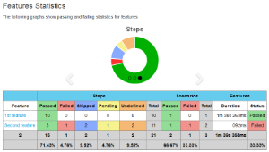
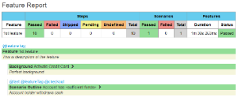
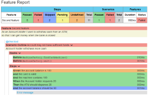
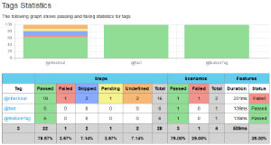
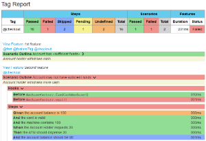
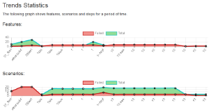

[.conf-macro .output-inline]# #

[.aui-icon .aui-icon-small .aui-iconfont-info .confluence-information-macro-icon]##

Older versions of this plugin may not be safe to use. Please review the
following warnings before using an older version:

* https://jenkins.io/security/advisory/2016-07-27/[Plugin disables
Content-Security-Policy for files served by Jenkins]

[[CucumberReportsPlugin-Publishprettycucumberreports]]
== Publish pretty cucumber reports

This is a Java Jenkins plugin which publishes
https://github.com/damianszczepanik/cucumber-reporting[pretty html
reports] showing the results of cucumber runs.

[[CucumberReportsPlugin-Configuration]]
== Configuration

Visit https://github.com/jenkinsci/cucumber-reports-plugin[project
website] to check how can you configure the plugin and how powerful it
is.

[[CucumberReportsPlugin-Screenshots]]
== Screenshots

[width="99%",cols="20%,16%,16%,16%,16%,16%",]
|===
|
|
|
|
|
|

a| a| a| a| a| a|
|===
